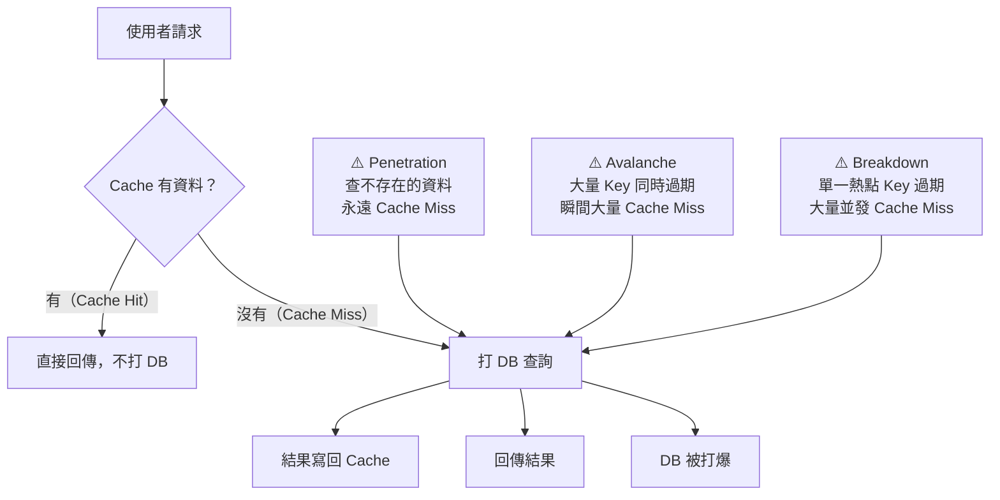
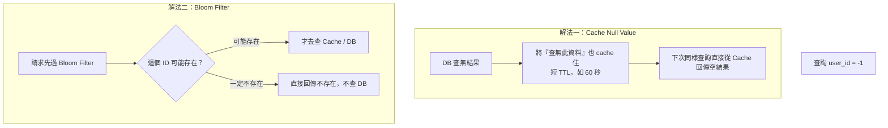
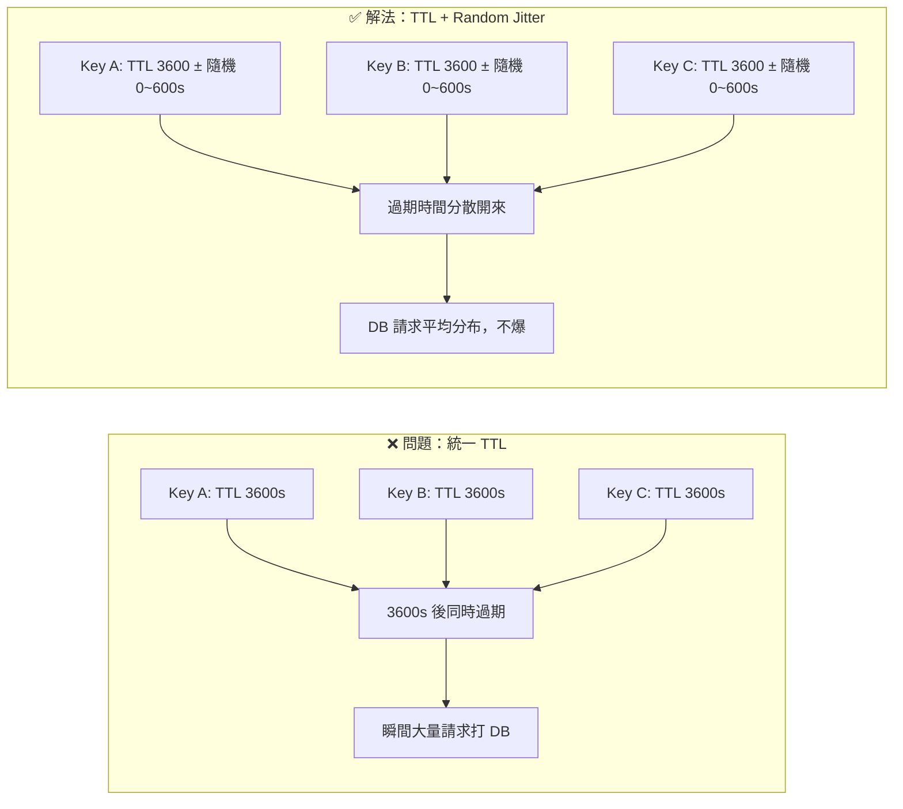
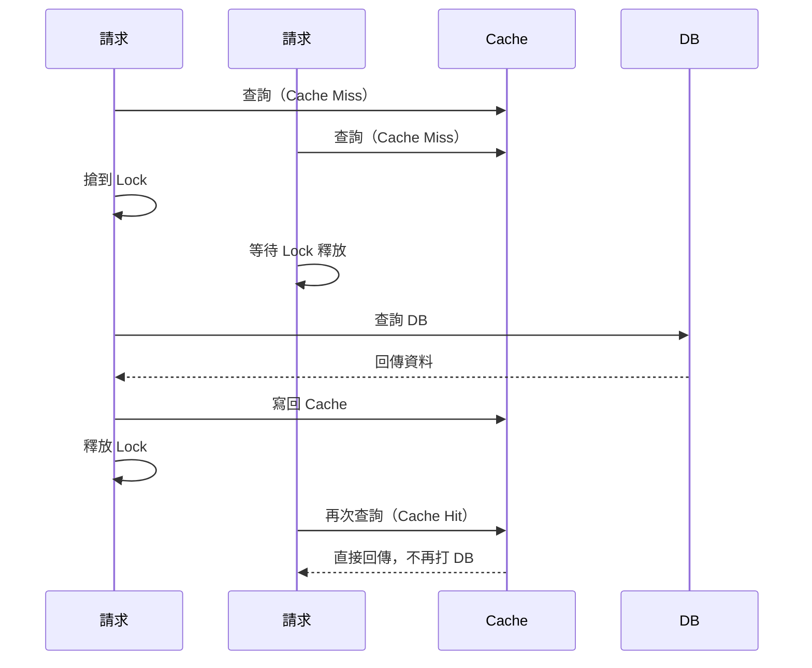

# Cache 三大失效問題：Penetration、Avalanche、Breakdown

> 學習日期：2026-07-19
> 涵蓋概念：Cache Miss、Cache Penetration、Cache Avalanche、Cache Breakdown、Bloom Filter、TTL Jitter、Mutex Lock

---

## 整體架構：三種問題的共同本質

三種問題有共同的破壞模式：**大量請求繞過 Cache 層直接打到 DB**，差異在於觸發原因不同。

---

## Cache Miss（正常現象）

首次查詢某筆資料時，Cache 裡沒有，打 DB 取得後寫回 Cache。下次同樣的查詢就能直接從 Cache 回傳。

這是 Cache 的正常運作流程，不是問題。問題在於「異常大量的 Cache Miss 集中發生」的三種場景。

---

## Cache Penetration（快取穿透）

### 問題

查詢一筆**根本不存在**的資料（例如 `user_id = -1`）。Cache 裡永遠不會有，DB 查了也沒有，結果也沒有可以寫回 Cache 的值。下次同樣的查詢，一樣穿透到 DB。

如果惡意用腳本大量查詢不存在的 ID，每一筆都直接打 DB，DB 承受大量無效查詢。

### 解法

| 解法 | 原理 | 適用情境 |
|------|------|---------|
| Cache Null Value | 把空結果也 cache 住，下次直接回空 | 簡單場景，key 種類不多 |
| Bloom Filter | 在打 Cache/DB 前先過濾掉必定不存在的 key | 高流量、key 種類極多的場景 |

> Bloom Filter 有 **false positive**（過濾器說「可能存在」，但查 DB 仍可能查無資料），無法完全阻止所有無效查詢。通常搭配 Cache Null Value 作為第二道防線，兩者互補。

---

## Cache Avalanche（快取雪崩）

### 問題

大量 Cache Key 在**同一時間**集體過期，導致瞬間大量 Cache Miss，所有請求同時打到 DB，輕則 DB 變慢，重則 DB 當機。

常見觸發場景：系統啟動時一次性把大量 Key 載入 Cache，且都設了相同的 TTL，時間到了就一起失效。

### 解法

**核心手法**：在基礎 TTL 上加上隨機的 jitter（偏移量），讓各個 Key 的過期時間錯開，避免集中失效。

---

## Cache Breakdown（快取擊穿）

### 問題

**單一熱點 Key** 過期的瞬間，大量並發請求同時發現 Cache Miss，全部同時打到 DB 查詢同一筆資料。

與 Avalanche 的差異：

| | Cache Avalanche | Cache Breakdown |
|-|----------------|----------------|
| Key 數量 | 大量 Key 同時失效 | 單一熱點 Key 失效 |
| 觸發規模 | 整體流量爆增 | 熱點資料的並發爆增 |
| 典型情境 | 系統重啟、批次載入 | 明星頁面、爆紅商品詳情 |

### 解法：Mutex Lock（互斥鎖）

只讓第一個搶到 Lock 的請求去 DB 查詢並回寫 Cache，其他請求等待 Lock 釋放後直接從 Cache 拿結果，不再打 DB。

> Lock 必須設定超時（TTL），避免持有 Lock 的請求異常時造成死鎖。等待的請求通常以短暫 sleep + retry 的方式輪詢 Cache，直到取得資料。

---

## 三種問題對比總覽

| | Penetration 穿透 | Avalanche 雪崩 | Breakdown 擊穿 |
|-|----------------|---------------|--------------|
| **根本原因** | 查不存在的資料 | 大量 Key 同時過期 | 單一熱點 Key 過期 |
| **Cache Miss 特徵** | 永遠 Miss（查無此資料） | 瞬間大量 Miss | 熱點並發 Miss |
| **主要解法** | Cache Null / Bloom Filter | TTL + Random Jitter | Mutex Lock |
| **常見觸發場景** | 惡意攻擊、異常查詢 | 系統啟動、批次載入 | 爆紅熱點資料 |

---

## 學習過程的關鍵卡點

**原本以為**：Cache 就是快取資料加速查詢，了解 Cache Miss 就差不多了，沒想到 Cache 本身也有三種會打垮 DB 的失效問題。

**實際上**：Cache Penetration、Avalanche、Breakdown 都是「Cache Miss 集中爆發」，但觸發原因不同，解法方向也完全不同——Penetration 要防止無效查詢打到 DB；Avalanche 要把過期時間分散；Breakdown 要用鎖讓並發請求排隊，只有第一個打 DB。理解這三種問題，才能在設計 Cache 策略時預防它們。
