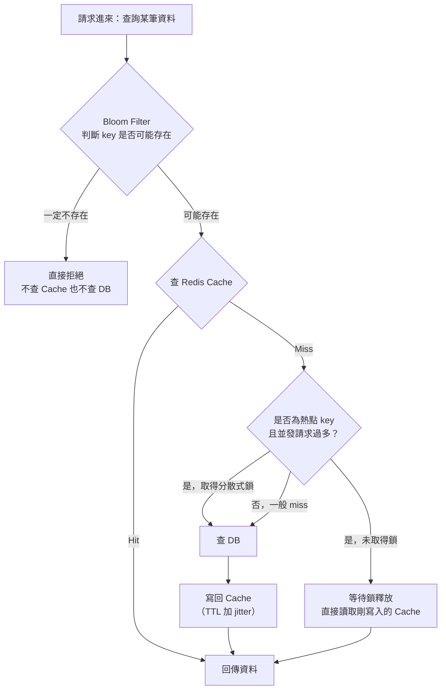
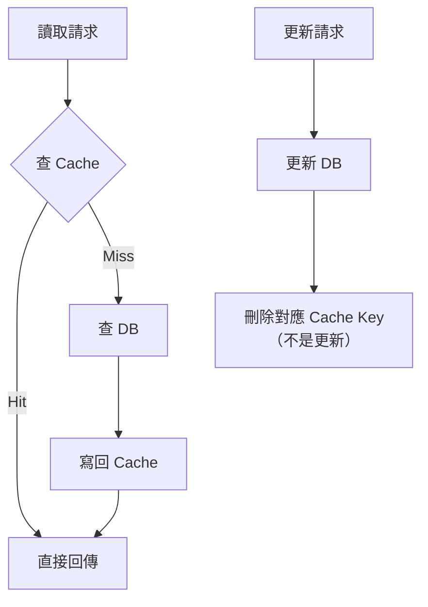
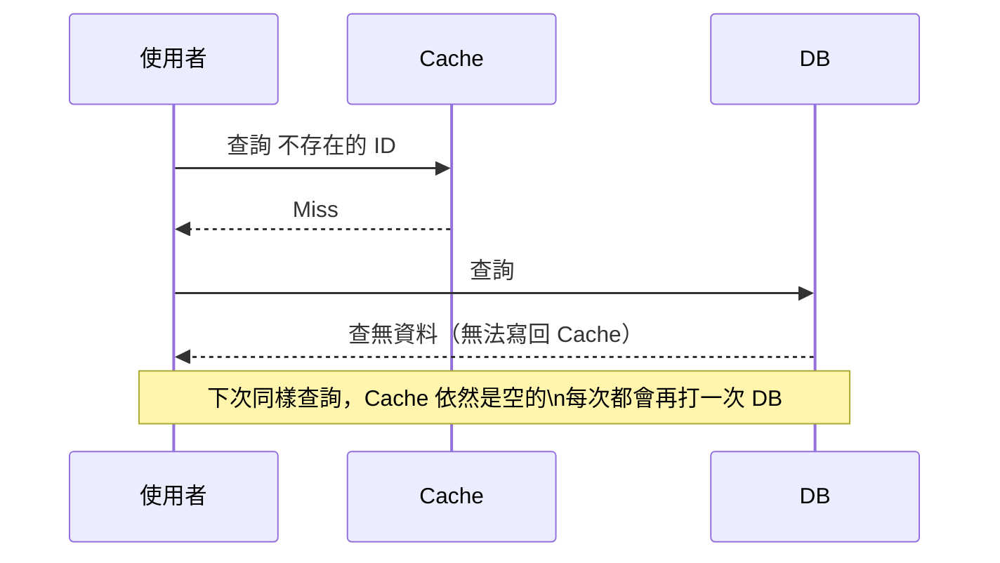
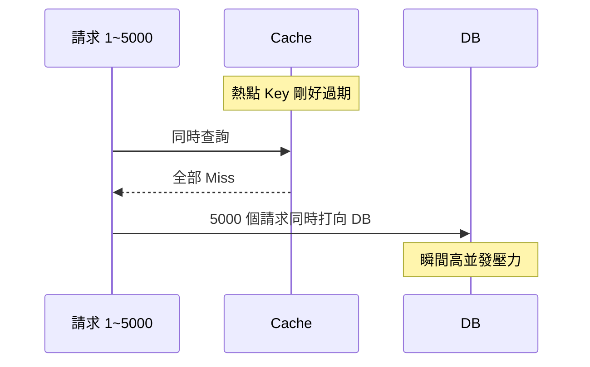
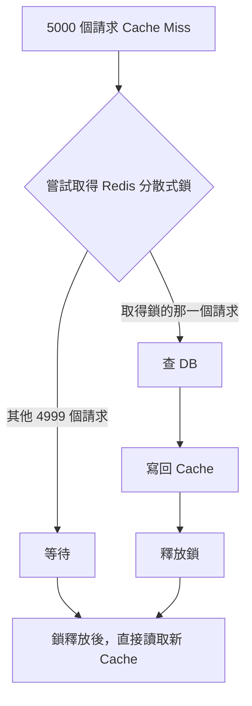
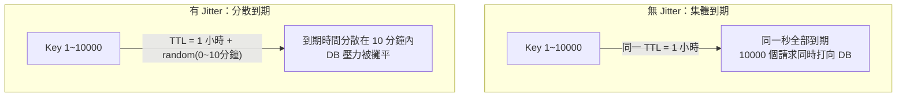

# Redis 快取模式與三大風險：Penetration、Breakdown、Avalanche

> 學習日期：2026-07-24
> 涵蓋概念：Cache-Aside、Cache Penetration、Bloom Filter、Cache Breakdown、分散式鎖、Cache Avalanche、TTL Jitter、高可用架構

---

## 整體架構：一次查詢請求的完整防護鏈



這張圖把今天學的三個風險的解法，全部串成同一條防護鏈：**Bloom Filter 擋 Penetration → 分散式鎖擋 Breakdown → TTL Jitter 擋 Avalanche**。

---

## Cache-Aside（旁路快取）：基礎模式

應用程式自己管理 Cache 與 DB 的同步，Cache 本身不知道 DB 的存在。



**為什麼是「刪除」而不是「更新」Cache？**

並發寫入時，兩個請求各自「寫 DB 後直接寫 Cache」的話，順序可能交錯：

```
請求 A：寫 DB(100)
請求 B：寫 DB(200)
請求 B：寫 Cache(200)
請求 A：寫 Cache(100)   ← Cache 停在舊值，DB 卻是正確的 200
```

刪除操作沒有「值覆蓋」的問題——最壞情況只是多一次 Cache Miss，下次讀取會重新從 DB 撈最新值寫回。

> 待釐清：即使改用刪除，理論上仍存在更細微的 race condition（刪除動作與另一個並發讀取重建動作交錯），業界常見緩解方式是「延遲雙刪」（刪 Cache → 更新 DB → sleep 一段時間 → 再刪一次 Cache），今天對話未深入展開細節。

---

## 風險一：Cache Penetration（快取穿透）

**情境**：查詢的資料在 DB 裡也**不存在**。



因為沒有資料可以寫回 Cache，Cache 永遠失去對這個 key 的防護能力，请求每次都「穿透」Cache 直接打向 DB。若被惡意大量請求利用，DB 可能被打垮。

### 解法一：快取空值

把查無結果的 key 也寫入 Cache（值為 null），並設定**較短的 TTL**：

| TTL 設定 | 問題 |
|---|---|
| 跟正常資料一樣長 | 若之後資料真的被建立，Cache 仍卡在舊的「空值」，造成資料不一致 |
| 設定極短 | 只能防護短時間內針對同一 key 的重複轟炸，無法長期防護，且對隨機 key 攻擊無效 |

只適用於「固定、可預期、被重複查詢」的不存在 key。若攻擊者每次用**隨機、從未出現過的 key**（如 UUID），快取空值對這種情況無效——因為每個 key 對 Cache 來說都是第一次見到，仍得先打一次 DB。

### 解法二：Bloom Filter

一種空間效率極高的機率型資料結構，能在**不查 DB、不查 Cache** 的情況下，快速判斷「這個 key 是否可能存在」。

**運作原理**：用多個 hash function 把已存在的資料對應到一個 bit array 的多個位置，設為 1。查詢時算出同樣的位置：

- 只要有**任一位置是 0** → 這個 key **一定不存在**（因為存在的話，寫入當下就會把所有對應位置設為 1）
- 所有位置都是 1 → 這個 key **可能存在**（也可能是不同 key 的 hash 位置剛好重疊，造成 false positive）

**關鍵特性：只會 false positive（誤判為存在），不會 false negative（誤判為不存在）。**

```python
import hashlib

class BloomFilter:
    def __init__(self, size=1000, hash_count=3):
        self.size = size
        self.hash_count = hash_count
        self.bit_array = [0] * size

    def _hashes(self, item):
        positions = []
        for seed in range(self.hash_count):
            h = hashlib.md5(f"{seed}:{item}".encode()).hexdigest()
            positions.append(int(h, 16) % self.size)
        return positions

    def add(self, item):
        for pos in self._hashes(item):
            self.bit_array[pos] = 1

    def might_exist(self, item):
        return all(self.bit_array[pos] == 1 for pos in self._hashes(item))
```

實務上不會自己刻，常用 Redis 的 **RedisBloom** 模組（`BF.ADD` / `BF.EXISTS`）或 Guava 的 `BloomFilter`。Bloom Filter 本身**預先建立、存在記憶體（或 Redis）裡**，不是每次查詢才去打 DB：

- 初始化時，把 DB 所有已存在的 ID 批次 add 進去
- 之後新資料寫入 DB 時，同步 add 進 Bloom Filter

> **限制**：標準 Bloom Filter 只能新增、不能刪除——DB 資料被刪除後，Filter 仍會持續判斷該 key「可能存在」，準確率隨時間單調下降（bit array 只會越填越滿，無法回收）。若需要支援刪除，要用 **Counting Bloom Filter**（每個位置用計數器取代單一 bit，刪除時計數器 -1）。

兩種解法通常搭配使用：Bloom Filter 擋掉大部分隨機 key 攻擊，快取空值處理少量、重複查詢的合法「查無資料」情境。

---

## 風險二：Cache Breakdown（快取擊穿）

**情境**：一筆**平常一直存在 Cache 裡**、被大量並發請求查詢的熱點資料，在 Cache 過期的瞬間，大量請求同時 miss、同時衝去查 DB。

跟 Penetration 的差異：Penetration 是資料**根本不存在**；Breakdown 是資料**明明存在**，只是快取剛好過期。



### 解法：分散式鎖

只讓其中一個請求去查 DB、重建 Cache，其餘請求等待這個過程完成後，直接讀取剛寫入的新值。

**為什麼不能用單機的 lock（如 Java `synchronized`）？** 分散式系統中多台伺服器各自的 lock 互不相通，只能鎖住同一台伺服器內的 thread。必須用 Redis 的 `SETNX` 或 Redlock 等跨機器生效的分散式鎖。



> 待釐清：另一個常見做法是「邏輯過期」——Cache 資料永不設實體 TTL，改在 value 內存一個邏輯過期時間欄位，過期時由背景執行緒非同步重建，當下請求先返回舊值。今天對話中提及但未深入其實作細節。

---

## 風險三：Cache Avalanche（快取雪崩）

跟 Breakdown 的差異在於**規模與成因**：Breakdown 是單一熱點 key 的並發失效；Avalanche 是**大規模、系統性**的快取失效，有兩種成因。

### 成因一：大量 key 集體到期



批次寫入的資料若全部用同一個固定 TTL，一小時後會**同時到期**，大量請求同時打向 DB，可能直接打爆。解法是為 TTL 加上**隨機偏移量（jitter）**，讓到期時間分散開來。

### 成因二：Redis 服務本身當機

若不是 key 過期，而是 Redis 整個當機（故障、網路斷線），所有請求瞬間變成 Cache Miss，全部打向 DB——**這種情況 TTL Jitter 無效**，因為問題根本不在 TTL，而在快取層完全消失。

需要兩個方向補強：

| 方向 | 做法 |
|---|---|
| **預防**：讓 Redis 不容易掛掉 | Redis Sentinel（主節點掛掉自動選出新主節點）、Redis Cluster（資料分片到多個 master；若每個分片都配置 replica，單一 master 故障可自動 failover，只造成短暫不可用——若沒配置 replica，該分片直接不可用，甚至可能影響整個 Cluster） |
| **止血**：Redis 掛了如何保護 DB | 限流（Rate Limiting）、熔斷（Circuit Breaker，偵測 DB 過載時暫時斷路）、服務降級（回傳預設值或簡化回應） |

> 待釐清：熔斷器的三種狀態（closed / open / half-open，如 Hystrix 模式）今天對話中提及方向但未展開實作細節。

---

## 三大風險對比表

| 風險 | 情境 | 成因 | 解法 |
|---|---|---|---|
| **Cache Penetration**（快取穿透） | 查詢 DB 中也不存在的資料 | 資料不存在，永遠無法寫回 Cache，每次都打穿到 DB | 1. 快取空值（短 TTL）<br>2. Bloom Filter 提前擋掉不存在的 key |
| **Cache Breakdown**（快取擊穿） | 單一熱點 key 過期瞬間，大量並發請求同時查詢 | 資料明明存在，但 Cache 剛好過期，並發請求一起穿過 Cache 打 DB | 1. 分散式鎖，只讓一個請求重建 Cache<br>2. 邏輯過期，背景非同步重建 |
| **Cache Avalanche**（快取雪崩） | 大量 key 同時到期，或 Redis 服務本身當機 | (a) 批次寫入用同一 TTL，集體到期<br>(b) Redis 單點故障，快取層整體失效 | (a) TTL 加隨機 jitter，分散到期時間<br>(b) Redis 高可用架構（Sentinel/Cluster）+ 限流/熔斷/服務降級保護 DB |

---

## 學習過程的關鍵卡點

**卡點 1：Cache-Aside 更新時，為什麼刪除 Cache 而不是更新 Cache？**

**原本以為**：更新 DB 時順便把新值直接寫進 Cache，比較直覺、有效率。

**實際上**：並發寫入時，兩個請求「寫 DB → 寫 Cache」的順序可能交錯，導致 Cache 最終停留在錯誤的舊值上（DB 明明是正確的新值）。刪除 Cache 沒有這個「值覆蓋」問題，最壞情況只是多一次 Cache Miss。

---

**卡點 2：把 Cache Breakdown 的解法跟 Cache Avalanche 的解法搞混**

**原本以為**：TTL 加 jitter 是萬用解法，可以拿來解決「單一熱點 key 過期瞬間、大量並發請求同時查詢」的問題。

**實際上**：Jitter 是用來分散**多個不同 key** 的到期時間；單一熱點 key 只有一個 TTL 值，加 jitter 沒有意義。Breakdown 真正的解法是分散式鎖——確保全系統只有一個請求去查 DB 重建 Cache。這兩個風險名稱相近（穿透 vs 擊穿 vs 雪崩），容易在解法上互相套用錯誤。

---

**卡點 3：Bloom Filter 是不是每次查詢都要先打 DB 才能判斷？**

**原本以為**：不確定 Bloom Filter 的「判斷不存在」是透過即時查詢 DB 還是查 Redis 資料得出。

**實際上**：Bloom Filter 是**預先（離線或增量）建立好**、存在記憶體（或 Redis 的 RedisBloom 模組）裡的獨立資料結構。查詢時純粹是記憶體運算（對 key 算 hash、查 bit array），完全不需要即時打 DB 或查詢 Cache 本身的實際資料，這也是它能扛住大量請求、速度極快的原因。
