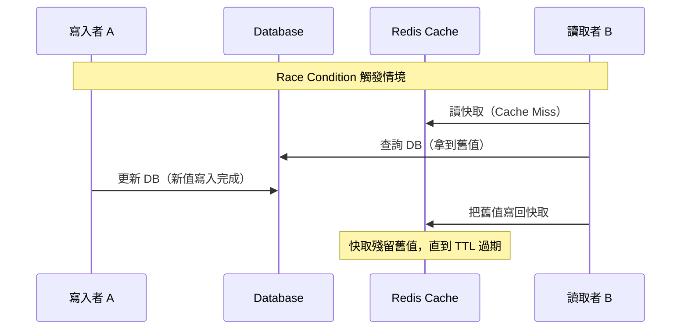
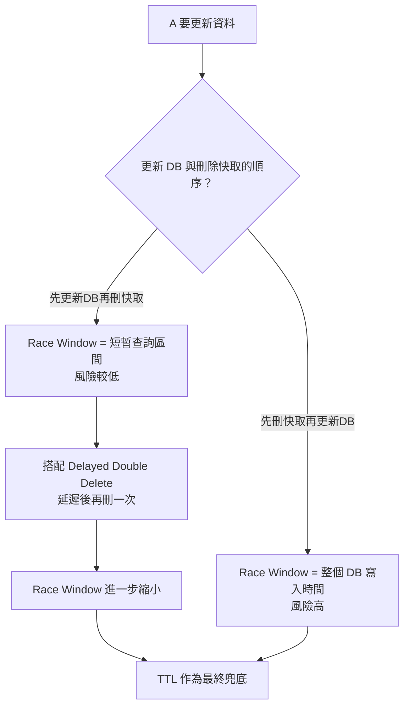
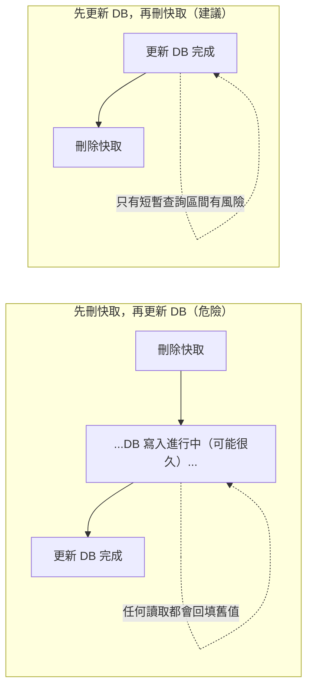

# Cache Invalidation 與資料不一致：Race Condition 全解析

> 學習日期：2026-07-27
> 涵蓋概念：Cache-Aside Race Condition、Delete-after-write、Delayed Double Delete、更新/刪除順序、多節點快取失效傳播、TTL 兜底

---

## 整體架構圖

---

## 核心問題：Cache-Aside 架構下為什麼會不一致

在 cache-aside 架構（讀時查快取沒中就查 DB 再回填；寫時直接更新 DB）下，即使寫入者已經把 DB 完成更新，快取仍可能殘留舊值。

**觸發條件**：讀取者 B「讀到 DB 舊值」的時間點，早於寫入者 A「完成 DB 寫入」；但 B「把舊值寫回快取」的時間點，晚於 A 完成寫入。只要這個事件順序成立，跟兩者之間絕對的時間差長短無關，race 就會發生。

殘留的舊值會一直誤導所有讀者，**直到 TTL 過期**才會自然修正。

---

## 解法一：Update DB 後刪除快取（而非直接更新快取）

寫入路徑改為：**更新 DB → 刪除快取**，而不是把新值直接寫入快取。

| 做法 | 問題 |
|------|------|
| 更新快取 | 併發寫入時可能因順序錯亂讓錯的值留下；若快取值運算成本高，等於白算 |
| 刪除快取 | 讓下一次讀取自然觸發重新查詢，簡單且不易寫錯值 |

**但刪除快取並沒有完全解決 race**：如果 B 的「查 DB → 寫回快取」動作橫跨在 A 的「刪除快取」之後才完成寫入，舊值一樣會被重新塞回去。

---

## 解法二：Delayed Double Delete（延遲雙刪）

流程：

1. 更新 DB
2. 立即刪除快取一次（處理大部分情況）
3. 延遲一段時間（依讀取路徑平均耗時抓，並留餘裕；建議用非同步任務/訊息佇列，不阻塞主寫入流程）
4. 再刪除一次快取，清掉延遲期間可能被寫入的舊值

**延遲時間的 trade-off**：

- 太短：覆蓋不到真正慢的讀取請求，race 仍會殘留
- 太長：延遲期間如果剛好有髒讀寫入，錯誤資料存在的時間也跟著變長

這個做法本質是「用時間換確定性」，是**降低機率**而非數學上完全消除 race。

---

## 更新 DB 與刪除快取的順序：為什麼順序決定 race window 大小

| 順序 | Race Window | 原因 |
|------|-------------|------|
| 先刪快取，再更新 DB | 整個 DB 寫入的持續時間 | 快取真空期間任何讀取都會把舊值重新寫回並刷新 TTL |
| 先更新 DB，再刪快取 | 極短暫（B 已開始查詢但還沒寫回快取的區間） | DB 已是新值，only 極少數已在飛行中的舊讀取會造成污染 |

**原則**：讓快取的失效動作盡量晚發生，避免快取真空期疊加上 DB 寫入這種相對耗時的操作。

> **注意**：如果讀取路徑有主從複製（read replica，讀寫分離），「先更新 DB 再刪快取」的 race window 不會永遠很短——A 更新的是主庫，B 讀到的可能是還沒同步的從庫舊值。即使 B 是在 A 刪除快取**之後**才發起查詢，只要從庫還沒追上主庫，B 一樣會把舊值寫回快取，這個 window 的長度取決於複製延遲，可能遠大於單純的查詢耗時。這也是為什麼 delayed double delete 的延遲時間，通常要涵蓋「複製延遲 + 讀取路徑耗時」，而不只是讀取本身的耗時。

---

## 多節點快取的失效傳播

| 快取架構 | 失效傳播問題 |
|---------|-------------|
| 集中式快取（如共用 Redis） | 刪除一次即全域生效，無傳播問題 |
| 本地快取（每台 app server 記憶體各存一份，如 Caffeine） | 各節點快取彼此獨立，A 的刪除不會自動同步到 B、C、D |

**解法**：透過 Pub/Sub 或訊息佇列廣播「key 失效」事件，各節點訂閱後主動清除本地對應的快取項目。

**兜底**：Pub/Sub 訊息可能因網路問題被漏接，因此必須搭配 **TTL** 作為最後一道防線——即使通知失敗，快取最終仍會在有限時間內過期並自我修正。

---

## 快速記憶脈絡

1. Cache-aside 的 race 本質是**事件順序交錯**，不是時間差長短的問題
2. 寫入順序永遠是「先更新 DB，再刪快取」，反過來會讓 race window 放大成整個 DB 寫入時間
3. 任何「主動失效」機制（delayed double delete、pub/sub 廣播）都應該搭配 **TTL 兜底**，因為主動通知永遠有失敗的可能性

---

## 學習過程的關鍵卡點

**原本以為**：快取不一致的原因是「跨區建立時間跟資料庫時間的先後」，把分散式系統的時鐘同步問題跟快取寫入時序問題混在一起。

**實際上**：這跟時鐘同步無關，是同一個系統內「讀取者查 DB 回填快取」跟「寫入者更新 DB」這兩個操作交錯導致的 race condition，關鍵是事件的相對順序，不是時間差長短或時鐘校準。

**原本以為**：更新 DB 後把新值直接寫進快取，或是刪除快取，就能保證資料一致。

**實際上**：不論更新或刪除快取，都無法完全消除 race——只要有讀取者在「舊值查詢」與「新值寫回」之間跨越了寫入者的動作，就會有殘留舊值的風險。真正能兜底的只有 TTL，delayed double delete 只是縮小這個風險窗口，不是徹底消除。

**原本以為**：「先刪快取，再更新 DB」跟「先更新 DB，再刪快取」只是順序不同，影響不大。

**實際上**：兩者的 race window 大小天差地遠——先刪快取會讓 race window 等於整個 DB 寫入時間（可能很長），先更新 DB 再刪快取則只有極短暫的查詢區間有風險。這是實務上的標準做法，而非隨意選擇。
