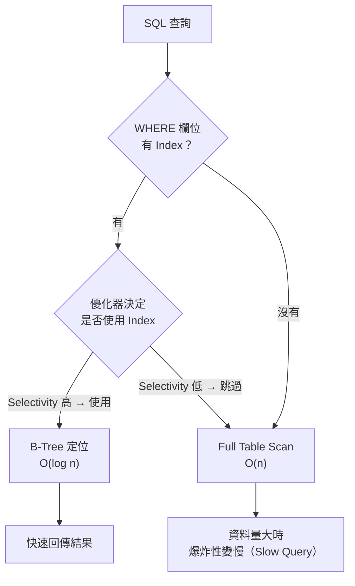
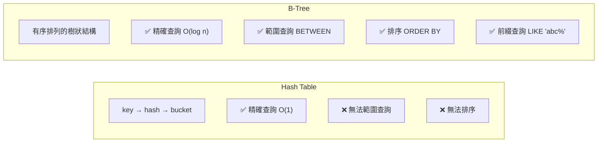
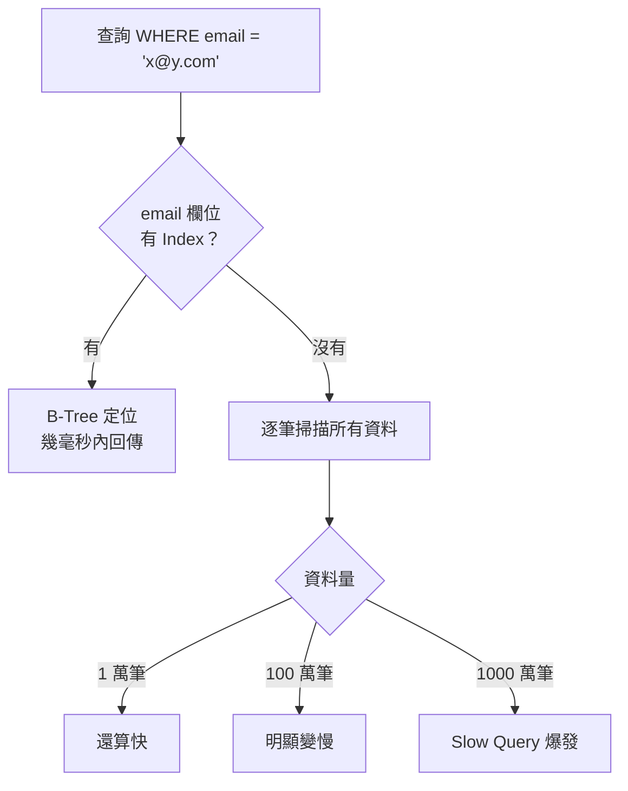
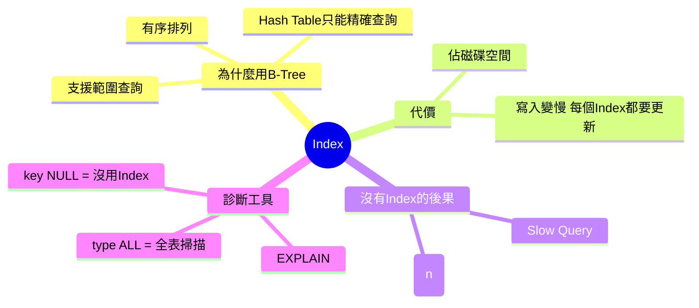

# Database Index 與 Slow Query：從 B-Tree 到 EXPLAIN

> 學習日期：2026-07-19
> 涵蓋概念：Index、B-Tree、Hash Table、Full Table Scan、Write Penalty、Slow Query、EXPLAIN

---

## 整體架構：查詢走 Index vs 走全表的差異



> 有 Index 不代表一定走 Index。優化器（Query Optimizer）會根據 Selectivity（索引選擇性）決定：當索引欄位的值種類極少（如性別只有 M/F），全表掃描反而可能更快。實際是否走 Index，透過 `EXPLAIN` 確認。

## Index 是什麼

Index 是一份「額外維護的資料結構」，存放在獨立的儲存空間，讓查詢可以跳過掃全表，直接定位到目標資料。

**本質是空間換時間**：多用一些磁碟空間，換取查詢速度大幅提升。

---

## 為什麼選 B-Tree，而不是 Hash Table



Hash Table 只能做精確查詢（`WHERE id = 5`），遇到範圍查詢（`WHERE age BETWEEN 20 AND 30`）就無能為力，因為 hash 之後的值失去了大小關係。

B-Tree 的資料是**有序排列**的，讓資料庫可以快速定位起點、再連續讀取，這是 Hash Table 做不到的。

> 以 MySQL InnoDB 為例，B-Tree 是預設且唯一支援的 Index 結構；Hash Index 在 MEMORY 引擎中存在，但不支援範圍查詢，且不同資料庫的 Hash Index 實作差異較大。

---

## Index 的代價：寫入效能下降

Index 不是開越多越好。

每次執行 **INSERT / UPDATE / DELETE**，資料庫不只修改資料本身，還要同步維護所有相關的 Index。

| 操作 | Index 越多的影響 |
|------|----------------|
| SELECT（查詢） | ✅ 越快 |
| INSERT（新增） | ❌ 越慢（每個 Index 都要更新） |
| UPDATE（修改） | ❌ 越慢 |
| DELETE（刪除） | ❌ 越慢 |

**結論**：在寫入頻繁的表（例如每秒千筆寫入的 log 表）上開太多 Index，反而拖慢整體效能。Index 要根據實際查詢模式選擇性建立。

---

## Slow Query 的根因：Full Table Scan

Slow Query（慢查詢）最常見的成因：**WHERE 條件欄位沒有 Index，導致全表掃描**。



沒有 Index 時，資料量從 10 萬成長到 100 萬，查詢時間也跟著線性成長（O(n)）。有 Index 時，B-Tree 的 O(log n) 讓相同的資料成長對速度影響極小。

---

## 診斷工具：EXPLAIN

拿慢的 SQL 加上 `EXPLAIN` 前綴，資料庫會回傳查詢計劃，重點看兩個欄位：

| 欄位 | 看什麼 | 警示狀態 |
|------|--------|---------|
| `type` | 存取方式 | `ALL` = Full Table Scan，最危險 |
| `key` | 實際使用的 Index 名稱 | `NULL` = 沒用到任何 Index |

```sql
EXPLAIN SELECT * FROM users WHERE email = 'x@y.com';
```

如果看到 `type: ALL` 且 `key: NULL`，就是「這個查詢正在全表掃描」的直接證據。

**其他 type 值參考**（大致由差到好，非嚴格線性）：

`ALL` → `index` → `range` → `ref` → `eq_ref` → `const/system`

> 注意：`index` 表示 Full Index Scan（掃描整棵 Index 樹），不代表一定比 `range` 快；實際效能仍取決於資料量與索引 Selectivity。這是診斷優先序的參考，不是絕對的速度保證。

---

## 快速記憶脈絡



---

## 學習過程的關鍵卡點

**原本以為**：知道資料庫預設用 B-Tree，但不清楚為什麼不用 Hash Table（單純覺得 B-Tree 比較常見）。

**實際上**：Hash Table 找單一值甚至比 B-Tree 更快（O(1) vs O(log n)），但 Hash Table 無法支援範圍查詢、排序、前綴查詢，因為 hash 之後的值失去了大小關係。資料庫需要這三種能力，所以選 B-Tree。

---

**原本以為**：Index 越多查詢越快，多建幾個沒壞處。

**實際上**：每次 INSERT/UPDATE/DELETE 都要同步更新所有 Index，在寫入頻繁的表上開太多 Index 會嚴重拖慢寫入效能。Index 是需要根據查詢模式取捨的設計決策，不是免費的。
