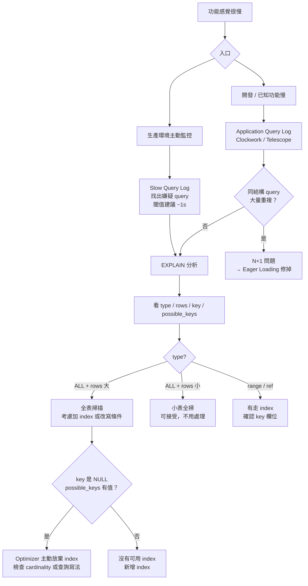
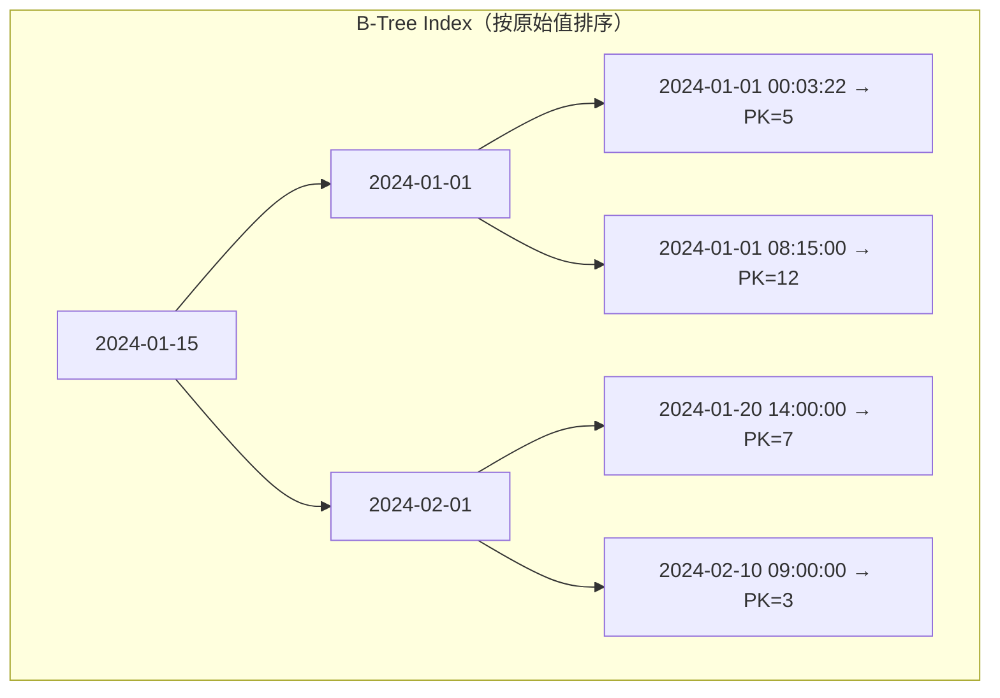
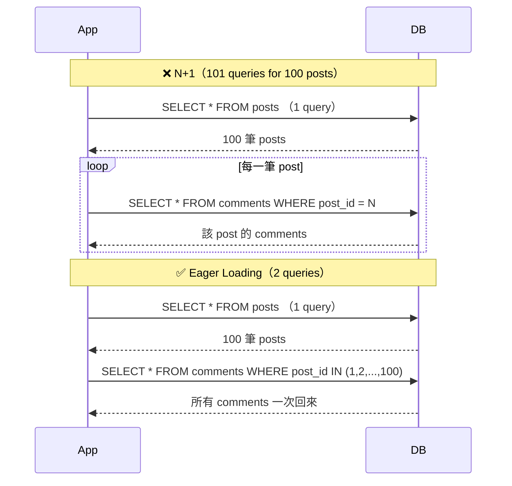
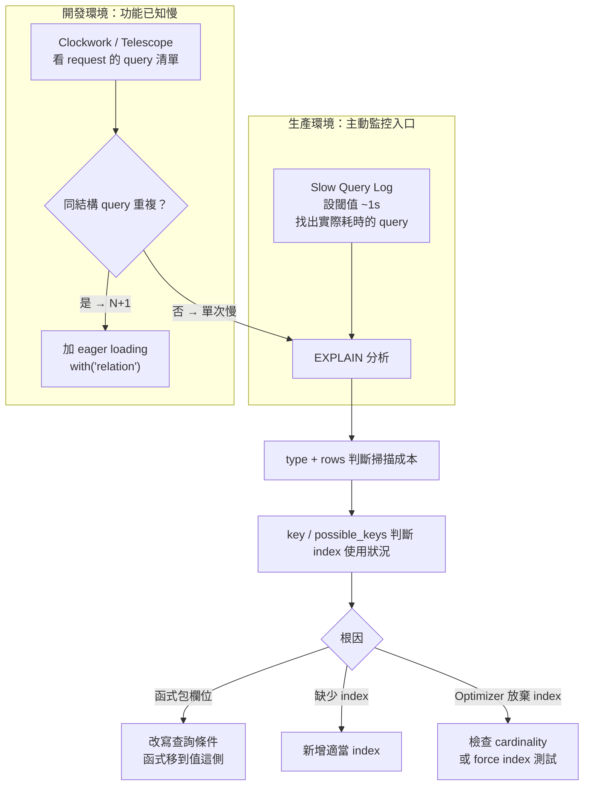

# DB 查詢效能核心：Index 失效、EXPLAIN 判讀、N+1 與慢查詢定位流程

> 學習日期：2026-07-22
> 涵蓋概念：B-Tree Index、Index 失效條件、EXPLAIN、N+1、Slow Query Log、慢查詢定位流程

---

## 整體診斷架構



---

## B-Tree Index 的本質

Index 是一本**按原始欄位值排好序的目錄**，以 B-Tree 結構儲存。查詢時從根節點往下走，每一層砍掉一半，達到 O(log n) 的時間複雜度——用儲存空間換取查詢速度。



> **InnoDB Secondary Index 注意**：葉節點存的是**主鍵值（PK）**，不是 row 的實體位址。找到葉節點後還需回到 Clustered Index 取得完整資料列（稱為「回表」）。若查詢所需的欄位全都在 index 內（Covering Index），則可省略回表，此時即使 cardinality 低，Optimizer 也可能選擇走 index。

### Index 失效的三種情況

| 情況 | 範例 | 原因 |
|------|------|------|
| 對欄位套函式 | `WHERE date(created_at) = '2024-01-01'` | B-Tree 存原始值，函式轉換後無法直接對應目錄位置 |
| 低 cardinality | 欄位只有 `true/false` 兩種值 | Optimizer 估算走 index 再回表的成本 > 全表掃描，主動放棄（若為 covering index 不需回表，即使 cardinality 低仍可能走 index） |
| 複合 index 順序不符 | 跳過最左欄直接查第二欄 | B-Tree 按左到右欄位排序，跳過第一欄目錄就失效（MySQL 8.0+ 有 Index Skip Scan 例外，但條件限制較多） |

### 函式讓 Index 失效——修正寫法

```sql
-- ❌ 對欄位套函式：B-Tree 無法跳頁，退化成全表掃描
WHERE date(created_at) = '2024-01-01'

-- ✅ 把函式移到值這側：欄位保持原始值，B-Tree 可做範圍掃描
WHERE created_at >= '2024-01-01 00:00:00'
  AND created_at < '2024-01-02 00:00:00'
```

**關鍵原則**：讓欄位側保持原始值，轉換只發生在比對值那側。

---

## EXPLAIN 判讀順序


### 各欄位含義

**`type`（掃描方式，由差到好）**

| 值 | 意義 | 需要處理？ |
|----|------|-----------|
| `ALL` | 全表掃描 | 配合 `rows` 判斷 |
| `range` | index 範圍掃描 | 通常 OK |
| `ref` | 非唯一索引等值查詢（可能匹配多列） | 很好 |
| `eq_ref` | JOIN 中走唯一索引，每次最多一列 | 很好 |
| `const` | 主鍵/唯一鍵等值查詢，planning 時視為常數 | 最好 |

**`rows`**：Optimizer 估算需掃描的列數。`type: ALL` 時：
- `rows: 3` → 小表全掃，沒問題
- `rows: 500000` → 真正的效能問題

**`key` vs `possible_keys`**

```
possible_keys = Optimizer 掃過 schema 後，理論上可以用的 index 清單
key           = Optimizer 最終選擇走的 index
```

- `key` 有值：有走 index
- `key: NULL`，`possible_keys` 有值：Optimizer **主動放棄** index（通常是 cardinality 太低）
- `key: NULL`，`possible_keys` 也是 NULL：**沒有可用的 index**，需要新增

---

## N+1 問題

### 問題本質

N+1 是**次數**問題，不是單次效能問題。



### 為什麼 EXPLAIN 看不出 N+1

每個 query 本身結構正確、走 index、執行速度快——EXPLAIN 顯示完全正常。問題在於這個 query 被打了 100 次，EXPLAIN 只看得到單次。

### 診斷訊號

用 Clockwork / Laravel Telescope / Debugbar 看 request 級別的 query log：

> **訊號**：同結構的 query 大量重複，只有參數不同（`post_id = 1`, `post_id = 2`, ...）

### 解法

```php
// ❌ 會產生 N+1
$posts = Post::all();
foreach ($posts as $post) {
    $post->comments; // 每次存取觸發一個新 query
}

// ✅ Eager Loading
$posts = Post::with('comments')->get(); // 2 queries
```

---

## Slow Query Log

MySQL 的慢查詢記錄機制，把執行時間超過閾值的 query 寫入 log。

| 項目 | 說明 |
|------|------|
| 預設閾值 | 10 秒（太高，實務上應調低） |
| 建議閾值 | 1 秒以下（生產環境視情況調整） |
| 設定參數 | `long_query_time` |
| 能抓到 N+1？ | **不能**——每個 query 都很快，不會超過閾值 |

**Slow query log 是生產環境的嫌疑犯清單，適合主動監控；Application query log 才能抓 N+1。**

---

## 慢查詢定位流程（完整版）



---

## 學習過程的關鍵卡點

**卡點一：知道函式會讓 index 失效，但不知道為什麼**

**原本以為**：`date()` 是某種特殊函式，DB 對它特別處理所以用不了 index。

**實際上**：根本原因是 B-Tree 存的是**欄位的原始值**。對欄位套任何函式，DB 都必須對每一列先算一次函式結果才能比對，沒辦法利用排好序的目錄結構跳頁——不是函式本身的問題，是「轉換發生在欄位這側」讓目錄失效。

這個卡點值得記：知道修法（把函式移到值側）之前，先搞懂**目錄失效的機制**，才不會在其他類似情境（如 `YEAR(created_at)`, `LOWER(email)`）又踩一次。

---

**卡點二：以為 EXPLAIN 是萬能的慢查詢偵測工具**

**原本以為**：所有查詢效能問題都能用 EXPLAIN 找到。

**實際上**：EXPLAIN 只分析**單一 query 的執行計畫**。N+1 的問題不在某一個 query 的執行方式，而在於這個 query 被重複執行了 N 次——EXPLAIN 完全正常，但整體效能很差。需要 request 級別的 query log 工具（Clockwork / Telescope）才能看到「次數」這個維度。

---

**卡點三：slow query log 應該是診斷終點，還是起點？**

**原本以為**：先排除 N+1、跑 EXPLAIN 之後，最後才看 slow query log。

**實際上**：在生產環境，你**不知道哪個 query 慢**——slow query log 是主動監控的入口，幫你把嫌疑犯找出來，之後再對嫌疑犯跑 EXPLAIN。在開發環境，你已知是哪個功能慢，才可能從 application log 出發。兩個入口各有適用情境。
