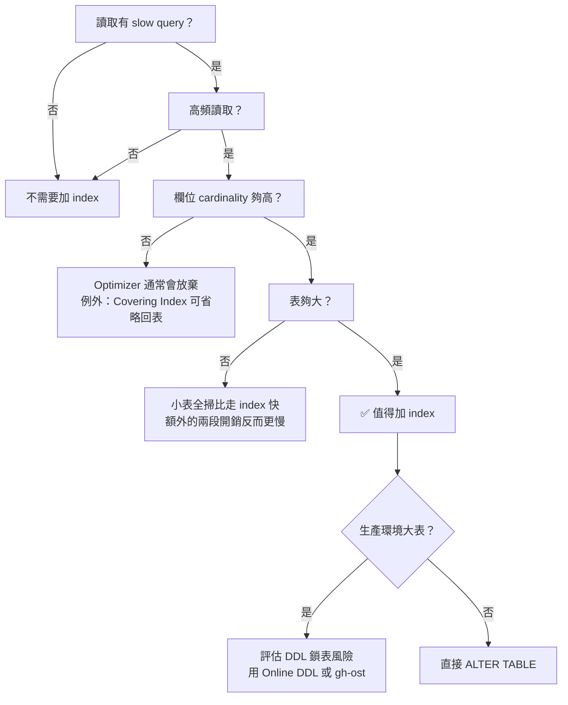
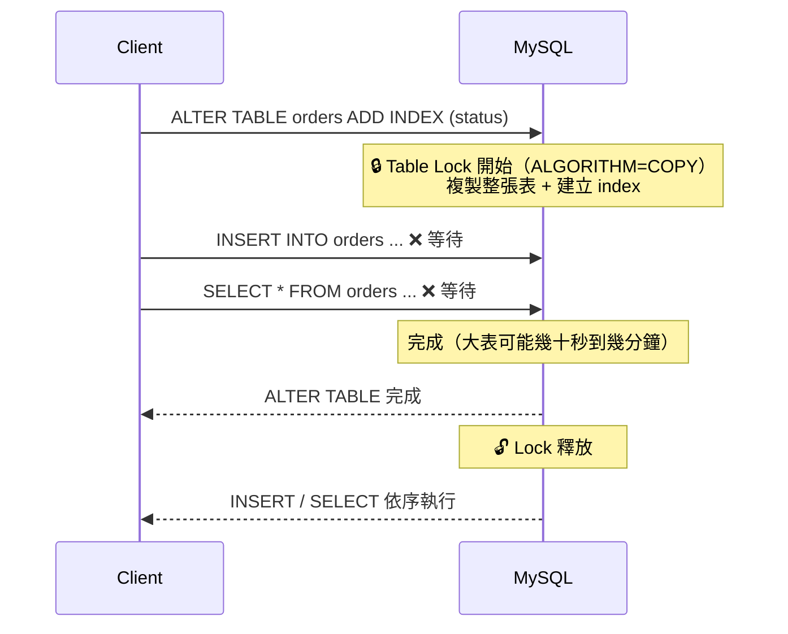
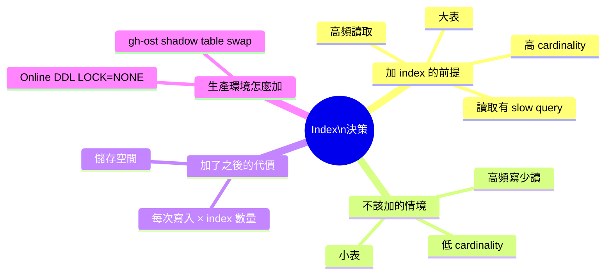

# Index 副作用與生產環境 DDL 鎖表風險

> 學習日期：2026-07-23
> 涵蓋概念：Index Trade-off、回表（Row Lookup）、何時不該加 Index、ALTER TABLE DDL Lock、Online DDL、gh-ost

---

## 整體決策架構



---

## Index 的核心 Trade-off

Index 是用**儲存空間**和**寫入效能**換**讀取速度**。

### 寫入成本

一張表有 N 個 index，每次 INSERT / UPDATE / DELETE：

```
1 次資料寫入
+ N 次 index 結構更新
= N+1 次寫入動作
```

index 越多，寫入越慢。**不是「讀快」就應該無限加 index**，每個 index 都是一筆持續的維護成本。

---

## 回表（Row Lookup）

Secondary Index 的葉節點存的是**主鍵值（PK）**，不是完整資料列。走 index 查詢其實是兩段路：


**回表的存在**解釋了為什麼小表全掃反而快——省掉了 index 查找和回表的兩段開銷。

> 例外：若查詢所需欄位全部在 index 內（Covering Index），可省略回表，此時即使 cardinality 低，Optimizer 也可能選擇走 index。

---

## 三種「不該加 Index」的情境

| 情境 | 原因 |
|------|------|
| 高頻寫入、幾乎不讀（如 log 收集表） | 每次寫入都要更新所有 index，寫入成本大於讀取收益 |
| 低 cardinality（如布林欄位、status 只有 2-3 個值） | Optimizer 估算走 index 再回表的成本 > 全表掃描，主動放棄 |
| 小表（幾十到幾百筆資料） | 全表掃描本來就快，index 查找 + 回表反而是多餘開銷 |

---

## 生產環境的隱性風險：DDL Lock

### MySQL 5.5 以前：ALGORITHM=COPY，全程鎖表

舊版 MySQL（5.5 以前）的 `ALTER TABLE ADD INDEX` 使用 `ALGORITHM=COPY`：複製整張表到新結構，全程持有表鎖，所有讀寫阻塞。



大表鎖幾十秒：**所有寫入 timeout、queue 爆掉、服務中斷**。

### MySQL 5.6+：Online DDL 是預設行為

MySQL 5.6 起，`ADD INDEX` 的預設行為已是 Online DDL（`ALGORITHM=INPLACE, LOCK=NONE`）——大多數情況下讀寫可以繼續，不需要額外指定參數：

```sql
-- MySQL 5.6+ 預設就是 Online DDL，大多數情況不鎖表
ALTER TABLE orders ADD INDEX (status);
```

但仍有兩個殘留風險：

**風險一：row log（online alter log）爆掉**

建 index 期間，新寫入暫存在 **online alter log（row log）** 中，建完後合併進新 index 結構。log 空間受 `innodb_online_alter_log_max_size` 控制（預設 128MB）。若這段時間寫入量極大、log 耗盡，ALTER TABLE 會失敗並回滾。

**風險二：Metadata Lock（MDL）短暫阻塞**

Online DDL 在**開始和結束的瞬間**需取得 MDL（Metadata Lock）。若此時有長事務尚未結束，MDL 取不到，後面所有讀寫請求都會排隊等待——即使主體的 index 建立是不鎖表的，這個短暫的 MDL 競爭仍可能造成阻塞。

### gh-ost：更安全的選擇（超大表推薦）

GitHub 開源工具，原理是建 shadow table 再做原子 swap：


複製階段完全不鎖表；**cut-over（swap）瞬間仍需短暫鎖（通常 < 1 秒）**。

使用前提：MySQL `binlog_format = ROW`。

---

## 快速記憶脈絡



---

## 學習過程的關鍵卡點

**卡點一：以為「讀寫」都會更新 index**

**原本以為**：每次「讀寫」都要更新 index 結構。

**實際上**：只有**寫入**（INSERT / UPDATE / DELETE）才需要更新 index；讀取只是利用 index 加速查找，不會修改它。

搞清楚這一點才能準確估算維護成本——是「每次寫入 × index 數量」，跟讀取頻率無關。

---

**卡點二：以為「加 index」只是下一道 SQL 的事**

**原本以為**：index 的副作用只有長期的寫入變慢和儲存空間，`ALTER TABLE` 就是一個很快執行完的指令。

**實際上**：MySQL 5.5 以前，`ALTER TABLE ADD INDEX` 全程鎖表，大表可能鎖幾十秒。MySQL 5.6+ 雖然預設改用 Online DDL 不鎖表，但仍有兩個殘留風險：row log 若在高寫入時耗盡會讓 DDL 回滾；MDL 的取得在 DDL 開始和結束瞬間可能因長事務而阻塞所有後續讀寫。

**加 index 有兩層成本**，缺一不能忽略：
1. **當下**：DDL 執行期間的鎖表或 MDL 阻塞風險
2. **長期**：每次寫入的 index 維護開銷
