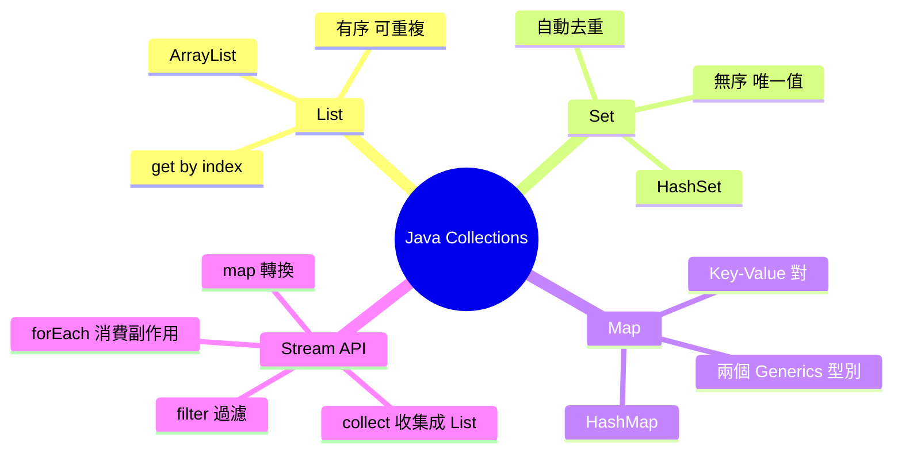
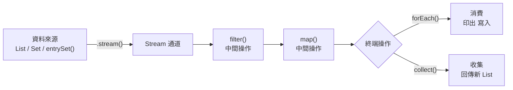
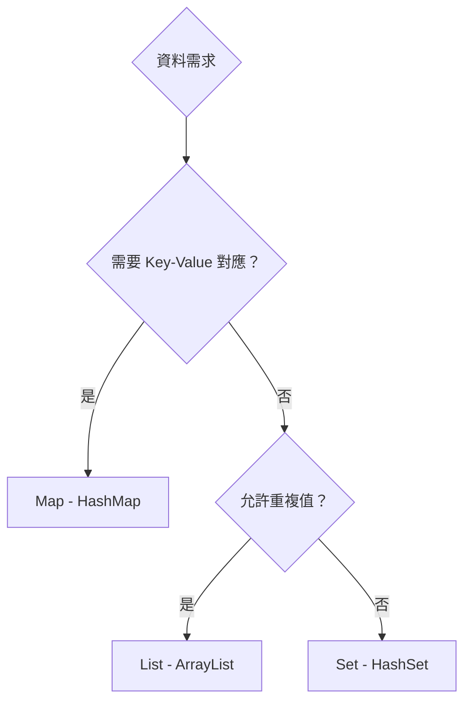

# Java Collections 與 Stream API：List、Map、Set 與 Pipeline 思維

> 學習日期：2026-07-15  
> 涵蓋概念：List、Map、Set、Generics、for-each、Stream API、命令式 vs 宣告式、Lazy Evaluation

---

## 整體架構



---

## 命令式 vs 宣告式

操作集合有兩種思維方式，這是理解 Stream API 的關鍵前提：

| 風格 | 英文 | 你在告訴電腦 |
|------|------|------------|
| 命令式 | Imperative | **怎麼做**：loop → if → push，一步一步指揮 |
| 宣告式 | Declarative | **要什麼**：我要 age > 18 的，你自己去跑 |

```java
// 命令式：手動指揮每一步
List<String> results = new ArrayList<>();
for (String name : names) {
    if (name.length() > 3) {
        results.add(name);
    }
}

// 宣告式：描述意圖，Stream 去執行
List<String> results = names.stream()
    .filter(name -> name.length() > 3)
    .collect(Collectors.toList());
```

對照 Laravel：`collect()->filter()->map()` 就是宣告式風格，和 Java Stream API 背後的思維一模一樣。

---

## List

### 宣告與操作

```java
List<String> names = new ArrayList<>();
names.add("Alice");
names.add("Bob");
names.add("Charlie");
```

### Generics（泛型）

`<String>` 告訴編譯器「這個 List 只能放 String」。

**為什麼要宣告元素型別**：沒有 Generics 的話，List 可以混放任何東西，取出時才發現型別不對——這是 **runtime crash**。有了 Generics，型別錯誤在 **compile time** 就被擋下來，程式根本跑不起來。

比較：PHP array 可以混放任何型別，後果在 runtime 才爆；Java 把這件事提前到編譯階段檢查。

### for-each 語法

```java
for (String name : names) {
    System.out.println(name);
}
```

公式：`for (型別 變數名 : 集合) { }`

對照 Python `for name in names`——概念相同，Java 多了型別宣告，用 `:` 不用 `in`。

---

## Stream API

Stream 是一條**資料加工管道（pipeline）**，讓你用宣告式方式串接操作。



### 兩種操作類型

| 類型 | 方法 | 說明 |
|------|------|------|
| **Intermediate（中間）** | `filter()` | 過濾，留下符合條件的元素，回傳 Stream |
| **Intermediate（中間）** | `map()` | 轉換，每個元素一進一出，回傳 Stream |
| **Terminal（終端）** | `forEach()` | 消費，做副作用（印出、寫入），不回傳值，Stream 結束 |
| **Terminal（終端）** | `collect()` | 收集，把 Stream 轉成 List 等集合，Stream 結束 |

### 完整範例：過濾 + 轉換 + 收集

```java
List<Integer> numbers = List.of(1, 2, 3, 4, 5, 6, 7, 8);

List<Integer> result = numbers.stream()
    .filter(n -> n % 2 == 0)           // 留偶數
    .map(n -> n * 2)                    // 每個乘以 2
    .collect(Collectors.toList());      // 收成新 List
// result = [4, 8, 12, 16]
```

### 過濾 + 轉換 + 印出

```java
List<String> names = List.of("Alice", "Bob", "Charlie", "Al");

names.stream()
    .filter(name -> name.length() > 3)
    .map(name -> name.toUpperCase())
    .forEach(System.out::println);
// 印出：
// ALICE
// CHARLIE
```

### Lazy Evaluation（惰性求值）

Stream 不會在每個中間操作後先把全部元素跑完，而是每個元素「**一條龍跑完整條 pipeline**」。

```
元素 1 → filter → map → collect
元素 2 → filter → map → collect
元素 3 → filter → (不過) → 跳過
...
```

所以 `filter + map + collect` 的時間複雜度仍然是 **O(n)**，且不需要建立中間集合，記憶體效率也更高。只有 terminal operation 觸發時，資料才真正開始流動。

---

## Map

### 宣告與操作

```java
Map<String, Integer> scores = new HashMap<>();
scores.put("Alice", 90);
scores.put("Bob", 75);
```

Generics 要宣告**兩個型別**：`<Key型別, Value型別>`。對照 PHP `["Alice" => 90, "Bob" => 75]`。

### 迭代方式

```java
// for-each 版本：用 Map.Entry 拿 key-value pair
for (Map.Entry<String, Integer> entry : scores.entrySet()) {
    System.out.println(entry.getKey() + ": " + entry.getValue());
}

// 純迭代：用 Iterable 的 forEach，不需要開 Stream
scores.entrySet().forEach(entry ->
    System.out.println(entry.getKey() + ": " + entry.getValue()));

// 需要 filter / map / collect 時才開 Stream
scores.entrySet().stream()
    .filter(entry -> entry.getValue() >= 80)
    .forEach(entry -> System.out.println(entry.getKey() + ": " + entry.getValue()));
```

`entrySet()` 把 Map 轉成一組 `Map.Entry` 的集合，每個 Entry 有 `getKey()` 和 `getValue()`。

> 注意：`Map` 本身沒有 `.stream()` 方法，必須先轉成 `entrySet()`、`keySet()` 或 `values()` 再接 `.stream()`。

---

## Set

```java
Set<String> visitors = new HashSet<>();
visitors.add("Alice");
visitors.add("Bob");
visitors.add("Alice"); // 重複，自動忽略

System.out.println(visitors.size()); // 2，不是 3
```

**特性**：
- 自動去重——不需要像 PHP 那樣手動呼叫 `array_unique()`
- 無順序——沒有 index，不能用 `get(0)`
- 使用場景：只關心「這個值有沒有在裡面」，不在乎順序

**有序的 Set 替代實作**：
- `LinkedHashSet`：保留**插入順序**
- `TreeSet`：按**自然排序**（字母、數字大小）排列

---

## 三種集合選型



| 特性 | List | Set | Map |
|------|------|-----|-----|
| 有順序 | ✅ | ❌ ¹ | ❌ ² |
| 可重複 | ✅ | ❌ | Key 不重複 |
| 取值方式 | `get(index)` | 無法 by index | `get(key)` |
| 常用實作 | `ArrayList` | `HashSet` | `HashMap` |
| 有序替代 | - | `LinkedHashSet` / `TreeSet` | `LinkedHashMap` / `TreeMap` |
| PHP 對應 | 數字 index array | - | associative array |
| Generics | `<T>` | `<T>` | `<K, V>` |

¹ `HashSet` 不保序；`LinkedHashSet` 保留插入順序，`TreeSet` 按自然排序。  
² `HashMap` 不保序；`LinkedHashMap` 保留插入順序，`TreeMap` 按 key 排序。

---

## 學習過程的關鍵卡點

**卡點一：Imperative vs Declarative 搞反了**

**原本以為**：手動 for loop 是 declarative，`collect()->filter()` 是 imperative。

**實際上**：Imperative 字根是「命令」——for loop 就是在一步一步下命令給電腦；filter() 是宣告「我要什麼」，不指揮電腦怎麼跑。記法：「命令式 = 指揮官，宣告式 = 點菜客人」。

---

**卡點二：forEach 被誤用在轉換步驟**

**原本以為**：轉換邏輯可以放在 `forEach` 裡，如 `.forEach(n -> n * 2)`，或在 `forEach` 裡呼叫 `.toUpperCase()`。

**實際上**：`forEach` 是 terminal operation，執行後 Stream 就終止，不回傳任何東西，後面沒辦法再接 `.collect()`。轉換要用 `map()`，最後才用 `forEach` 印出或 `collect` 收集。

記法：**map = 工廠（一進一出）；forEach = 回收站（消費掉，不吐東西）**

---

**卡點三：偶數判斷寫成 `% 2 == true`**

**原本以為**：`%` 的結果可以和 `true` 比較。

**實際上**：`%` 回傳的是整數餘數，偶數的餘數是 `0`，應該是 `n % 2 == 0`。`true` 是 boolean，型別不同，這在 Java 的強型別環境下會直接報錯。

---

**卡點四：多個 Stream 步驟以為是 O(n²)**

**原本以為**：`filter` 跑一遍 n 個、`map` 再跑一遍 n 個，所以總共 O(2n) 甚至 O(n²)。

**實際上**：Lazy evaluation 讓每個元素一條龍跑完整條 pipeline，不是每個步驟各掃一遍。三個步驟加起來仍然是 **O(n)**。
