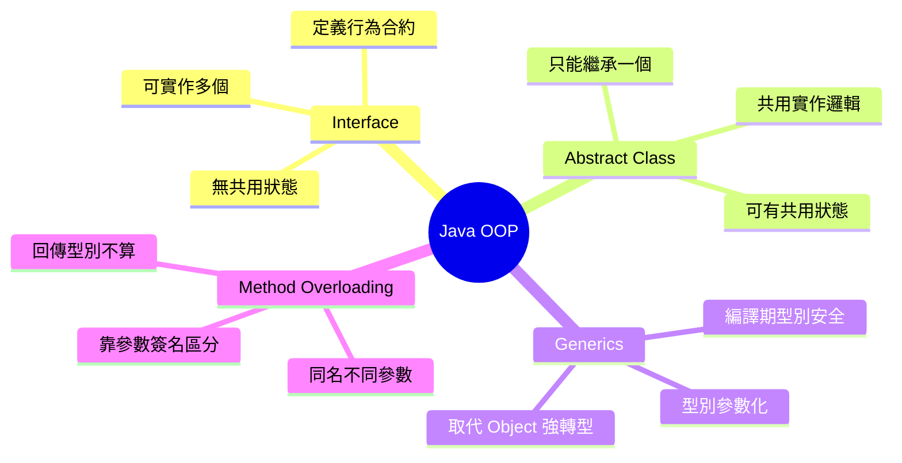
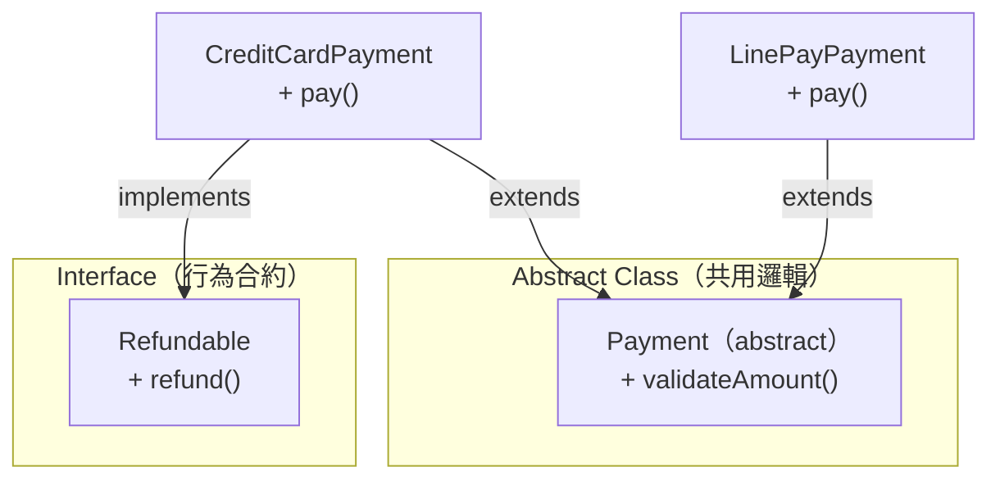
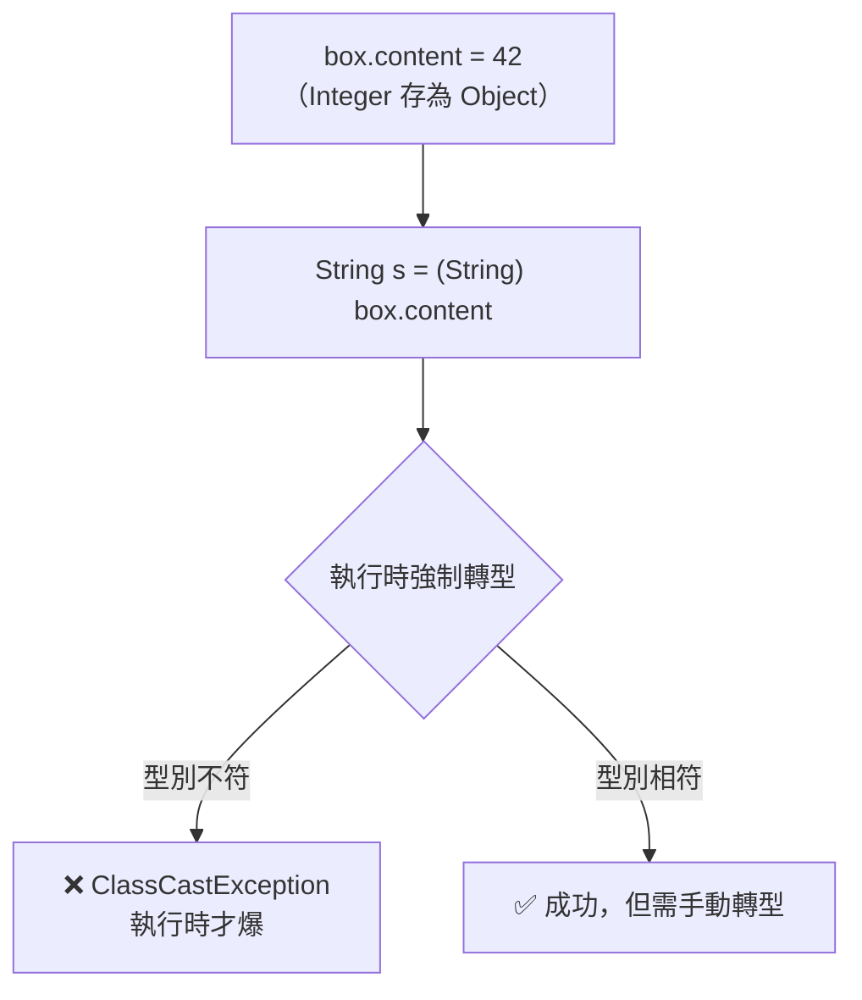
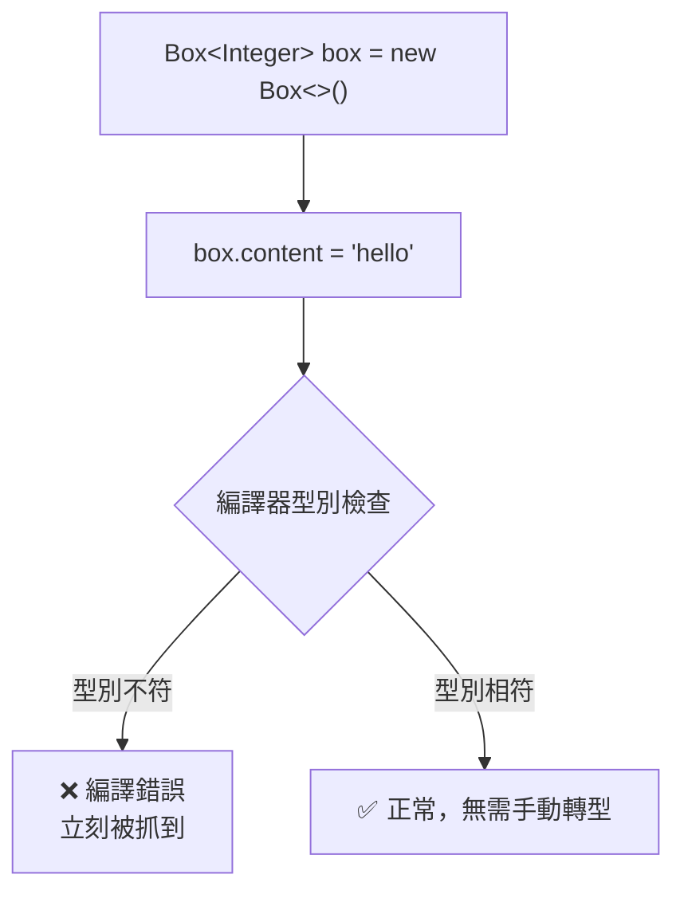
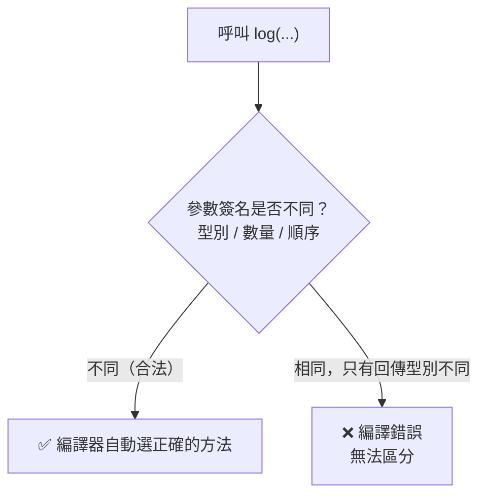

# Java OOP 核心：Interface、Abstract Class、Generics、Method Overloading

> 學習日期：2026-07-15
> 涵蓋概念：Interface、Abstract Class、Generics、Method Overloading、Java 單一繼承限制

---

## 整體概念關係



---

## Interface vs Abstract Class

### 機制差異

| 維度 | Interface | Abstract Class |
|------|-----------|----------------|
| 有無實作 | 預設無（Java 8 後可有 `default` / `static` 方法；`static` 方法只能透過介面名稱呼叫，不被實作類別繼承） | 可有具體實作，也可有 `abstract` 方法（留給子類別強制實作） |
| 一個類別能掛幾個 | 多個（`implements A, B, C`） | 只能一個（`extends`） |
| 設計意圖 | 「能做什麼」（能力/合約） | 「是什麼」（共用狀態與邏輯） |

### 典型設計模式：兩者搭配使用



`CreditCardPayment` 同時 `extends Payment`（拿到 `validateAmount` 共用邏輯）又 `implements Refundable`（掛上退款能力）。LinePayPayment 只繼承共用邏輯，不掛退款。

```java
abstract class Payment {
    void validateAmount(int amount) { /* 共用驗證邏輯；實務金額建議用 BigDecimal 避免浮點誤差 */ }
    abstract void pay();
}

interface Refundable {
    void refund();
}

class CreditCardPayment extends Payment implements Refundable {
    public void pay() { /* 信用卡付款 */ }
    public void refund() { /* 信用卡退款 */ }
}

class LinePayPayment extends Payment {
    public void pay() { /* LINE Pay 付款 */ }
    // 不實作 Refundable，不支援退款
}
```

### 選擇原則

- 有**共用的實作邏輯或狀態** → Abstract Class
- 需要**彈性掛上多種能力**，且各類別實作細節完全不同 → Interface
- 需要**兩者兼顧**時，兩個一起用

---

## Generics（泛型）

### 問題：用 Object 裝任何東西



問題根源：`Object` 能裝任何東西，但取出來必須手動強制轉型，型別錯誤要等到**執行時**才爆。

### 解法：Generics 把型別提前鎖定



```java
// 沒有 Generics（危險）
class Box {
    Object content;
}
Box box = new Box();
box.content = 42;
String s = (String) box.content; // 編譯過，執行時 ClassCastException

// 有 Generics（安全）
class Box<T> {
    T content;
}
Box<Integer> box = new Box<>();
box.content = "hello"; // 編譯錯誤，立刻被抓到
```

**Generics 的核心價值**：把型別錯誤從「執行時爆炸」提前到「編譯時就被擋下」——這是 Java 靜態型別系統最大的安全網。

> **進階注意：型別擦除（Type Erasure）**
> Generics 的型別安全保證發生在**編譯期**。執行期因型別擦除，`Box<Integer>` 和 `Box<String>` 在 JVM 裡都只是 `Box`，無法在執行時用 `instanceof` 或反射取得泛型參數型別。初學可暫時略過，但遇到反射相關問題時要記得這個限制。

---

## Method Overloading（方法多載）

### 什麼是 Overloading

同一個類別裡，允許多個**同名方法**共存，只要**參數簽名**（型別、數量、順序）不同即可。

```java
class Logger {
    void log(String message) { ... }              // 只傳訊息
    void log(String message, String level) { ... } // 訊息 + 等級
    void log(int code) { ... }                    // 傳錯誤代碼
}
```

### Java 如何區分同名方法



**關鍵規則**：Java **只用參數簽名**來區分同名方法，回傳型別不計入判斷。

```java
// ✅ 合法：參數型別不同
String log(String message) { ... }
String log(int code) { ... }

// ❌ 非法：參數完全相同，只有回傳型別不同
String log(String message) { ... }
void   log(String message) { ... } // 呼叫 log("hello") 時編譯器無從選擇
```

**為什麼回傳型別不算**：呼叫端寫 `log("hello")` 時，編譯器只看得到傳入的參數，看不到呼叫端期望拿回什麼型別，所以沒辦法靠回傳型別來選方法。

### Overloading vs Overriding

| | Overloading（多載） | Overriding（覆寫） |
|--|------------------|--------------------|
| 發生在 | 同一個類別內 | 子類別覆蓋父類別 |
| 方法名 | 相同 | 相同 |
| 參數 | 不同 | 相同 |
| 目的 | API 乾淨，不用記一堆名字 | 多型，子類別有自己的行為；加 `@Override` 讓編譯器驗證覆寫是否成立 |

---

## 學習過程的關鍵卡點

**卡點 1：Interface 和 Abstract Class 以為只能二選一**

**原本以為**：一個類別只能用 interface 或 abstract class，必須選一個。

**實際上**：Java 允許同時 `extends` 一個 abstract class **又** `implements` 多個 interface。這兩件事不衝突，而且是很常見的設計模式——abstract class 處理共用邏輯，interface 補充彈性能力。

記住這個組合，就能理解為什麼 Java 的「單一繼承」限制其實沒有想像中嚴格。

---

**卡點 2：Generics 不知道 Object 方案在哪裡斷**

**原本以為**：用 `Object` 裝任何型別應該沒問題，PHP 的 union type 也在做類似的事。

**實際上**：`Object` 確實能裝任何東西，但取出來要強制轉型，轉錯了是**執行時**才爆的 `ClassCastException`——程式在客戶端跑到那行才炸。Generics 把這個錯誤提前到**編譯期**，寫錯直接就報，不會等到上線。

PHP union type（`int|string`）解決的是「這個參數接受哪幾種型別」；Generics 解決的是「這個容器裡放的是什麼型別，**編譯期**全程保持一致」，是不同問題。（執行期因型別擦除，型別資訊不保留，詳見上方 Generics 章節。）

---

**卡點 3：以為回傳型別不同可以區分 Overloading**

**原本以為**：`String log()` 和 `void log()` 參數都是空的，但回傳型別不同，Java 應該能分辨。

**實際上**：呼叫端寫 `log("hello")` 時，編譯器只看得到傳進去的參數，根本不知道呼叫方打算拿回什麼型別，所以回傳型別不算區分條件。參數簽名一樣就是衝突，不管回傳型別怎麼設。
