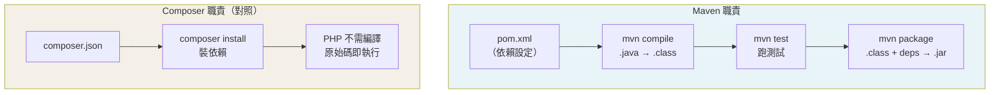
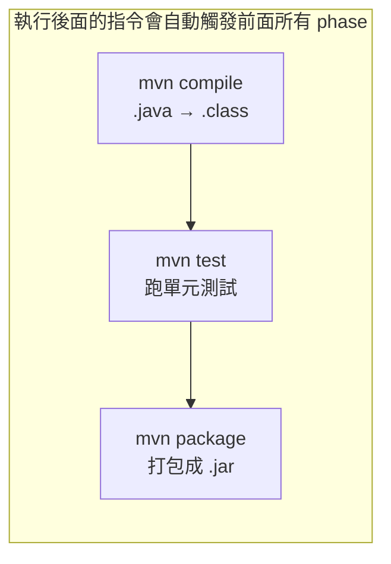
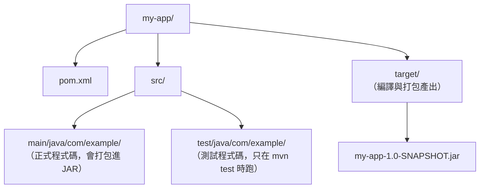

# Java 建置環境：Maven 的依賴、編譯、打包與語法總檢核

> 學習日期：2026-07-16
> 涵蓋概念：Maven、pom.xml、Build Lifecycle、JAR、Java 專案結構、interface、class、List、Stream、Lambda

---

## 整體概念架構



---

## Maven vs Composer：為什麼 Java 需要更多？

PHP 的編譯由 runtime 自動完成（Zend Engine 即時將原始碼編譯成 opcode，OPcache 會快取這份 opcode），開發者不需要手動執行編譯步驟，因此 Composer 只需管依賴。

Java 的 JVM 執行的不是 `.java`，而是編譯後的 **bytecode（`.class` 檔）**，所以需要一個工具管理整個 build 流程。

| 功能 | Composer | Maven |
|------|----------|-------|
| 讀 config 裝依賴 | ✅ `composer.json` | ✅ `pom.xml` |
| 區分開發/正式依賴 | ✅ `require-dev` | ✅ `<scope>test</scope>` |
| 編譯原始碼 | ❌ 不需要 | ✅ `.java` → `.class` |
| 打包產出物 | ❌ 不需要 | ✅ `.class` + 依賴 → `.jar` |

**JAR 是什麼**：Java Archive，本質是一個 ZIP，裡面放編譯好的 `.class` 和 metadata。打包不是再編譯一次，是把已編譯的東西**集合**在一起。

---

## Maven Build Lifecycle



下 `mvn package` 時，Maven 會自動依序執行 `compile → test → package`，不需要手動一個一個跑。（實際 lifecycle 有更多中間 phase，如 `validate`、`process-resources` 等，此處列出最常感知的三個。）

---

## pom.xml 結構

```xml
<project>
  <modelVersion>4.0.0</modelVersion>
  <groupId>com.example</groupId>      <!-- 組織 ID -->
  <artifactId>my-app</artifactId>     <!-- 專案名稱 -->
  <version>1.0-SNAPSHOT</version>     <!-- SNAPSHOT = 開發中版本 -->

  <properties>
    <maven.compiler.source>11</maven.compiler.source>
    <maven.compiler.target>11</maven.compiler.target>
  </properties>

  <dependencies>
    <dependency>
      <groupId>junit</groupId>
      <artifactId>junit</artifactId>
      <version>4.11</version>
      <scope>test</scope>   <!-- 只在測試時用，不打包進最終 JAR -->
    </dependency>
  </dependencies>
</project>
```

`<scope>test</scope>` 對應 Composer 的 `require-dev`——只在開發/測試時需要，不進生產環境。Maven 的 `scope` 有多種值（`compile` 預設、`provided`、`runtime`、`test` 等），此處只示範最常用的 `test`。

---

## Maven 專案目錄結構



`main/` 和 `test/` 的分離，對應 `scope` 概念：目錄本身就是隔離邊界。

---

## 常用 Maven 指令

| 指令 | 做什麼 |
|------|--------|
| `mvn compile` | 編譯 `src/main` 的 `.java` → `.class` |
| `mvn test` | 編譯 + 跑 `src/test` 的測試 |
| `mvn package` | compile → test → 打包成 `.jar` |
| `mvn clean` | 刪除 `target/` 目錄（清除上次 build 產出） |

---

## Java 語法實作：不查文件的總檢核

### Interface 宣告

Interface 只宣告「契約」，不寫實作 body：

```java
public interface Shape {
    double area();   // 只有 signature + 分號，沒有 {}
}
```

（Java 8 起 interface 可以有 `default` method 附帶預設實作，Java 9 後還可以有 `private` method。本筆記以基本用法為主，不展開此特性。）

### Class 實作 Interface

```java
public class Circle implements Shape {
    private double radius;   // 先宣告 field

    public Circle(double radius) {
        this.radius = radius;   // constructor：class 名稱當方法名，無回傳型別
    }

    @Override
    public double area() {
        return this.radius * this.radius * Math.PI;   // r²，不是 r*2
    }
}
```

### List + Stream + Lambda

```java
import java.util.ArrayList;
import java.util.List;

List<Shape> shapes = new ArrayList<>();
shapes.add(new Circle(2));
shapes.add(new Circle(4));

// 單純 iterate 用 forEach 即可，不需要 .stream()
shapes.forEach(shape -> System.out.println(shape.area()));

// 若需要 filter/map 等操作才接 .stream()
shapes.stream()
      .map(Shape::area)
      .forEach(System.out::println);
```

**Lambda 格式**：`element -> 做什麼`，是匿名函式的簡寫。

---

## 學習過程的關鍵卡點

**卡點 1：以為 compile 和 package 是兩次編譯**

**原本以為**：`.java → .class` 是一次編譯，`.class → .jar` 是第二次編譯。

**實際上**：打包（package）不是編譯，是把已經編譯好的 `.class` 檔和依賴 JAR **壓縮集合**在一起，類似 Docker image 把檔案打包，不會重新解釋原始碼。

---

**卡點 2：Constructor 和 field 宣告的順序**

**原本以為**：可以直接在 constructor 裡 `this.radius = radius`。

**實際上**：Java 的 field 必須先在 class body 宣告（`private double radius;`），constructor 才能賦值。而且 Java 用 `this.field`，不是 PHP 的 `$this->field`。

---

**卡點 3：r² 的寫法**

**原本以為**：`r²` 是「乘以 2」，寫成 `radius * Math.PI * 2`。

**實際上**：`r²` 是「r 的平方」，即 `r * r`。`* 2` 是乘二，`* radius` 才是乘以自己（平方）。正確寫法：`radius * radius * Math.PI`。

---

**卡點 4：Java 多版本並存問題**

Mac 上同時裝了系統 Java 1.8 和 Homebrew Java 26，`java` 指令預設用舊版。因為 `pom.xml` 設定了 `maven.compiler.target=11`，Maven 產出的是 class file version 55.0（Java 11 bytecode）——是 pom 設定決定 target bytecode，不是 JVM 版本本身。用系統 Java 1.8（最高支援 class file version 52.0）執行就會噴 `UnsupportedClassVersionError`。

解法：在 `~/.zshrc` 設定 `JAVA_HOME` 指向 Homebrew 的 Java，確保 `java` 和 `mvn` 用同一個版本。使用 `brew --prefix` 避免硬寫版本號，升級後仍有效：

```bash
export JAVA_HOME=$(brew --prefix openjdk)/libexec/openjdk.jdk/Contents/Home
export PATH=$JAVA_HOME/bin:$PATH
```
