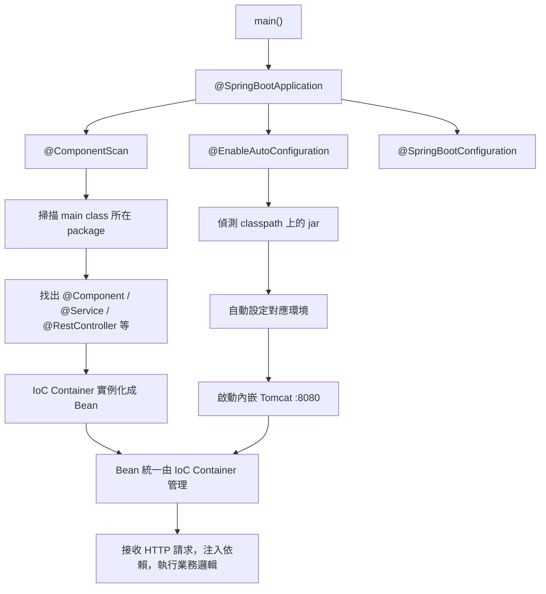
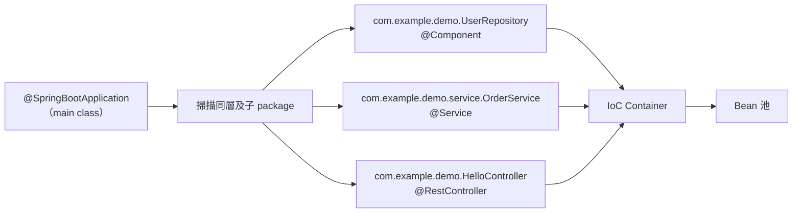
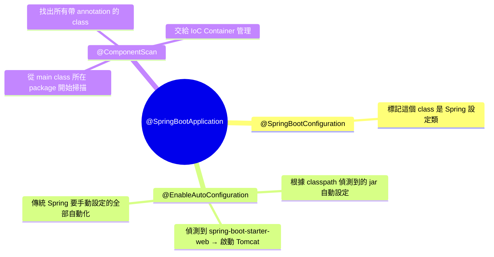
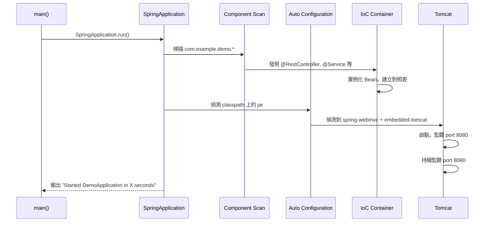

# Spring Boot 心智模型：IoC Container、DI 與啟動流程

> 學習日期：2026-07-17
> 涵蓋概念：IoC（Inversion of Control）、DI（Dependency Injection）、IoC Container、Bean、Component Scan、@Autowired、@Service、@Component、@SpringBootApplication、Auto Configuration、內嵌 Tomcat

---

## 整體架構：Spring Boot 啟動全貌



---

## IoC：控制反轉

**IoC（Inversion of Control）** 是一個設計原則，描述「誰負責建立物件」這件事的控制權轉移。

### 傳統寫法：控制權在呼叫方

```java
// 呼叫方自己決定要 new 什麼
UserRepository repo = new UserRepository();
```

問題：呼叫方跟實作緊耦合，測試困難，依賴難以替換。

### IoC 寫法：控制權交給 Container

```java
@Service
public class OrderService {
    private final UserRepository userRepository;

    // Container 幫你決定注入哪個實作
    public OrderService(UserRepository userRepository) {
        this.userRepository = userRepository;
    }
}
```

呼叫方只宣告「我需要什麼」，IoC Container 負責「準備好塞進來」。

---

## Bean：被 IoC Container 管理的物件

在 Spring 裡，被 IoC Container 接管、建立、管理的物件統稱為 **Bean**。

一個 class 要成為 Bean，需要加上對應的 annotation：

| Annotation | 語意 | 典型用途 |
|---|---|---|
| `@Component` | 通用元件 | 工具類、無明確分層的 class |
| `@Service` | 業務邏輯層 | Service class |
| `@Repository` | 資料存取層 | DAO / Repository class |
| `@RestController` | HTTP 控制器（@Controller + @ResponseBody） | REST API endpoint |

前三者功能幾乎相同，差別在語意與 Spring 可能的額外處理（如 `@Repository` 的例外轉換）。`@RestController` 則不同——它帶有 `@ResponseBody`，使所有方法回傳值直接序列化為 HTTP response body，是行為差異而非純語意標記。

---

## Component Scan：Spring 如何發現 Bean



Spring Boot 預設從 **main class 所在的 package** 開始掃描，往下涵蓋所有 sub-package。
這就是為什麼 main class 要放在 package 的最頂層。

---

## DI：依賴注入的兩種寫法

### 建構子注入（推薦）

```java
@Service
public class OrderService {
    private final UserRepository userRepository;

    public OrderService(UserRepository userRepository) {
        this.userRepository = userRepository;
    }
}
```

優點：依賴明確、可用 `final`、不依賴 Container 就能測試。
Spring Boot 若 class 只有一個建構子，**不需要任何 annotation，自動注入**（Spring 4.3+ 支援；Spring Boot 2.x 以上預設符合此條件）。

### @Autowired Field 注入

```java
@Service
public class OrderService {

    @Autowired
    private UserRepository userRepository;
}
```

告訴 IoC Container：這個 field 不用我處理，你找到對應的 Bean 塞進來。
較不推薦：依賴隱藏在 field 裡，測試時必須依賴 Container。

---

## @SpringBootApplication 的三個身份



---

## Spring Boot vs 傳統 Spring

| 項目 | 傳統 Spring | Spring Boot |
|---|---|---|
| Tomcat | 外部安裝，手動設定 | 內嵌，自動啟動 |
| 打包格式 | WAR（部署到外部 Tomcat）| JAR（自帶 Tomcat 直接跑）|
| 設定方式 | XML 或大量 `@Configuration` | `@EnableAutoConfiguration` 自動搞定 |
| Component Scan | 需手動指定 | `@SpringBootApplication` 預設啟用 |

Spring Boot 的核心語法（`@Component`、`@Autowired`、`@GetMapping` 等）與傳統 Spring **完全相同**，差別只在設定與啟動的自動化程度。

---

## 對照 Laravel：Service Container vs IoC Container

| 概念 | Laravel | Spring Boot |
|---|---|---|
| 管物件的核心 | Service Container | IoC Container |
| 登記/標記方式 | Service Provider `bind()` / `singleton()` | `@Component` / `@Service` 等 annotation |
| 管理的物件 | （無專有名詞） | **Bean** |
| 物件生命週期 | `bind()`→每次新建；`singleton()`→單例 | 預設 singleton（可透過 `@Scope` 調整）|
| 注入方式 | 建構子 type-hint | 建構子注入 or `@Autowired` |
| 自動掃描 | 無（需手動 bind） | Component Scan 自動掃描 |
| 自動設定環境 | 無 | `@EnableAutoConfiguration` |

**核心差異**：Laravel 需要你在 Service Provider 明確 `bind()` 每個對應關係；Spring 只要加上 annotation，Container 自動掃描接管。

---

## 最小 Spring Boot App 的啟動流程



---

## 學習過程的關鍵卡點

**卡點一：IoC 以為是縮寫**

**原本以為**：IoC 是「Interface of Container」的縮寫。

**實際上**：IoC 是 **Inversion of Control（控制反轉）**，描述的是控制權轉移的設計概念——物件的建立控制權從「呼叫方自己 new」移交給「Container 統一管理」。

---

**卡點二：Service Provider 跟 Service Container 混為一談**

**原本以為**：Laravel 的 Service Provider 就是負責注入物件的東西。

**實際上**：Service Provider 只是在 app 啟動時做「登記」工作（告訴 Container 誰對應誰）；真正負責「查表、建物件、注入」的是 **Service Container**。Spring 的 `@Component` annotation 則取代了手動 `bind()` 的步驟，讓 Container 自動掃描接管。

---

**卡點三：不知道 Tomcat 是什麼**

**原本以為**：不清楚 Tomcat 的角色。

**實際上**：Tomcat 是 Java Web Server，功能類似 Laravel 架構中的 Nginx / Apache——負責接收 HTTP 請求再交給應用程式處理。傳統 Spring 需要外部安裝 Tomcat 並部署 WAR 檔；Spring Boot 將 Tomcat **內嵌在 JAR 檔裡**，執行一個指令就全部啟動。
