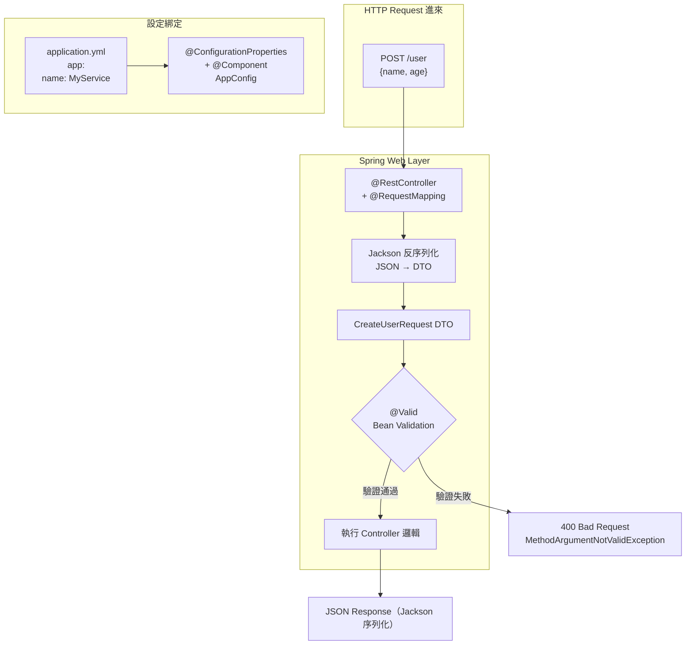
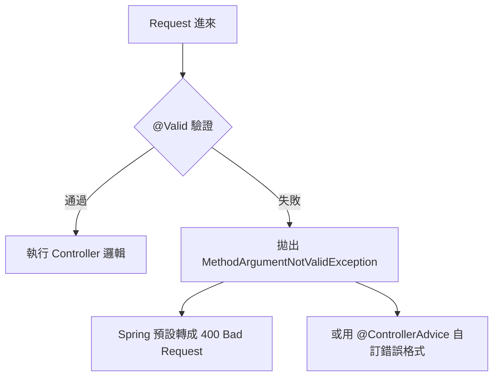
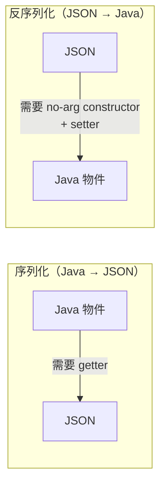

# Spring Boot Web Layer 基礎：Controller、Config 與 Bean Validation

> 學習日期：2026-07-18
> 涵蓋概念：@RestController、@RequestMapping、application.yml、@ConfigurationProperties、@Valid、@NotNull、Jackson 序列化

---

## 整體架構圖



---

## @RestController

### 它做了什麼

`@RestController` 是 Spring MVC 提供的複合 annotation：

```
@RestController = @Controller + @ResponseBody
```

- `@Controller`：繼承自 `@Component`，讓 Spring 掃描這個 class 成為 Bean，同時告訴 `DispatcherServlet`「這是一個 MVC Handler」，使 Handler Mapping 能把 URL 路由到它
- `@ResponseBody`：告訴 Spring 不要走 view 渲染（不找 HTML 模板），直接把 return 值寫進 HTTP response body

這意味著你**不需要手動把回傳值包成 JSON**——比較 Laravel 的做法：

| | Laravel | Spring Boot |
|---|---|---|
| 回傳 JSON | `return response()->json($data)` | `return data;`（直接回傳物件） |
| 序列化由誰做 | 開發者呼叫 | Jackson 自動處理 |

### Content Negotiation

Spring 透過 **content negotiation** 決定回應格式：看 request 的 **`Accept` header**（不是 `Content-Type`）。

```
Accept: application/json   → 回 JSON
Accept: application/xml    → 回 XML（需額外設定）
Accept: */*                → 預設 JSON（Jackson 內建）
```

`Content-Type` 描述的是**你送給 server 的 body 格式**，方向相反，不要混淆。

---

## @RequestMapping

### 與 @GetMapping 的關係

`@GetMapping`、`@PostMapping`、`@PutMapping`、`@DeleteMapping` 都是 `@RequestMapping` 的**語法糖**，鎖死了 HTTP method：

```java
// 這兩個等價
@GetMapping("/users")

@RequestMapping(value = "/users", method = RequestMethod.GET)
```

### Class 層級的 prefix

`@RequestMapping` 放在 class 上，效果是統一 URL prefix：

```java
@RestController
@RequestMapping("/api/users")
public class UserController {

    @GetMapping("/{id}")      // 完整路徑：/api/users/{id}
    public User getUser(@PathVariable Long id) { ... }

    @PostMapping("")          // 完整路徑：/api/users
    public User createUser(@Valid @RequestBody CreateUserRequest req) { ... }
}
```

改 prefix 只需動一個地方，不用逐一修改每個 method。

---

## application.yml 與 @ConfigurationProperties

### 兩種取設定值的方式

```yaml
# application.yml
app:
  name: MyService
  max-retries: 3
```

**方式一：`@Value`**——一個一個取，適合只需要少數幾個值時。但不支援 relaxed binding（`max-retries` 無法自動對應 `maxRetries`），也沒有 type-safe 保障：

```java
@Value("${app.name}")
private String name;
```

**方式二：`@ConfigurationProperties`**——整個 prefix 一次綁進一個 class，適合設定項目多時：

```java
@Component
@ConfigurationProperties(prefix = "app")
public class AppConfig {
    private String name;
    private int maxRetries;  // yml 的 max-retries 自動對應

    // 需要 getter/setter，Spring 才能注入值
    public String getName() { return name; }
    public void setName(String name) { this.name = name; }
    public int getMaxRetries() { return maxRetries; }
    public void setMaxRetries(int maxRetries) { this.maxRetries = maxRetries; }
}
```

**注意**：`@ConfigurationProperties` 本身不讓 Spring 認識這個 class，需要搭配 `@Component`（或在其他地方加 `@EnableConfigurationProperties(AppConfig.class)`）。

### kebab-case 自動對應 camelCase

yml 的 `max-retries` 會自動對應 Java 欄位 `maxRetries`，Spring 幫你做轉換。

---

## Bean Validation

### 宣告驗證規則

規則標在 **DTO 欄位**上：

```java
public class CreateUserRequest {
    @NotNull
    private String name;  // 注意：@NotNull 只擋 null，不擋空字串 ""
                          // 若要同時防空字串，改用 @NotBlank

    @NotNull
    private Integer age;

    // 需要 no-arg constructor + getter/setter，讓 Jackson 能反序列化
    public String getName() { return name; }
    public void setName(String name) { this.name = name; }
    public Integer getAge() { return age; }
    public void setAge(Integer age) { this.age = age; }
}
```

### 觸發驗證

在 Controller 方法的參數上加 `@Valid`：

```java
@PostMapping("")
public User createUser(@Valid @RequestBody CreateUserRequest request) {
    return new User(request.getName(), request.getAge());
}
```

### 驗證失敗的處理



### 對比 Laravel FormRequest

| | Laravel | Spring Boot |
|---|---|---|
| 規則定義在 | 獨立的 `FormRequest` class（`rules()` 方法） | DTO 欄位上的 annotation |
| 觸發方式 | Controller 方法參數 type hint `FormRequest` | `@Valid` |
| 驗證失敗 | 自動 redirect 或回 422 | 拋 `MethodArgumentNotValidException`，預設 400 |
| 宣告風格 | 兩者都是宣告式，Controller 不寫 if/else | 同左 |

---

## Jackson 序列化 / 反序列化規則

這個細節在動手時踩到，值得記下來：



- **序列化**：Jackson 透過 getter 讀欄位值。沒有 getter → 欄位不會出現在 JSON（回傳 `{}`）
- **反序列化**：Jackson 預設先用 no-arg constructor 建物件，再透過 setter 把 JSON key 的值塞進去。若欄位是 `public`、加了 `@JsonProperty`，或使用 Lombok `@Data`，則不一定需要明確的 setter

若想用有參數的 constructor，需要加 `@JsonCreator` + `@JsonProperty`：

```java
@JsonCreator
public CreateUserRequest(
    @JsonProperty("name") String name,
    @JsonProperty("age") Integer age
) { ... }
```

---

## 必要的 Maven 依賴

```xml
<!-- REST endpoint 能力：@RestController、@RequestBody、Jackson -->
<dependency>
    <groupId>org.springframework.boot</groupId>
    <artifactId>spring-boot-starter-web</artifactId>
</dependency>

<!-- Bean Validation：@Valid、@NotNull -->
<dependency>
    <groupId>org.springframework.boot</groupId>
    <artifactId>spring-boot-starter-validation</artifactId>
</dependency>
```

---

## 學習過程的關鍵卡點

**卡點一：Content-Type vs Accept header 方向搞反**

**原本以為**：Spring 看 `Content-Type` header 決定回傳 JSON 還是 XML。

**實際上**：`Content-Type` 描述「我送給你的 body 是什麼格式」（request body），`Accept` 描述「我希望你回給我什麼格式」（response format）。Spring 的 content negotiation 看的是 `Accept`，不是 `Content-Type`。

兩者方向相反，Laravel 的 `response()->json()` 封裝掉了這個細節，直接用 Spring 時才會碰到。

---

**卡點二：`@ConfigurationProperties` 需要搭配 `@Component`**

**原本以為**：標上 `@ConfigurationProperties` 就能被 Spring 管理。

**實際上**：`@ConfigurationProperties` 只負責「把 yml 的值綁進欄位」，不代表 Spring 會掃描這個 class。要讓 Spring 認識它，必須加 `@Component`（或用 `@EnableConfigurationProperties`）。

---

**卡點三：PHP 語法習慣污染 Java**

**原本以為**：欄位名稱和方法呼叫用 `$name`、`request->getName()` 是對的。

**實際上**：Java 變數命名不用 `$` 前綴（`$` 在 Java 合法但慣例上不用）；方法呼叫用 `.` 不用 `->`（`->` 在 Java 是 lambda 語法）。

Laravel/PHP 背景切換 Java 時最容易踩的語法陷阱。
