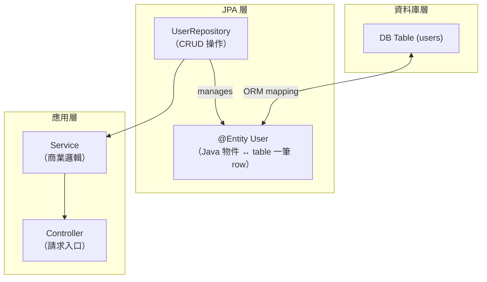
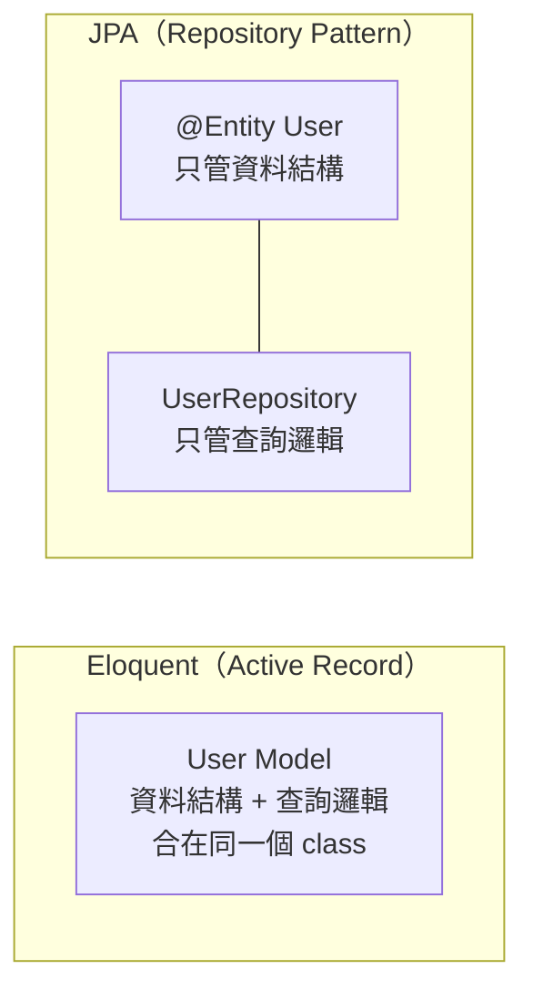
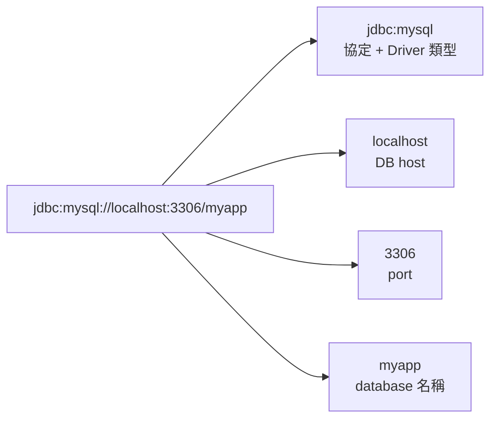
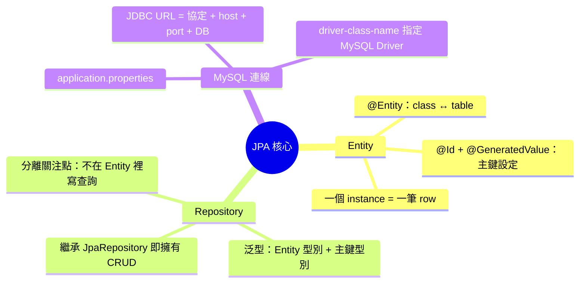

# Spring Boot JPA 入門：Entity、Repository 與 MySQL 連線設定

> 學習日期：2026-07-19
> 涵蓋概念：@Entity、@Id、@GeneratedValue、JpaRepository、Active Record vs Repository Pattern、JDBC URL、application.properties

---

## 整體架構



---

## Active Record vs Repository Pattern

JPA 和 Eloquent 的最大差異在設計哲學：



| 比較維度 | Eloquent（Active Record） | JPA（Repository Pattern） |
|---------|--------------------------|--------------------------|
| 資料結構 | Model class | @Entity class |
| CRUD 操作 | `User::find(1)` — 直接在 Model 上呼叫 | `userRepository.findById(1L)` — 透過獨立 Repository |
| 職責邊界 | 結構與操作合一，寫起來快 | 明確分離，測試與替換較容易 |
| table 命名預設 | `User` → `users`（複數 snake_case） | `User` → `user`（直接用 class 名稱，不加複數） |

---

## @Entity：Java 物件與 DB Table 的對映

```java
@Entity
@Table(name = "users")   // 覆蓋預設命名，對應 users table
public class User {

    @Id
    @GeneratedValue(strategy = GenerationType.IDENTITY)
    private Long id;      // 對應 AUTO_INCREMENT 主鍵

    private String name;
    private String email;
}
```

### 關鍵 Annotation

| Annotation | 作用 | 對應 Laravel |
|-----------|------|-------------|
| `@Entity` | 標記這個 class 對應一張 DB table | `extends Model` |
| `@Table(name = "...")` | 手動指定 table 名稱 | `protected $table = '...'` |
| `@Id` | 標記主鍵欄位 | `$table->id()` 的主鍵 |
| `@GeneratedValue(strategy = IDENTITY)` | 主鍵由 DB AUTO_INCREMENT 產生；注意此策略不支援 Hibernate batch insert（每次 insert 需立即取得 DB 產生的 id） | 同上，Laravel migration 預設行為 |

**一個 @Entity instance = table 裡的一筆 row。**

---

## JpaRepository：繼承即擁有 CRUD

```java
public interface UserRepository extends JpaRepository<User, Long> {
    // 空的也沒關係——CRUD 方法全部繼承自 JpaRepository
}
```

泛型參數的意義：
- `User`：這個 Repository 操作的 Entity 型別
- `Long`：主鍵（`@Id`）的型別

### 內建方法（無需自己寫）

| 方法 | 說明 |
|-----|------|
| `findById(Long id)` | 查單筆，回傳 `Optional<User>` |
| `findAll()` | 查全部 |
| `save(user)` | id 為 null 時呼叫 `persist()`（insert）；id 非 null 時呼叫 `merge()`（DB 有該筆就 update、沒有就 insert） |
| `deleteById(Long id)` | 刪除 |
| `count()` | 計算總筆數 |

---

## MySQL 連線設定：application.properties

```properties
spring.datasource.url=jdbc:mysql://localhost:3306/myapp
spring.datasource.username=root
spring.datasource.password=secret
spring.datasource.driver-class-name=com.mysql.cj.jdbc.Driver
```

### JDBC URL 拆解



| 設定 key | 說明 | 對應 Laravel .env |
|---------|------|------------------|
| `spring.datasource.url` | JDBC URL，含 host、port、database | `DB_HOST` + `DB_PORT` + `DB_DATABASE` |
| `spring.datasource.username` | DB 帳號 | `DB_USERNAME` |
| `spring.datasource.password` | DB 密碼 | `DB_PASSWORD` |
| `spring.datasource.driver-class-name` | 指定 JDBC Driver class（通常可省略，Spring Boot 會從 JDBC URL 自動推斷） | 無對應（Laravel 用 `DB_CONNECTION`） |

**JDBC（Java Database Connectivity）**：Java 連接資料庫的標準介面規範。`jdbc:mysql://` 就像 `http://` 一樣，是 URL scheme，告訴 Java 用哪個 Driver 去建立連線。

---

## 快速記憶脈絡



---

## 學習過程的關鍵卡點

**卡點一：Eloquent 的 table 綁定**

**原本以為**：Eloquent Model 一定要手動宣告 `$table` 才能對應到 DB table。

**實際上**：Eloquent 採用「約定優於配置」——`User` Model 預設對應 `users` table（複數 snake_case），只有需要覆蓋才寫 `$table`。這個對比讓人更容易理解 JPA 的顯式 annotation 風格：JPA 要求你用 `@Entity` 明確標記，命名預設不加複數（`User` → `user`），需要複數時要自己加 `@Table(name = "users")`。

---

**卡點二：JDBC 是什麼縮寫**

**原本以為**：JDBC 是「Java Driver Boot Class」。

**實際上**：JDBC 是 **Java Database Connectivity**，是 Java 連接資料庫的標準介面規範（不是某個具體 class）。`jdbc:mysql://` 這個 URL scheme 就像 `http://`，告訴 Java 要用 MySQL Driver 去建立連線——Driver class 本身是 `com.mysql.cj.jdbc.Driver`，兩者是不同層次的概念。
