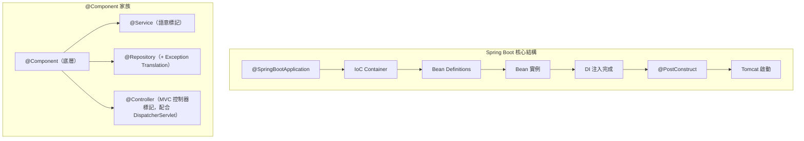
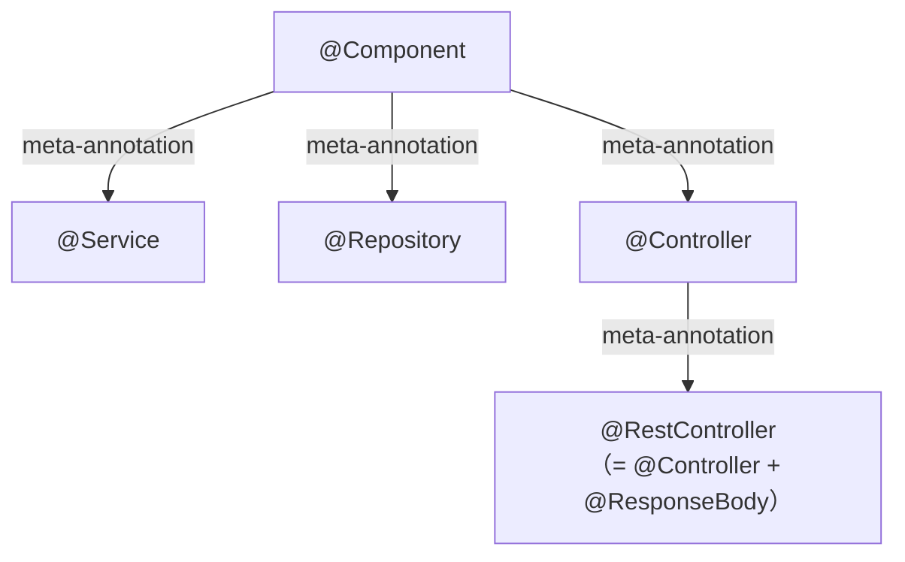
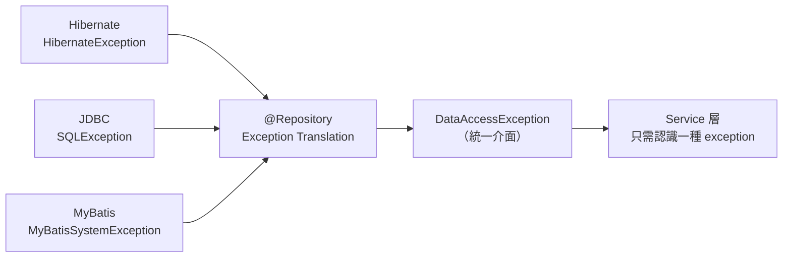
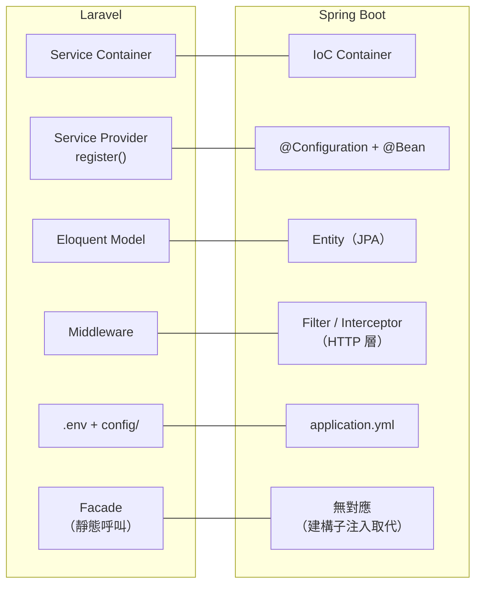
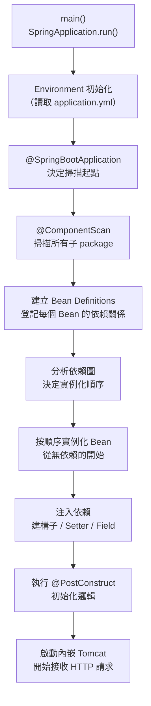
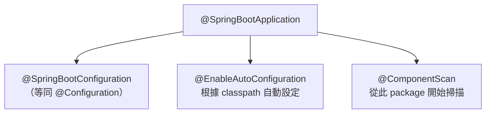
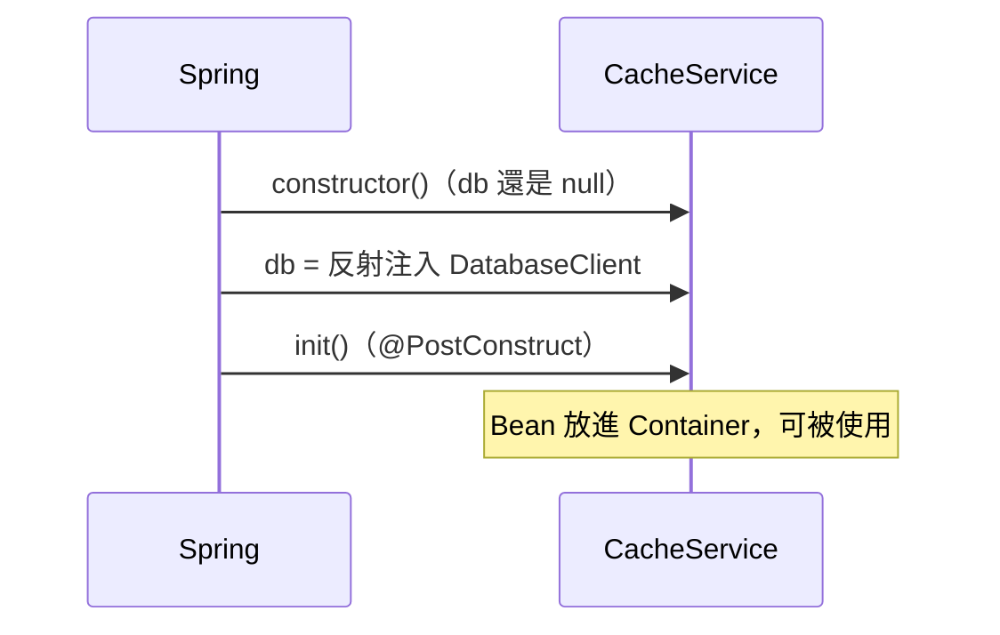

# Spring Boot 核心概念：@Component 家族、Laravel 對照與啟動流程

> 學習日期：2026-07-20
> 涵蓋概念：@Component、@Service、@Repository、Exception Translation、IoC Container、Bean Definition、DI、@PostConstruct、Laravel vs Spring Boot 對照

---

## 整體架構圖



---

## @Component 家族

### 三個 annotation 的關係

`@Service` 和 `@Repository` 都是 `@Component` 的 **meta-annotation 特化版本**——它們的定義上面都標了 `@Component`。從 IoC Container 的角度看，三個做的事情相同：**把這個 class 註冊成一個 Bean**。



### 三者的實質差異

| Annotation | 層次 | 額外行為 |
|-----------|------|---------|
| `@Component` | 通用 | 無，只是 Bean 註冊 |
| `@Service` | Service 層 | 無額外行為，純語意標記；是 AOP 的好切入點 |
| `@Repository` | Repository 層 | **Exception Translation**：把底層 DB exception 統一包成 `DataAccessException` |

### @Repository 的 Exception Translation

不同 DB 框架（Hibernate、JDBC、MyBatis）拋出的 exception 類型各不相同。若不做轉譯，Service 層每次換框架都要跟著改 `catch` 的 exception 類型。

`@Repository` 讓 Spring 自動攔截底層 exception，統一轉成 `DataAccessException`：



### 常見混淆：@Repository vs JpaRepository

`@Repository` 是 annotation，貼在 class 上，作用是 Bean 註冊 + Exception Translation。

CRUD 方法（`findById`、`save`、`delete`）來自 **`JpaRepository` interface**，是 `extends` 繼承來的，和 annotation 完全無關。

---

## Laravel vs Spring Boot 對照表



| Laravel | Spring Boot | 說明 |
|--------|-------------|------|
| Service Container | IoC Container | 管理物件建立與 DI |
| Service Provider `register()` | `@Configuration` + `@Bean` | 告訴 Container：這個 interface 用哪個實作；`@Bean` 主要用於第三方 class 或複雜建構邏輯，多數 class 直接用 `@Component` + 建構子注入即可 |
| Eloquent Model | Entity（JPA）| ORM 層物件，底層模式不同但層次對應 |
| Middleware | Filter / Interceptor | HTTP 請求/回應攔截（不是 AOP） |
| `.env` + `config/` | `application.yml` | 環境設定與讀取 |
| Facade | 無對應 | Spring 不提供靜態呼叫，改用顯式建構子注入 |

### 設計哲學差異

**Laravel**：隱式、快速開發——Facade 讓你靜態呼叫就能拿到依賴，方便但依賴被藏起來，不好 mock。

**Spring**：顯式、可測試——強迫你在 constructor 聲明所有依賴，依賴一眼看清，測試好替換。

> AOP 不是 Middleware 的對應。AOP 是**方法層**的橫切關注點（logging、@Transactional），Middleware 是 **HTTP 層**攔截——兩者層次不同。

---

## Spring Boot 啟動流程



### 關鍵步驟：Bean Definition 先於實例化

Spring 不會「掃到就 new」，而是分兩階段：

1. **登記階段**：掃描所有 `@Component` 系列，建立 Bean Definition（只記錄「這個 class 存在、需要哪些依賴」，不建立實例）
2. **實例化階段**：分析完整依賴圖，從沒有依賴的 Bean 開始往上建立，確保依賴對象永遠在被依賴方之前準備好

### @SpringBootApplication 的組成



---

## @PostConstruct：依賴注入後的初始化鉤子

### 問題來源

Field 注入的依賴，是在 constructor **之後**才由 Spring 透過反射塞入的。若在 constructor 裡用這些欄位，會拿到 `null`：

```java
@Service
public class CacheService {

    @Autowired
    private DatabaseClient db;  // Field 注入

    public CacheService() {
        db.query("SELECT ...");  // 💥 NullPointerException：db 還是 null
    }
}
```

### @PostConstruct 的解決方式

```java
@Service
public class CacheService {

    @Autowired
    private DatabaseClient db;

    @PostConstruct
    public void init() {
        db.query("SELECT ...");  // ✅ 此時 db 保證已注入
    }
}
```

### Bean 生命週期時序



白話說：**「等 Spring 把我需要的東西都給我之後，再執行這段初始化程式碼。」**

> Laravel 類比：Service Provider 的 `boot()` 方法——在所有 `register()` 執行完（Container 建立好）之後才跑，確保這時候可以安全地從 Container 拿東西用。

---

## 三種依賴注入方式比較

| 注入方式 | 寫法 | 推薦程度 | 原因 |
|---------|------|---------|------|
| **建構子注入** | constructor 參數 | ✅ 推薦 | 依賴明確、不可變、好測試；Spring 4.3+ 單一 constructor 不用寫 `@Autowired` |
| **Setter 注入** | setter 上標 `@Autowired` | 可選 | 適合可選依賴（不一定要有的） |
| **Field 注入** | 欄位上標 `@Autowired` | 不推薦 | 依賴被藏起來、無法宣告 `final`、不好 mock（無法直接 `new` 繞過 Container 測試）；在 constructor 裡無法使用 field-injected 依賴（需搭配 `@PostConstruct`） |

---

## 學習過程的關鍵卡點

**卡點一：以為 @Service / @Repository 提供額外方法**

**原本以為**：`@Repository` 標了之後，class 會有 DB CRUD 方法可以用。

**實際上**：CRUD 方法來自 `JpaRepository` interface（`extends` 繼承），跟 `@Repository` annotation 完全無關。`@Repository` 只做兩件事：把 class 註冊成 Bean，以及啟用 Exception Translation。

把 annotation 和 interface 搞混是一個常見陷阱——前者是標籤，後者才是能力的來源。

---

**卡點二：Middleware 對應到 AOP**

**原本以為**：Laravel Middleware 對應 Spring AOP。

**實際上**：AOP 是方法層的橫切工具（如 `@Transactional`），不是 HTTP 層。Laravel Middleware 攔截的是 HTTP 請求/回應，Spring 對應的是 **Filter**（Servlet 層）或 **Interceptor**（Spring MVC 層）。

---

**卡點三：掃到就建立實例**

**原本以為**：Spring 掃描到 `@Component` 就立刻 new 出物件。

**實際上**：掃描只是「登記」（建立 Bean Definition），Spring 要先知道所有 Bean 的依賴關係，才能決定實例化的正確順序——從無依賴的葉節點開始往上建立。若掃到就 new，無法保證依賴方比被依賴方先準備好。

---

**卡點四：@PostConstruct 的存在意義**

**原本以為**：初始化邏輯寫在 constructor 就好。

**實際上**：Field 注入是在 constructor 執行完之後才發生的，所以在 constructor 裡用 field-injected 的依賴會拿到 `null`。`@PostConstruct` 標記的方法保證在所有注入完成後才執行，是放「需要依賴才能做的初始化邏輯」的正確位置。
