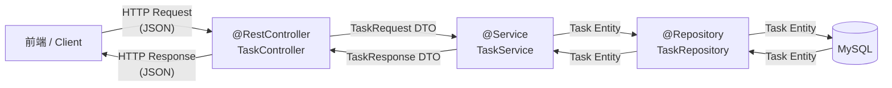
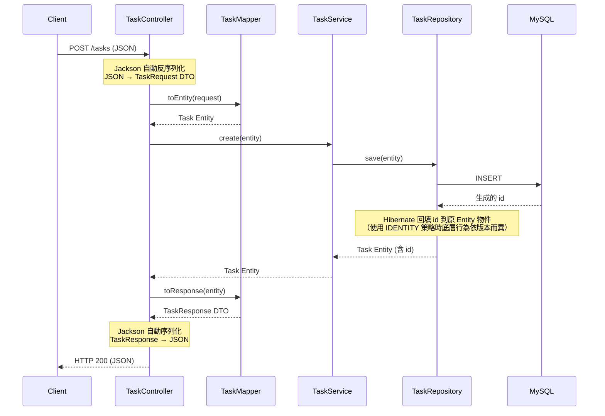
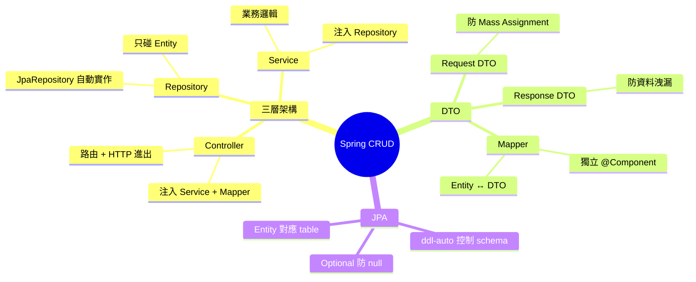

# Spring Boot CRUD 三層架構與 DTO 設計

> 學習日期：2026-07-21
> 涵蓋概念：Controller、Service、Repository、Entity、DTO、Mapper、Optional、JpaRepository、application.properties

---

## 整體架構圖



---

## Laravel vs Spring Boot 對照

| Laravel | Spring Boot | 職責 |
|---------|-------------|------|
| Route | `@GetMapping` / `@PostMapping` 等 | 路由聲明 |
| Controller | `@RestController` | 接收 HTTP、回傳結果 |
| Service | `@Service` | 業務邏輯 |
| Repository | `@Repository` + JpaRepository | 資料庫存取 |
| Model / Eloquent | `@Entity` + JPA | 資料表映射 |

層與層之間透過**建構子注入（Constructor Injection）**串接，由 Spring IoC Container 在啟動時自動組裝，不需要手動 `new`。

---

## 三層職責

### Entity

對應資料庫的一張 table。`@Id` + `@GeneratedValue` 讓 JPA 自動管理主鍵。

```java
@Entity
@Table(name = "tasks")
public class Task {
    @Id
    @GeneratedValue(strategy = GenerationType.IDENTITY)
    private Long id;
    private String title;
    private boolean completed;
    // Getters & Setters
}
```

### Repository

繼承 `JpaRepository<Entity, ID型別>`，Spring Data JPA 在**啟動時自動產生實作類別**，不用手寫任何 SQL 或實作程式碼。

```java
@Repository
public interface TaskRepository extends JpaRepository<Task, Long> {
    // findAll、findById、save、deleteById 已內建
}
```

`findById` 回傳 `Optional<Task>` 而非裸的 `Task`——在型別層面明確表達「這個值可能不存在」，讓開發者意識到必須處理 absent 的情況，避免 `null` 悄悄流進後續邏輯再爆炸。

```java
taskRepository.findById(id)
    .orElseThrow(() -> new RuntimeException("Task not found: " + id));
```

### Service

封裝業務邏輯，透過建構子注入 Repository。

```java
@Service
public class TaskService {
    private final TaskRepository taskRepository;

    public TaskService(TaskRepository taskRepository) {
        this.taskRepository = taskRepository;
    }

    public List<Task> getAll() { return taskRepository.findAll(); }

    public Task getById(Long id) {
        return taskRepository.findById(id)
                .orElseThrow(() -> new RuntimeException("Task not found: " + id));
    }

    public Task create(Task task) { return taskRepository.save(task); }

    public Task update(Long id, Task updated) {
        Task task = getById(id);
        task.setTitle(updated.getTitle());
        task.setCompleted(updated.isCompleted());
        return taskRepository.save(task);
    }

    public void delete(Long id) { taskRepository.deleteById(id); }
}
```

### Controller

接收 HTTP 請求，呼叫 Service，回傳結果。**不做業務邏輯，不碰資料庫。**

```java
@RestController
@RequestMapping("/tasks")
public class TaskController {
    private final TaskService taskService;
    private final TaskMapper taskMapper;

    public TaskController(TaskService taskService, TaskMapper taskMapper) {
        this.taskService = taskService;
        this.taskMapper = taskMapper;
    }

    @GetMapping
    public List<TaskResponse> getAll() {
        return taskService.getAll().stream()
                .map(taskMapper::toResponse)
                .collect(Collectors.toList());
    }

    @PostMapping
    public TaskResponse create(@RequestBody TaskRequest request) {
        Task task = taskMapper.toEntity(request);
        return taskMapper.toResponse(taskService.create(task));
    }
    // ... getById, update, delete
}
```

---

## DTO 設計

DTO（Data Transfer Object）控制資料在系統邊界的進出，解決兩個方向的問題：

| 方向 | 問題 | DTO |
|------|------|-----|
| 進來（Request） | 防止惡意寫入不該修改的欄位（如 `id`、`createdAt`）—— Mass Assignment | `TaskRequest` |
| 出去（Response） | 防止暴露不該對外的欄位（如密碼、內部欄位） | `TaskResponse` |

```java
// 進來：只接受前端可填的欄位
public class TaskRequest {
    private String title;
    private boolean completed;
}

// 出去：只暴露前端可看的欄位
public class TaskResponse {
    private Long id;
    private String title;
    private boolean completed;
}
```

### Mapper

DTO ↔ Entity 的轉換獨立成 Mapper 類別，讓 Service 只專注業務邏輯。

```java
@Component
public class TaskMapper {
    public TaskResponse toResponse(Task task) {
        TaskResponse res = new TaskResponse();
        res.setId(task.getId());
        res.setTitle(task.getTitle());
        res.setCompleted(task.isCompleted());
        return res;
    }

    public Task toEntity(TaskRequest request) {
        Task task = new Task();
        task.setTitle(request.getTitle());
        task.setCompleted(request.isCompleted());
        return task;
    }
}
```

> 實務延伸：MapStruct 可在**編譯期**自動產生 Mapper 實作，欄位名稱相同自動對應，省去手寫 setter。需要在 `pom.xml` 引入 annotation processor，不是 Spring Boot 預設開箱即用。

> 設計選擇：本筆記的範例將 DTO↔Entity 轉換放在 Controller 層（Controller 呼叫 Mapper 再傳 Entity 給 Service）。另一種流派是讓 Service 直接接收 DTO，在 Service 內部做轉換，以隔離 Controller 的細節——兩種做法各有取捨，沒有唯一正解。

---

## 完整請求流程



---

## MySQL 設定

```properties
# application.properties
spring.datasource.url=jdbc:mysql://localhost:3306/your_db_name
spring.datasource.username=root
spring.datasource.password=your_password
spring.datasource.driver-class-name=com.mysql.cj.jdbc.Driver

spring.jpa.hibernate.ddl-auto=update
spring.jpa.show-sql=true
```

### `ddl-auto` 選項

| 值 | 行為 | 適用環境 |
|----|------|---------|
| `update` | 有變動就新增欄位／table；**不會刪除或修改既有欄位**（欄位改名 = 舊欄位留存 + 新欄位為空） | 開發 |
| `create` | 每次啟動重建 table，**資料清空** | 測試 |
| `create-drop` | 啟動建、關閉刪 | 測試 |
| `validate` | 只驗證 schema 是否符合 Entity | 預發布 |
| `none` | 不動 schema | **Production**（改用 Flyway / Liquibase） |

---

## 學習過程的關鍵卡點

**原本以為**：Controller 負責把 HTTP Request 轉換成 DTO；Repository 負責把 DTO 轉換成 Entity。

**實際上**：
- HTTP JSON → DTO 的轉換由 **Jackson + `@RequestBody`** 自動完成，Controller 收到時已經是 `TaskRequest` DTO，不需要手動轉換。
- DTO → Entity 的轉換由 **Mapper** 負責，在 Service 呼叫之前完成；Repository 只碰 Entity，完全不知道 DTO 的存在。

這個卡點反映了一個常見的思維慣性：以為「進來的東西是 HTTP 格式，所以要在 Controller 手動解析」。實際上 Spring 的序列化/反序列化在框架層就處理掉了，到 Controller 時已經是型別安全的物件。

---

## 快速記憶脈絡


