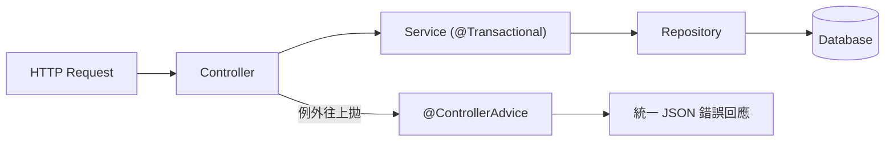
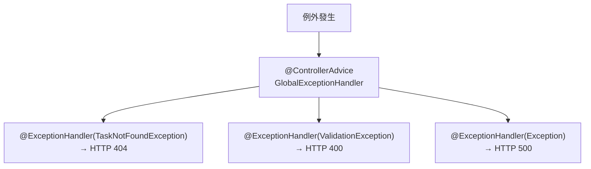
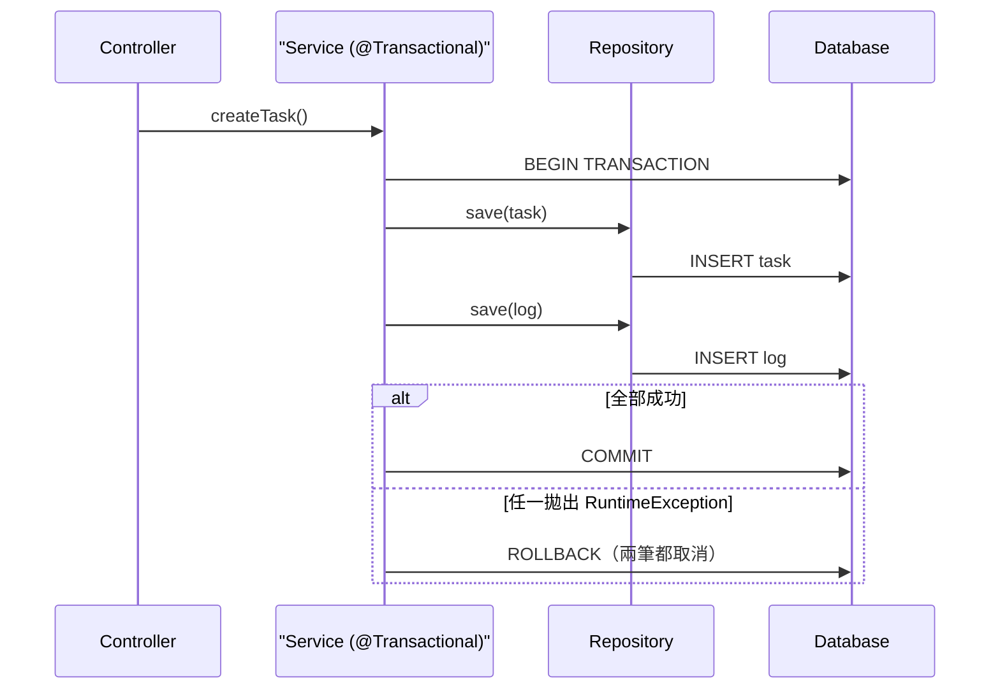
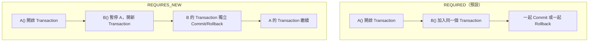
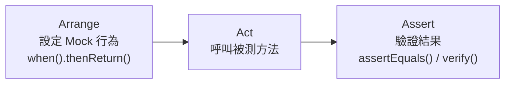

# Spring Boot 例外處理、交易管理與單元測試

> 學習日期：2026-07-22
> 涵蓋概念：@ControllerAdvice、@ExceptionHandler、@Transactional、Transaction Propagation、JUnit 5、Mockito、AAA 測試結構

---

## 整體架構



> Service 拋出的例外若沒有在 Controller 被 catch，會繼續往上拋到 ControllerAdvice。ControllerAdvice 的攔截邊界是 Controller 出口，不是 Service——例外的傳播路徑是 Service → Controller → DispatcherServlet → ControllerAdvice。

---

## 全域例外處理：@ControllerAdvice + @ExceptionHandler

### 為什麼需要

沒有集中例外處理時，每個 Controller 都要自己 try-catch：

- 重複的樣板程式碼
- 每個人寫的錯誤回應格式不一樣，前端要處理多種格式

### 對應 Laravel 的概念

`@ControllerAdvice` 等同 Laravel 的 `App\Exceptions\Handler.php`——所有沒被 catch 住的例外，最終都流到這裡，統一決定回傳什麼給前端。

### 運作方式



一個 `@ControllerAdvice` 類別裡可以有多個 `@ExceptionHandler` 方法，每個方法負責一種例外類型：

```java
@ControllerAdvice
public class GlobalExceptionHandler {

    @ExceptionHandler(TaskNotFoundException.class)
    public ResponseEntity<ErrorResponse> handleNotFound(TaskNotFoundException e) {
        return ResponseEntity.status(404).body(new ErrorResponse(e.getMessage()));
    }

    @ExceptionHandler(ValidationException.class)
    public ResponseEntity<ErrorResponse> handleValidation(ValidationException e) {
        return ResponseEntity.status(400).body(new ErrorResponse(e.getMessage()));
    }
}
```

---

## 交易管理：@Transactional

### 為什麼需要

一個業務操作可能包含多個 DB 寫入。中途失敗會讓資料停在不一致的中間狀態。Transaction 保證**要嘛全部成功（Commit），要嘛全部回滾（Rollback）**。

### 加在哪一層

加在 **Service 層**——Controller 太高層（不碰 DB），Repository 太低層（只做單一操作），Service 是業務邏輯的邊界，一個方法代表一個完整的業務操作，Transaction 的範圍跟它對齊最自然。



### Rollback 的觸發條件

`@Transactional` 預設**只對 `RuntimeException`（unchecked）觸發 Rollback**，對 checked exception 不會。

| 例外類型 | 說明 | 需要在方法簽名加 throws？ | 預設 Rollback？ |
|---------|------|------------------------|----------------|
| `RuntimeException` | 非預期或業務例外，如 `IllegalArgumentException`、自訂的 `TaskNotFoundException` | 不需要 | ✅ 會 |
| checked `Exception` | 編譯器強制處理，如 `IOException` | 需要 | ❌ 不會 |

原因：這個行為延續自 EJB 時代的慣例。checked exception 既然編譯器強迫你處理，Spring 預設不介入 Rollback，視同業務已自行決定如何應對。若有疑慮，直接加 `rollbackFor = Exception.class` 是更明確安全的做法。

若需要對 checked exception 也 Rollback：

```java
@Transactional(rollbackFor = Exception.class)
```

### Transaction 傳播行為（Propagation）

當 `A()` 呼叫 `B()`，兩個方法都有 `@Transactional` 時，Spring 的行為由 `propagation` 決定：

| Propagation | 行為 |
|------------|------|
| `REQUIRED`（預設） | 加入外層已有的 Transaction；沒有才新建一個 |
| `REQUIRES_NEW` | 暫停外層 Transaction，自己開一個獨立的 |



**REQUIRES_NEW 的例外傳播細節：**

`B()` 拋出例外 → B 的 Transaction Rollback → 例外往上拋給 `A()` → A 的 Transaction 也 Rollback（前提：例外為 `RuntimeException`，觸發 A() 的 Rollback 規則）。

若要讓 A 繼續執行（例如 Log 失敗不影響主流程），需要在 `A()` 裡 try-catch 把 B 的例外吃掉：

```java
try {
    logService.save(log); // REQUIRES_NEW
} catch (Exception e) {
    // 吃掉，主流程繼續
}
```

---

## 單元測試：JUnit 5 + Mockito

### 核心概念

單元測試只測「這個方法的邏輯」，不測它的依賴（DB、外部 API）。Mockito 讓你把依賴換成假的物件，完全控制它的行為，不受環境影響。

### 關鍵 Annotation

| Annotation | 用途 |
|-----------|------|
| `@ExtendWith(MockitoExtension.class)` | 啟用 Mockito 的 JUnit 5 整合 |
| `@Mock` | 建立假的依賴物件（預設回傳 null / 0 / false / `Optional.empty()` / 空 List） |
| `@InjectMocks` | 標記被測目標，Mockito 自動把 `@Mock` 物件注入進去 |

### AAA 測試結構

每個測試方法分三個階段：



```java
@ExtendWith(MockitoExtension.class)
class TaskServiceTest {

    @Mock
    TaskRepository taskRepository;

    @InjectMocks
    TaskService taskService;

    @Test
    void createTask_shouldReturnSavedTask() {
        // Arrange
        Task task = new Task("買牛奶");
        when(taskRepository.save(any())).thenReturn(task);

        // Act
        Task result = taskService.createTask("買牛奶");

        // Assert
        assertEquals("買牛奶", result.getTitle());
        verify(taskRepository).save(any()); // 確認 save 有被呼叫
    }
}
```

### assertEquals vs verify

| 方法 | 驗證什麼 |
|------|---------|
| `assertEquals(expected, actual)` | 方法的**回傳值**是否正確 |
| `verify(mock).method()` | 某個方法**有沒有被呼叫過**（不在乎回傳值） |

---

## 學習過程的關鍵卡點

**原本以為**：`@Transactional` 對所有例外都會觸發 Rollback。

**實際上**：預設只對 `RuntimeException`（unchecked）Rollback。checked exception 因為編譯器強迫你處理，Spring 假設你已自己決定如何應對，不介入 Rollback。需要的話要加 `rollbackFor = Exception.class`。

這個細節值得記住，因為 Java 的 checked/unchecked 設計在 Spring 很多地方都有這個隱含假設——不了解這個差異，Rollback 沒觸發會很難 debug。

---

**原本以為**：`REQUIRES_NEW` 讓 B() 失敗時，A() 可以自動繼續執行。

**實際上**：`REQUIRES_NEW` 只是讓 B() 用獨立的 Transaction，但例外還是會往上拋給 A()。A() 要繼續執行，必須在 A() 裡 try-catch 把 B() 的例外吃掉，才能真正隔離失敗影響。

---

**原本以為**：不知道 AAA 這個詞的存在。

**實際上**：Arrange / Act / Assert 是業界標準的測試結構，自己其實已經在用這個節奏，只是沒有這個名字。有了名字方便跟團隊溝通，也更容易辨認測試是否結構清晰。
