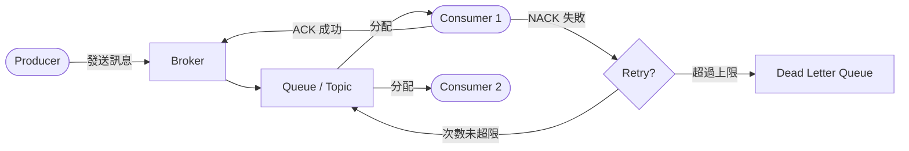
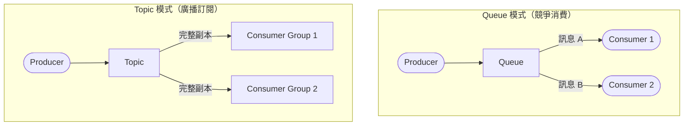
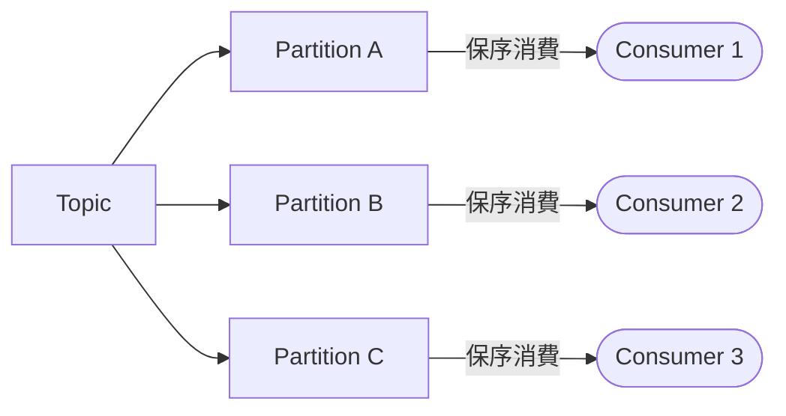
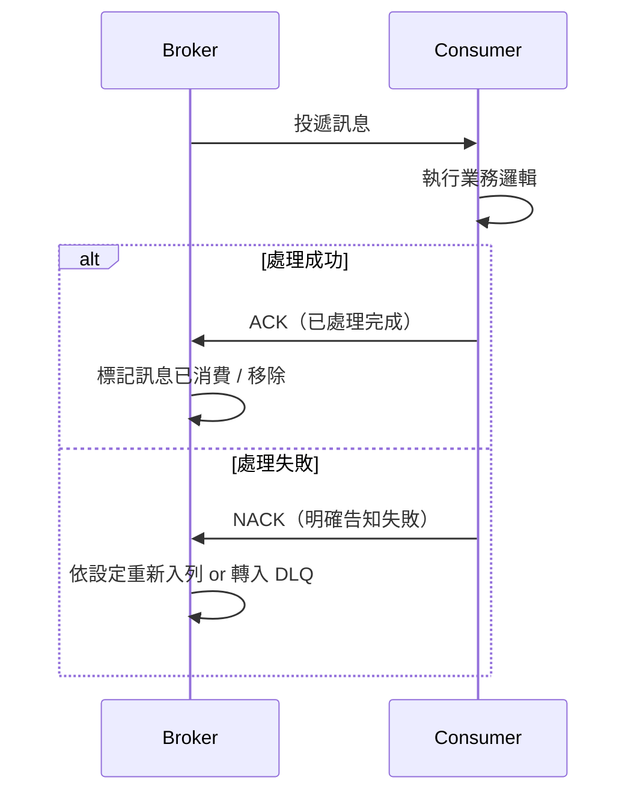
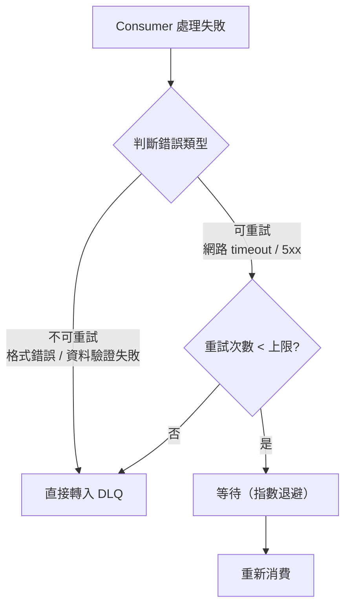
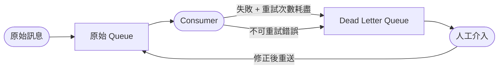
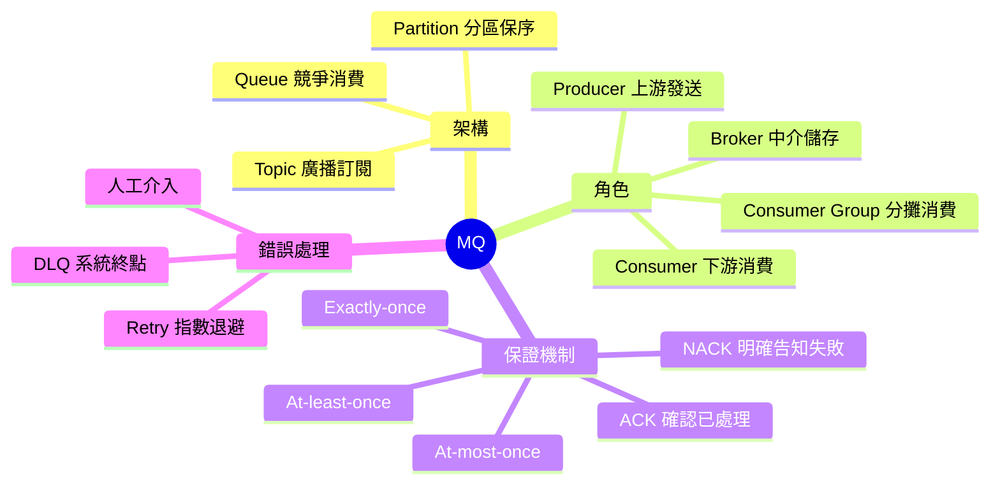

# MQ 核心術語：從 Queue 到 DLQ 的完整設計邏輯

> 學習日期：2026-07-01
> 涵蓋概念：Queue、Topic、Producer、Consumer、ACK、Retry、DLQ

---

## 整體架構一眼看懂

---

## 基礎架構

### Queue vs Topic：一對一 vs 一對多

這是最常被混淆的第一個概念。兩者都是「訊息的容器」，但消費模型根本不同。

| 維度 | Queue | Topic |
|------|-------|-------|
| 消費模型 | 競爭消費，每則訊息只被一個 Consumer 處理 | 廣播，每個 Consumer Group 都收到完整訊息 |
| 適用情境 | 任務派發、一次性處理 | 多個獨立服務訂閱同一事件流 |
| 典型代表 | RabbitMQ、SQS | Kafka、RocketMQ |

**核心記憶點：**
- Queue → 「大家搶著做同一批工作」
- Topic → 「同一個事件廣播給多個不同部門各自知道」

### Partition（分區）

Topic 底下的實際儲存單位（Kafka 用語），是 Kafka 實現水平擴展與並行消費的基本單位。每個 Partition 由一個 Broker 負責（Leader），Producer 依據 key 或輪詢策略決定訊息要寫入哪個 Partition，**同一 Partition 內保序，跨 Partition 不保序**。

---

## 角色定義

| 角色 | 說明 |
|------|------|
| **Producer（生產者）** | 發送訊息到 Queue/Topic 的一方，通常是上游服務或 API Server |
| **Broker** | MQ 系統的伺服器節點，負責儲存與轉發訊息 |
| **Consumer（消費者）** | 從 Queue/Topic 取出並處理訊息的一方 |
| **Consumer Group** | 一組 Consumer 共同分攤消費同一 Topic；**同一 Partition 在同個 Group 內只會被一個 Consumer 消費**，避免重複處理 |

---

## 訊息保證機制

### ACK（確認機制）

ACK 是 Consumer 告知 Broker「訊息已成功處理完成」的信號；Broker 收到後才會標記訊息已消費或將其移除。沒有 ACK，Broker 無從得知訊息有沒有被成功消費。

### Auto-ack vs Manual-ack

| 模式 | 時機 | 風險 |
|------|------|------|
| **Auto-ack** | 訊息一送達 Consumer 就視為成功 | Consumer 收到訊息後若當機，訊息遺失 |
| **Manual-ack** | 業務邏輯執行完成後才手動發送 ACK | 較安全，但需要自行處理重複消費的冪等問題 |

### 三種傳遞語意

| 語意 | 說明 | 代價 |
|------|------|------|
| **At-most-once** | 最多一次，可能遺失但不重複 | 最低（不需重試或 ACK 確認） |
| **At-least-once** | 至少一次，不遺失但可能重複 | 中（需 ACK + Retry，Consumer 需具備冪等性） |
| **Exactly-once** | 恰好一次，不重複不遺失 | 最高（需分散式事務或冪等設計） |

---

## 錯誤處理

### Retry 策略

Consumer 失敗後，讓訊息重新被消費的機制。關鍵是**錯誤類型的判斷發生在進入下一次重試之前**：

**指數退避（Exponential Backoff）**：每次重試等待時間加倍（例如 1s → 2s → 4s → 8s → 16s），避免失敗服務被持續轟炸，也讓暫時性故障有時間自行恢復。

### DLQ（Dead Letter Queue，死信佇列）

DLQ 是訊息在 Retry 機制所有機會用完後的去處，是**系統自動化能力的終點**。

**為什麼需要 DLQ？**

如果沒有 DLQ，失敗的訊息只有兩個下場：
1. 直接丟棄 → 資料遺失，且沒有任何痕跡讓人知道需要修正
2. 無限重試 → 卡住整個 Queue，阻塞後續所有正常訊息（Poison Message Problem）

**重要觀念釐清：DLQ 階段不再做自動判斷**

走到 DLQ 的訊息，代表：
- 錯誤類型的判斷（可重試 vs 不可重試）**已在 Retry 階段完成**
- 所有的自動重試機會都已耗盡
- 剩下的，通常是程式邏輯本身的問題（格式錯誤、邊界情況未處理），而非暫時性的服務中斷

因此，DLQ 裡的訊息**預設就是需要人工介入**——排查程式邏輯錯誤、修正資料，再視情況重新送回原 Queue 重新處理。

| | Retry 階段 | DLQ 階段 |
|-|-----------|---------|
| **主要任務** | 自動恢復暫時性故障 | 保存失敗訊息供人工排查 |
| **執行方式** | 系統自動（依錯誤類型決定） | 人工介入 |
| **判斷依據** | 錯誤類型（可重試 / 不可重試）、重試次數 | 無自動判斷，一律轉人工 |

**DLQ 的可觀測性價值**：監控 DLQ 訊息數量的異常增長，可以及早發現系統性的程式錯誤，而不是等到客訴或資料不一致才發現問題。

---

## 快速記憶脈絡

三句話記住核心關係：
1. **Queue vs Topic**：Queue 是「搶工作」，Topic 是「廣播通知」
2. **ACK 是信任確認**：沒有 ACK，Broker 不知道訊息是否真的處理完成
3. **Retry + DLQ 是一組**：Retry 救暫時性失敗，DLQ 兜底持續性失敗，兩者搭配才能避免訊息無限循環或無聲遺失

---

## 學習過程的關鍵卡點

這次學習中最值得記住的一個認知修正：

**原本以為**：走到 DLQ 的訊息還可以進一步分流，一部分自動重試（服務中斷型）、一部分人工處理（程式錯誤型）。

**實際上**：這個分流判斷（依錯誤類型決定要不要重試）發生在 Retry 階段，不是 DLQ 階段。能自動解決的早就在 DLQ 之前被處理掉了——真正走到 DLQ 的訊息，系統已經沒有更多自動化手段，預設就是交給人工介入。

這個卡點也提醒了一個重要的設計思維：**系統架構中的每個「兜底機制」都有它的邊界**，DLQ 是 Retry 的邊界，Retry 是正常消費的邊界，每一層都清楚地知道自己能做什麼、不能做什麼。
