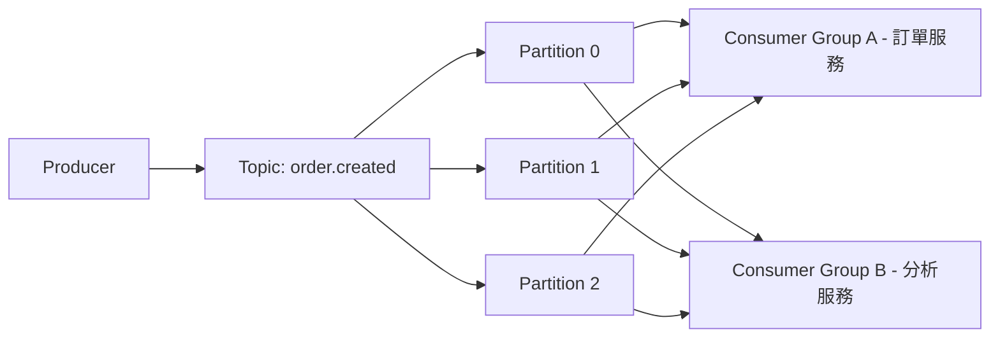
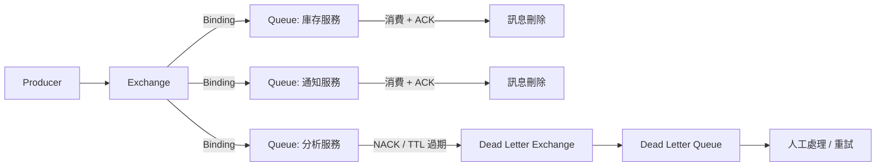
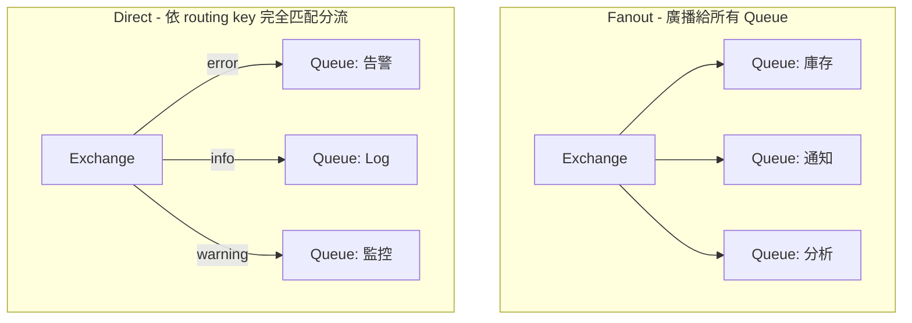
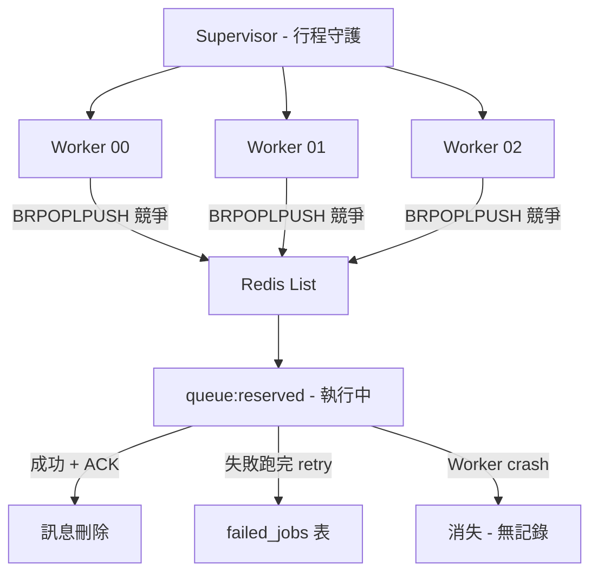
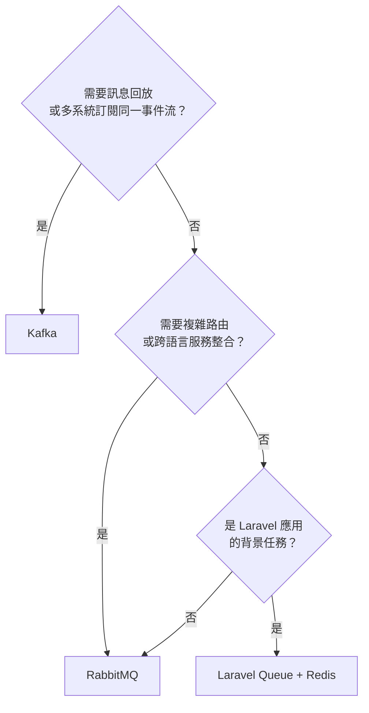

# Kafka、RabbitMQ、Laravel Queue 核心概念與選型差異

> 學習日期：2026-07-02  
> 涵蓋概念：Topic、Partition、Offset、Consumer Group、Retention Policy、Exchange、Binding、ACK、DLX、DLQ、Laravel Queue 限制

---

## Kafka 架構

### Topic 與 Partition

Topic 是訊息分類的單位，Producer 發訊息時指定 Topic 名稱，對應 Laravel Queue 的 Queue 名稱。Topic 底下切成多個 **Partition**，每個 Partition 是一條獨立的有序 Log，每個 Partition 指定給 Consumer Group 裡的一個 Consumer 負責，不需要競爭搶奪。

Laravel Queue 多個 Worker 同時搶同一個 Redis List，Worker 越多競爭開銷越大。Partition 消除了這個問題。



> **重要限制**：Consumer Group 的最大有效並行數 = Partition 數。Consumer 數量超過 Partition 數時，多出的 Consumer 閒置。

### Offset

Consumer 用 **Offset** 追蹤自己讀到哪一筆，以 Consumer Group 為單位儲存在 Kafka 內部的 `__consumer_offsets` Topic。

Kafka 的訊息不因被消費而消失，只有 offset 往前移。這帶來兩個 Laravel Queue 做不到的能力：
1. **Consumer 重啟不丟進度**：從上次的 offset 繼續讀
2. **歷史訊息回放**：把 offset 往回調，重新處理歷史資料

### Consumer Group

同一個 Consumer Group 內的成員分攤 Partition；不同 Consumer Group 各自獨立消費，各自有自己的 offset，互不干擾。

「一份事件流，多個不同系統都要消費完整資料」這個需求，Kafka 用多個 Consumer Group 天然解決。Laravel Queue 做不到——Job 被一個 Worker 拿走後就消失，其他 Worker 拿不到同一份。

### Retention Policy

Kafka 訊息的刪除不靠「消費」觸發，而是靠 **Retention Policy**：

| 模式 | 說明 |
|---|---|
| 時間（預設） | 保留 7 天，可設更長或永久 |
| 大小 | Partition 超過指定大小，刪最舊的（注意：上限以 Partition 為單位計算，Topic 實際總儲存上限 = 設定值 × Partition 數） |

**能回放多久，取決於 Retention 設定**。Retention 只設 7 天，就無法回放 30 天前的資料。這是部署前要規劃的，不是 Kafka 天生就能無限保留的。

---

## RabbitMQ 架構

### Exchange 與 Binding

RabbitMQ 在 Producer 和 Queue 之間插了一層 **Exchange**，讓 Producer 不需要知道有哪些 Queue。

- **Producer** 只把訊息丟給 Exchange，不指定 Queue
- **Exchange** 根據 Binding 規則決定送給哪些 Queue
- **Binding** 由消費者那側自己去 RabbitMQ 設定

新增一個消費者，只需要那個服務自己去綁定 Exchange，Producer 和其他 Consumer 的程式碼完全不用改。



### Exchange 類型



| Exchange 類型 | 路由方式 | 適用情境 |
|---|---|---|
| **Fanout** | 廣播給所有綁定的 Queue | 一個事件，多個系統都要知道（如訂單成立） |
| **Direct** | routing key 完全匹配 | 同一來源的訊息分流到不同地方（如 log 依嚴重程度） |
| **Topic** | routing key 萬用字元匹配（`order.*`） | 比 Direct 更彈性的分流 |
| **Headers** | 依訊息 Header 屬性比對 | 少用，適合複雜條件路由 |

### ACK 機制

Consumer 消費完後送 **ACK** 給 RabbitMQ，收到 ACK 才刪除訊息。Consumer crash、TCP 斷線，RabbitMQ 偵測到後自動把訊息 re-queue，讓其他 Consumer 接手。這是 Broker 層的保證，不依賴應用程式程式碼執行。

### DLX 與 DLQ

訊息變成 **Dead Letter** 的三種情況：
1. Consumer **NACK** 拒絕（且不重新入列）
2. 訊息超過 **TTL** 過期
3. Queue 已滿，訊息被丟棄

**Dead Letter Exchange（DLX）** 本質上就是一個普通的 Exchange，專門接收走不下去的訊息，再路由到 **Dead Letter Queue（DLQ）**。因為 DLX 是普通的 Exchange，它具備完整的路由能力，可以把不同類型的失敗訊息分流到不同的 DLQ：

```
失敗訊息 → DLX（Topic Exchange）
  ├── order.# → 訂單 DLQ（人工處理）
  ├── email.# → 寄信 DLQ（自動重試）
  └── report.# → 報表 DLQ（告警通知）
```

沒有 DLX/DLQ，走不下去的訊息會直接被丟棄，無聲消失，無法追蹤或補救。

---

## Laravel Queue + Supervisord 的限制



| 面向 | 限制 | 成熟 MQ 的做法 |
|---|---|---|
| **可靠性** | Redis in-memory，重啟可能遺失未消費的訊息 | 磁碟持久化（Kafka / RabbitMQ Durable Queue） |
| **重複消費** | Timeout 誤判造成同一 Job 被兩個 Worker 執行 | ACK / offset commit 在執行完才確認，不主動撈回執行中的訊息 |
| **跨系統整合** | Job Payload 是 Laravel 特定格式，非 PHP 服務無法直接消費 | 語言無關的協定（AMQP / Kafka Client） |
| **新增消費者** | Producer 要改程式碼，指定新 Queue 名稱 | Binding（RabbitMQ）或新 Consumer Group（Kafka），Producer 不用動 |
| **訊息回放** | 消費後即刪除，無法回放歷史 | Kafka offset 可往回調 |
| **失敗捕捉** | `failed_jobs` 是應用層寫入，Worker crash 時可能無聲消失 | Broker 層保證，Consumer 死了 Broker 自動處理 |

---

## 三者選型快速對比

| 維度 | Kafka | RabbitMQ | Laravel Queue |
|---|---|---|---|
| 訊息保留 | 依 Retention Policy | 消費後刪除 | 消費後刪除 |
| 多系統訂閱 | Consumer Group 各自獨立 | Fanout Exchange 複製到多 Queue | 不支援 |
| 路由能力 | 無（靠 Topic 名稱） | 強（四種 Exchange 類型） | 無（靠 Queue 名稱） |
| 跨語言 | 是 | 是 | 否（PHP/Laravel 專屬） |
| 運維複雜度 | 高 | 中 | 低 |
| 適合情境 | 事件回放、多系統訂閱、高吞吐資料管線 | 複雜路由、微服務任務分派、即時低延遲 | Laravel 應用內背景任務 |



---

## 學習過程的關鍵卡點

**卡點一：Fanout 還是 Direct？**

**原本以為**：「訂單成立」是特定情境，應該用 Direct Exchange 才對。

**實際上**：Direct 是用來「分流」的——同一來源的訊息，依 routing key 送到不同地方。「訂單成立」要讓庫存、通知、分析三個服務都收到，這是廣播行為，Fanout 才正確。Direct 要達到同樣效果，三個 Queue 都要設同樣的 routing key，反而更麻煩。

判斷方式：一條訊息要送全部 → Fanout；要根據內容分送不同地方 → Direct / Topic。

---

**卡點二：Kafka 可以無限回放？**

**原本以為**：Kafka 訊息永遠保留，隨時能回調任意時間點。

**實際上**：Kafka 依 Retention Policy 刪除訊息（預設 7 天）。「能回放多久」取決於 Retention 設定，這是部署前要規劃的，不是 Kafka 的天生保證。

---

**卡點三：DLX 和 DLQ 是同一件事？**

**原本以為**：DLX 和 DLQ 指的是同一個元件。

**實際上**：DLX 是 Exchange（負責路由），DLQ 是 Queue（負責存放），兩者是搭配使用的一組。DLX 本質上是普通的 Exchange，具備完整路由能力，可以把不同類型的失敗訊息分流到不同的 DLQ。

---

**卡點四：Kafka Topic 和 RabbitMQ Topic 是同一件事？**

**原本以為**：兩個系統都有 Topic，應該是對應的概念。

**實際上**：
- **Kafka Topic**：資料分類的單位，Producer 發訊息的目標
- **RabbitMQ Topic**：Exchange 的一種**類型**，指支援萬用字元匹配的路由模式

名字相同，完全不同的東西。Kafka Topic 對應的是 RabbitMQ 的 **Exchange**，而不是 RabbitMQ 的 Topic Exchange。

---

**卡點五：Laravel `failed_jobs` 和 RabbitMQ DLX 一樣可靠？**

**原本以為**：`failed_jobs` 能捕捉所有失敗的 Job。

**實際上**：`failed_jobs` 是應用層寫入，需要 Job 程式碼跑完所有 retry 後才寫入。Worker 行程 crash（如 OOM 被 kill），程式碼沒機會執行，那筆 Job 無聲消失。RabbitMQ 的 DLX 是 Broker 層機制，Consumer 死了 Broker 自己偵測並處理，不依賴 Consumer 的程式碼。
