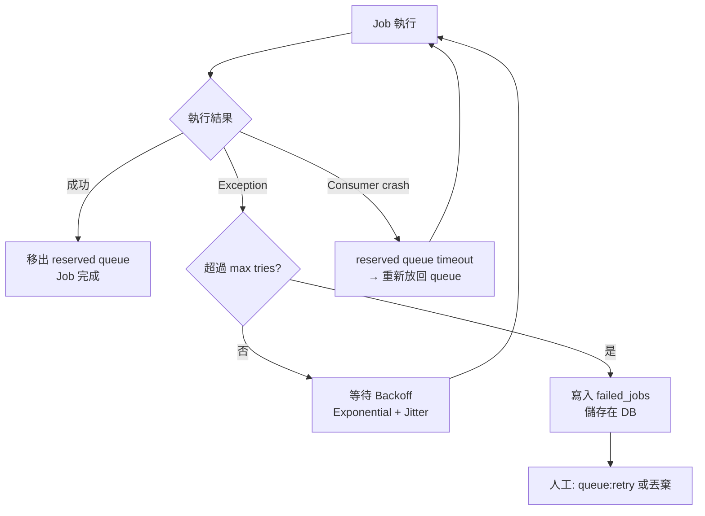
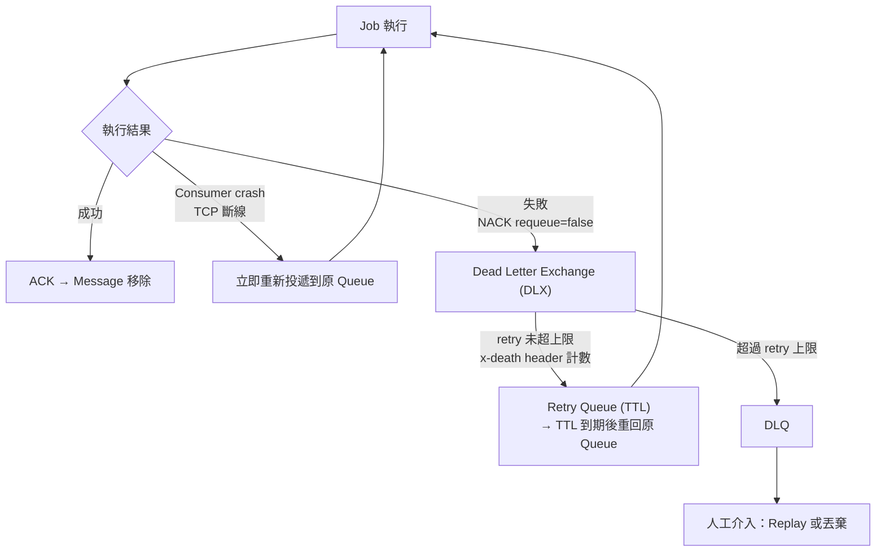
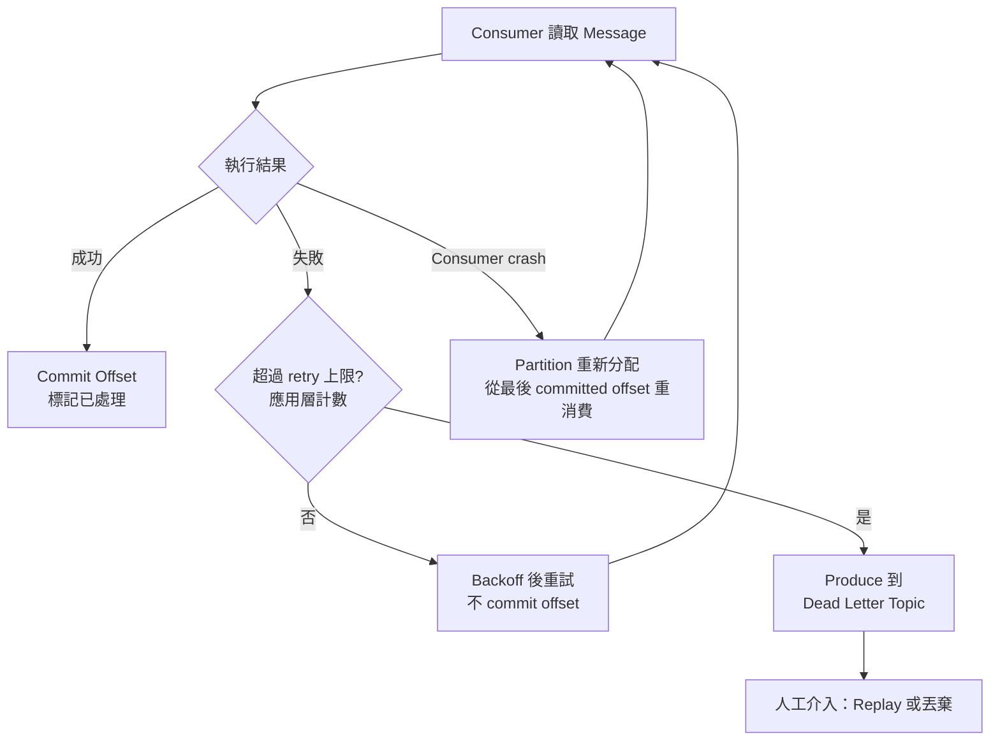
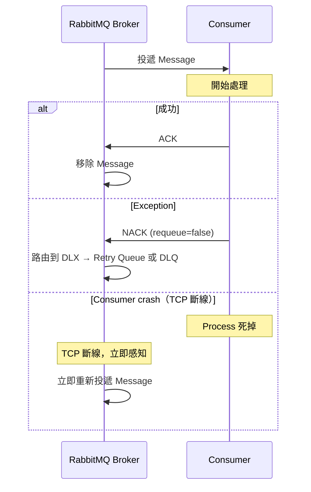
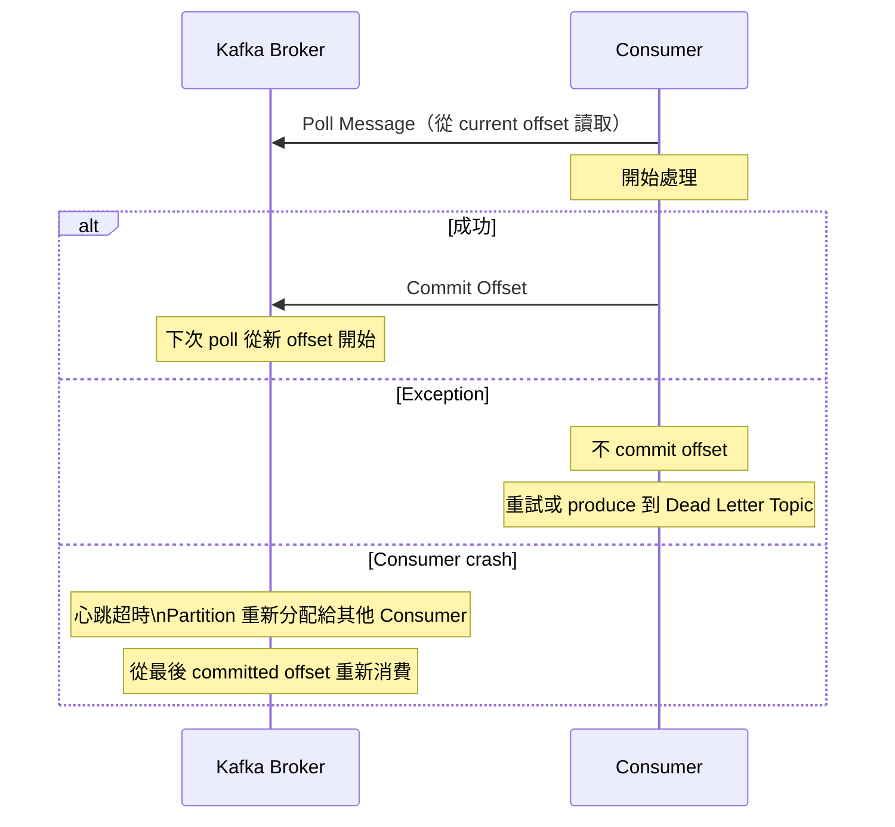
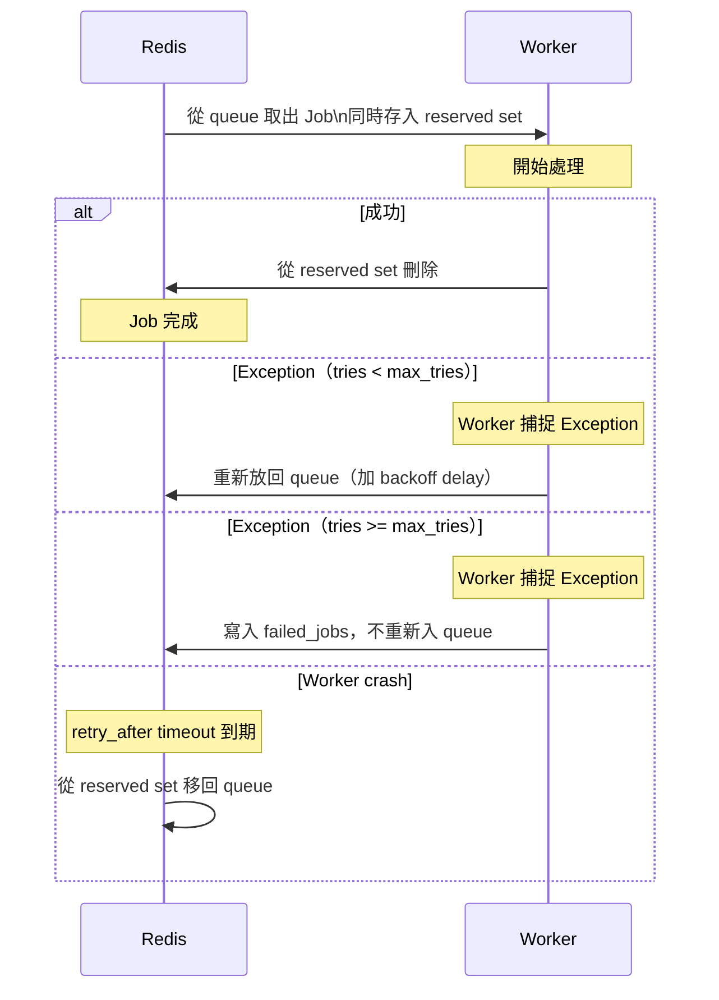
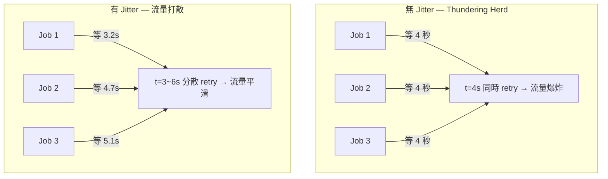
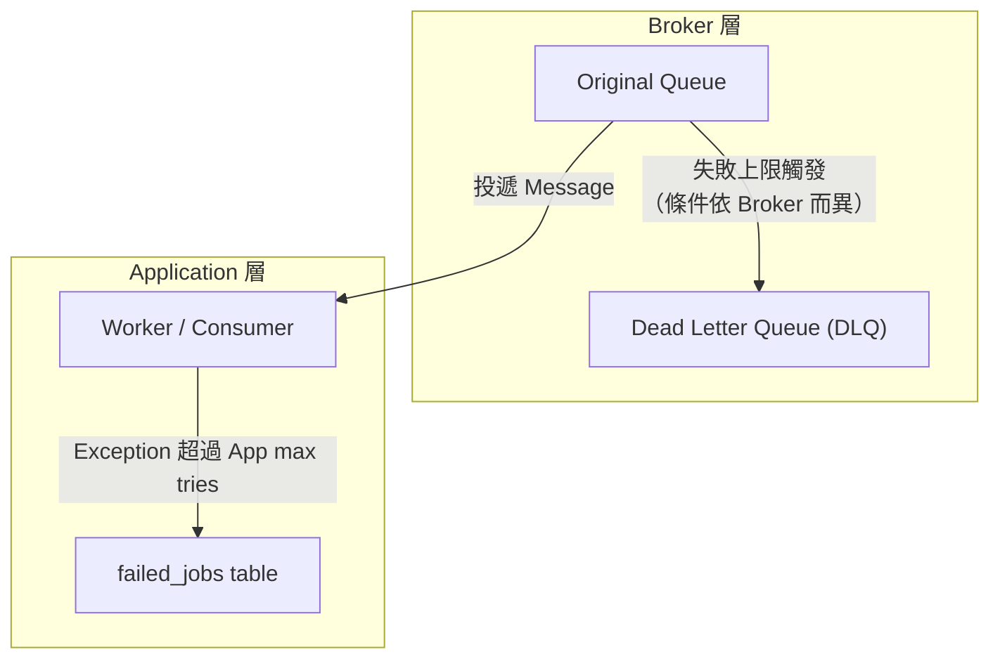

# Consumer 失敗處理全流程：Retry Strategy、Failed Job 與 DLQ

> 學習日期：2026-07-03  
> 涵蓋概念：Consumer 失敗、ACK 機制、Retry Strategy、Exponential Backoff、Jitter、Thundering Herd、Failed Job、DLQ

---

## 整體失敗處理流程

### Laravel Queue（Redis）



### RabbitMQ



> **注意**：RabbitMQ 本身無內建 retry 計數器，需由應用層讀取 `x-death` header 判斷是否超過上限，再決定路由到 DLQ 或 Retry Queue。

### Kafka



> **注意**：Kafka 沒有 Broker 層的 retry / DLQ 機制，retry 次數計數與 Dead Letter Topic 的路由邏輯都需應用層自行實作（通常由 consumer framework 如 Spring Kafka 提供封裝）。

---

## Consumer 失敗與確認機制

三種系統的失敗感知機制根本上不同：

| | Laravel Queue (Redis) | RabbitMQ | Kafka |
|---|---|---|---|
| **成功確認方式** | 從 reserved set 刪除 job | 顯式送出 ACK | Commit Offset |
| **Exception 感知層** | Application 層（Worker 捕捉） | Application 層（Consumer 送 NACK） | Application 層（不 commit offset） |
| **Consumer crash 感知方式** | reserved queue timeout | TCP 斷線立即感知 | Consumer Group 心跳超時 |
| **Consumer crash 重投延遲** | 有（retry_after 到期） | 無（立即重投） | 有（Partition 重新分配後） |

### RabbitMQ — ACK / NACK 機制



> **注意**：此序列圖簡化了 Exception 路徑。實際上 NACK 後依 retry 計數（`x-death` header）決定路由到 Retry Queue 或 DLQ，詳見上方 Flowchart。

### Kafka — Offset Commit 機制



### Laravel Queue (Redis) — Reserved Queue 機制



---

## Retry Strategy

失敗後不應立刻 retry——當失敗原因是**依賴服務過載**時，立刻 retry 只會讓情況更糟。

### Exponential Backoff（指數退避）

每次 retry 間隔以指數成長，給依賴服務恢復時間：

```
第 1 次失敗 → 等 1 秒
第 2 次失敗 → 等 2 秒
第 3 次失敗 → 等 4 秒
第 4 次失敗 → 等 8 秒
```

### Jitter（隨機抖動）

在 backoff 間隔加入隨機值，打散多個失敗 job 的 retry 時間點。

**沒有 Jitter 的問題（Thundering Herd）**：同一批失敗的 job 用相同 backoff 間隔，等待結束後**同時**打回依賴服務，可能再次壓垮服務。



### Max Tries（最大重試次數）

Retry 必須有上限，否則永久性錯誤的 job 會無限消耗資源。超過上限後進入後續的失敗記錄流程。

---

## Failed Job vs DLQ：兩層失敗記錄



| 比較維度 | `failed_jobs` table | DLQ |
|---------|---------------------|-----|
| **所在層** | Application 層 | Broker 層 |
| **儲存位置** | 資料庫（如 MySQL） | MQ 系統本身（另一條 Queue） |
| **觸發時機** | App 捕捉到 Exception 超過 max tries | 依 Broker 不同（見下方說明） |
| **App 掛掉時** | 可能來不及寫入，記錄遺失 | 不受影響，Broker 自主處理 |
| **重新投遞** | `php artisan queue:retry` | 從 DLQ replay 回 Original Queue |
| **適用場景** | Laravel 等 Framework 內建機制 | RabbitMQ、SQS 等 Broker 原生功能 |

**DLQ 的核心優勢**：失敗追蹤在 Broker 層完成，不依賴 Application 的狀態。即使 App 整個掛掉、DB 不可用，Message 依然安全地保存在 DLQ，等待人工處理。

> **DLQ 觸發機制的 Broker 差異**
> - **SQS**：Visibility Timeout 超時（視為 ACK 未確認）→ receive count 累加 → 超過 `maxReceiveCount` → 自動移入 DLQ
> - **RabbitMQ**：① Consumer 送出 NACK（`requeue=false`）、② Message TTL 到期、或 ③ Queue 超過長度限制 → 路由到 Dead Letter Exchange → DLQ。**RabbitMQ 本身沒有內建的 max retry 計數器**，累計 retry 次數需由應用層或 plugin（透過 `x-death` header）自行實作。

---

## 人工介入 DLQ 的標準流程

1. 監控 DLQ 的 Message 數量（有 Message 即代表出現超過上限的失敗）
2. 查看 Message 內容與錯誤資訊，判斷失敗原因
3. 決策：
   - **暫時性問題**（依賴服務剛恢復）→ Replay 回 Original Queue
   - **永久性錯誤**（資料格式錯誤、業務邏輯問題）→ 修復程式碼後再 replay，或直接丟棄

---

## 學習過程的關鍵卡點

**卡點 1：Retry 應該立刻執行還是等一下？**

**原本以為**：失敗後立刻 retry 是合理的，快點再試一次。

**實際上**：如果失敗原因是依賴服務過載，立刻 retry 只是繼續打一台已經喘不過氣的服務，讓情況更糟。正確做法是 Exponential Backoff，給依賴服務喘息時間。

Retry 的目的是讓 job **最終成功**，不是讓它快點再失敗一次。

---

**卡點 2：Consumer crash 後 Message 會消失嗎？**

**原本以為**：Consumer process 掛掉，Message 就不見了。

**實際上**：RabbitMQ / SQS / Laravel Queue 使用 ACK 機制——Message 要等 Consumer 明確送出 ACK 之後才被移除。若 ACK 超時或未確認，Broker 視為處理失敗，自動重新投遞。Message 不會因為 Consumer 掛掉而消失。

這是這類 MQ 系統的核心可靠性保證，由 Broker 層自主維護，不依賴 Application。

> **Kafka 的差異**：Kafka 以 **Offset Commit** 標記消費進度，Message 不因 commit 而被移除（由 retention policy 決定保留期限）。Consumer crash 後，Partition 重新分配給其他 Consumer，從最後 committed offset 重新讀取，沒有「ACK 超時→自動重投」的概念。

---

**卡點 3：DLQ 存在哪裡？**

**原本以為**：DLQ 是存在磁碟上的某種資料。

**實際上**：DLQ 是 Broker 本身的另一條 Queue，存活在 MQ 系統（如 RabbitMQ、SQS）內部，跟 Original Queue 是同等地位的 Queue，只是角色不同。這也是它跟 `failed_jobs` table 最本質的差異——一個在 Broker 層，一個在 Application 層，保護的失敗情境也不同。
