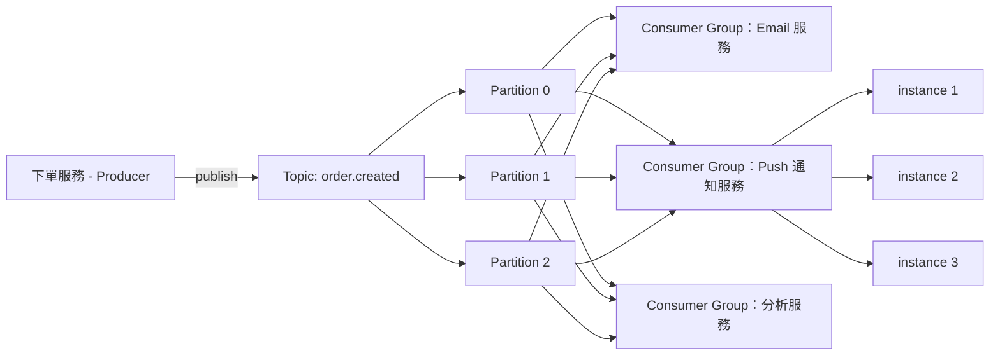
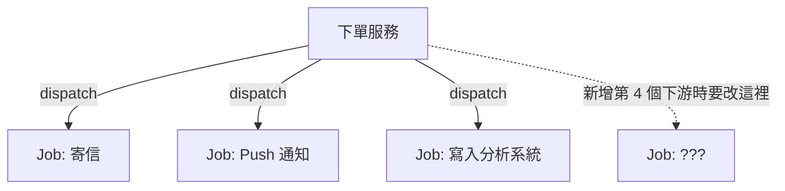
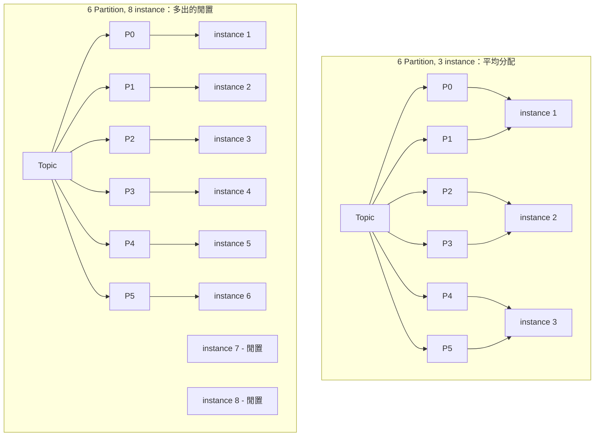

# 從 Laravel Queue 到 MQ：設計一個非同步通知系統

> 學習日期：2026-07-04
> 涵蓋概念：Task Queue vs Pub/Sub、Producer-Consumer 耦合、Topic/Exchange、Consumer Group、Partition 分工

---

## 整體架構圖

下單服務只負責 publish 一個事件，完全不知道有哪些下游要處理；每個下游各自是一個獨立的 Consumer Group，各自水平擴展。

---

## 核心概念一：Task Queue vs Pub/Sub

### 舊做法：多次 dispatch

一開始用 Laravel Queue 的直覺做法是「有幾個下游需求，就多 dispatch 幾個 Job」：

這樣做的問題：**下單服務的程式碼跟每一個下游綁死**。每多一個下游需求，就要回頭改下單這支程式碼、重新部署，耦合度隨下游數量線性增加，維護成本越滾越大。

### 新做法：Pub/Sub 解耦

Laravel 內建 Queue（Redis/DB + Worker pull）本質是 **Task Queue（點對點）**：一個 Job 被一個 Worker 拿走執行、消費掉就沒了，設計目的是「分派任務」，不是「廣播事件」。

而「一個事件、多個獨立系統都要各自收到一份」需要的是 **Pub/Sub** 語意：Producer 只 publish 到一個 **Topic**（Kafka 用語）或 **Exchange**（RabbitMQ 用語），完全不需要知道有誰在聽；每個 Consumer 各自訂閱，訂閱後就能收到屬於自己的那份訊息副本。新增下游系統，只需要「訂閱」，Producer 的程式碼完全不用動。

| 維度 | Task Queue（Laravel Queue） | Pub/Sub（Topic/Exchange） |
|---|---|---|
| 訊息去向 | 被一個 Worker 拿走就消失 | 每個訂閱者各自收到一份 |
| Producer 是否需要知道下游 | 需要（指定 Queue 名稱） | 不需要 |
| 新增下游的成本 | 改 Producer 程式碼 | 下游自己訂閱即可 |
| 適合場景 | 工作分派（寄信、產報表） | 多方都關心同一事件（下單成立） |

---

## 核心概念二：Consumer Group 怎麼分工

> 以下 Partition / Consumer Group 的分工模型是 **Kafka 特有設計**。RabbitMQ 沒有 Partition 這個中間層，要達到類似的水平擴展效果，是讓多個 consumer 訂閱同一個 Queue、用「競爭消費者（competing consumers）」模式各自搶訊息，訊息分配不是依 key hash 決定，而是誰先搶到算誰的。

Pub/Sub 解決了「多系統各收一份」的問題，但緊接著會撞到另一個問題：**同一個下游服務，如果為了承載量開了多個 instance，這些 instance 之間要怎麼分工？**

如果每個 instance 都訂閱同一個 Topic、各自收到全部訊息，會導致同一則通知被重複發送多次，浪費資源又困擾使用者。正確做法是讓同一個 Consumer Group 內的 instance **互斥分工**：

- 訊息依 key 做 hash，決定進哪個 **Partition**（沒有指定 key 時，Producer 通常採 round-robin 分配）
- 同一個 Consumer Group 裡，每個 Partition 只會被其中一個 instance 消費
- 一個 instance 可以同時負責多個 Partition，但一個 Partition 同時只能被一個 instance 消費

**Partition 數量 = 這個 Topic 對某個 Consumer Group 而言的最大平行度上限。** instance 數 ≤ partition 數時可以平均分配、全部 partition 都在運作；一旦 instance 數超過 partition 數，多出的 instance 完全分不到 partition，白白閒置。這也是為什麼 partition 數量要在建 Topic 時就提前規劃，考慮未來擴展需求。

---

## 學習過程的關鍵卡點

**卡點一：多加 dispatch 就能解決多系統需求？**

**原本以為**：新增一個下游需求（例如分析系統要接收下單事件），只要在下單服務裡多 dispatch 一個 Job 就好。

**實際上**：這種做法會讓下單服務的程式碼跟每一個下游耦合——每加一個新下游都要回頭改 Producer 程式碼、重新部署。真正該做的是把「決定誰要收到這個事件」的責任從 Producer 搬出去，改用 Pub/Sub：Producer 只 publish 事件，下游各自訂閱，Producer 完全不需要知道下游是誰、有幾個。

這個卡點值得記住，因為 Laravel Queue 的使用經驗（dispatch Job 到指定 Queue）很容易讓人下意識用「點對點」的思維去解決「廣播」的問題，兩者的擴展性差異在下游數量變多時才會真正顯現。

---

**卡點二：Consumer Group 內多開 instance，會不會每個都收到全部訊息？**

**原本以為**：同一個下游服務開多個 instance 訂閱同一個 Topic，理所當然每個 instance 都會收到全部訊息（跟不同下游服務各收一份的邏輯一樣）。

**實際上**：這是把「Pub/Sub 的跨 Consumer Group 廣播」跟「同一 Consumer Group 內的水平擴展」兩件事搞混了。同一個 Consumer Group 內的多個 instance，是把 Topic 底下的 Partition **互斥分配**出去，每個 Partition 只被一個 instance 消費，藉此達到「訊息只被處理一次、又能平行擴展」。

判斷方式：**不同 Consumer Group 之間是廣播（各收一份完整資料）；同一 Consumer Group 內部是分工（合力瓜分同一份資料）。**

---

**卡點三：instance 數量是不是開越多、平行處理能力就越強？**

**原本以為**：沒有明確思考過這個問題，直覺覺得 instance 開越多，處理速度就越快。

**實際上**：Partition 數量才是這個 Topic 對某個 Consumer Group 的**平行度天花板**。instance 數超過 partition 數之後，多出來的 instance 完全分不到 partition、處於閒置狀態，並不會帶來額外的處理能力。這代表 partition 數量必須在設計階段就依照預期的最大擴展規模去規劃，而不是等到要擴充 instance 才發現撞到天花板。
