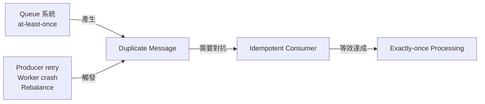
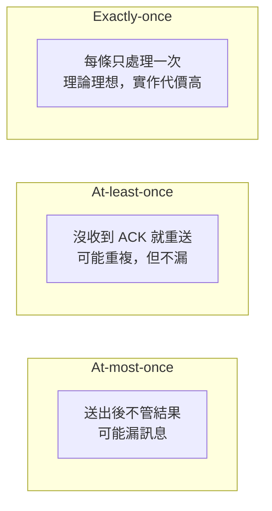
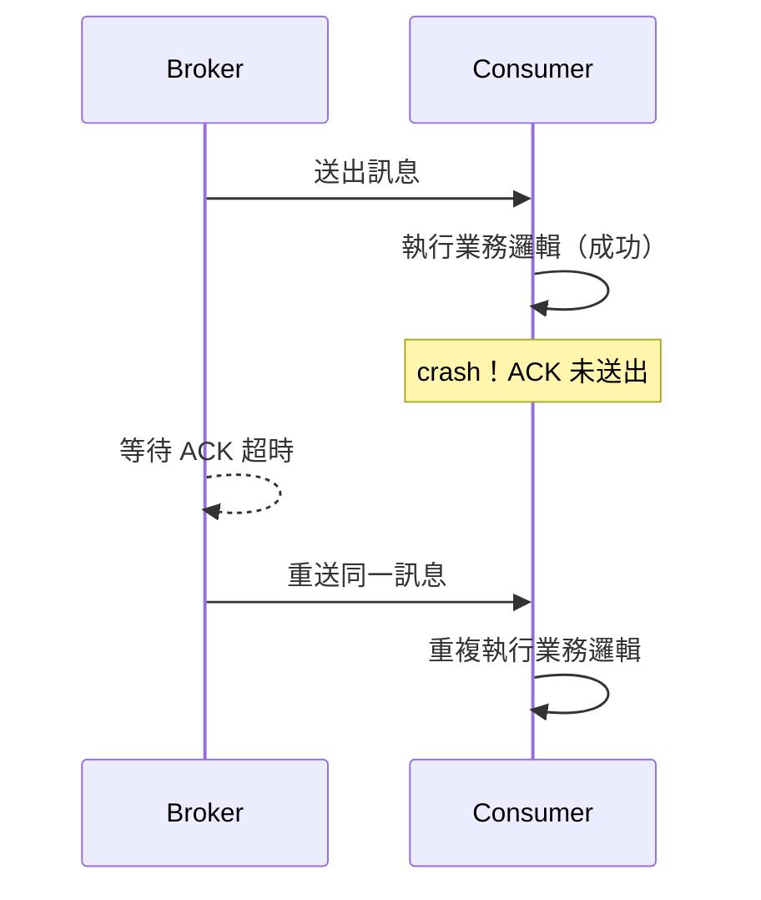
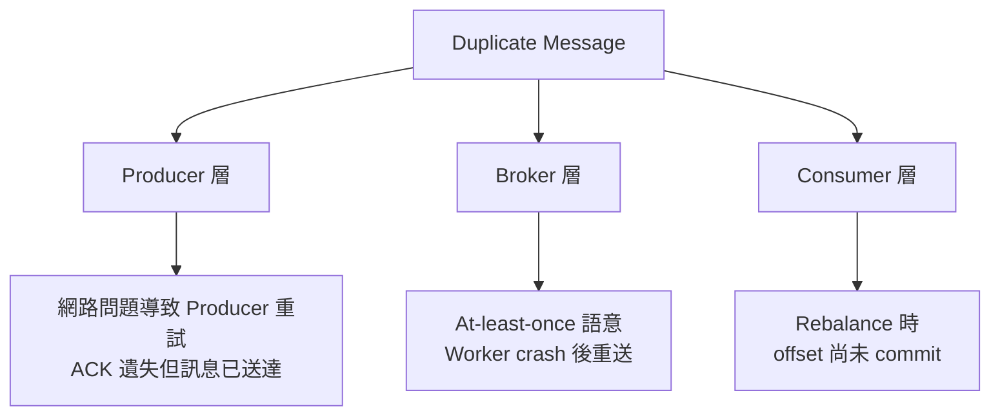
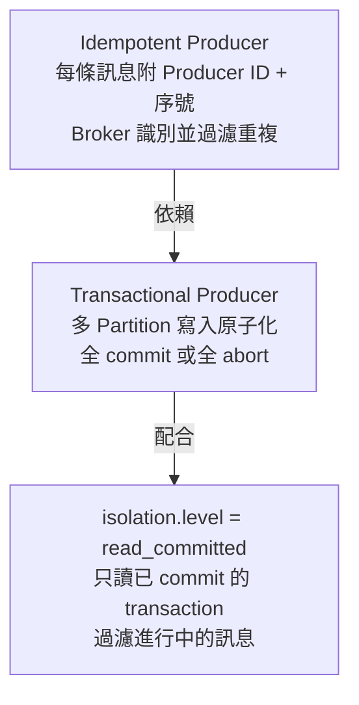
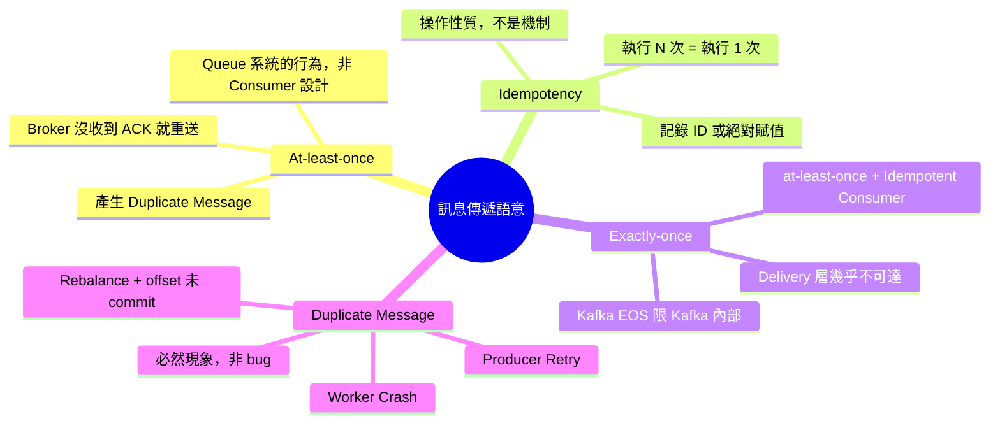

# 冪等性與訊息傳遞語意：Idempotency、At-least-once、Exactly-once

> 學習日期：2026-07-06
> 涵蓋概念：Idempotency、At-least-once、Exactly-once、Duplicate Message、Kafka EOS

---

## 整體關係圖



## Idempotency（冪等性）

**存在的原因**：Queue 系統預設是 at-least-once，訊息可能被重複傳遞。如果 Consumer 的操作不是 idempotent 的，重複執行會造成副作用。

Idempotency 是一種**操作的性質**：不管執行幾次，最終結果與執行一次相同。

### 實作方式

**1. 記錄已處理 ID，跳過重複**

適合有副作用的操作（如寄信、扣款）：在資料庫記錄「這個 order_id 已處理過」，重複到達時直接 skip。

**2. 把相對操作改成絕對操作**

```php
// 非 idempotent：執行 N 次 = 加了 N 次
$order->amount += 100;

// idempotent：執行 N 次 = 結果都一樣
$order->amount = 100;
```

也適用於 SQL 層：`INSERT ... ON DUPLICATE KEY UPDATE` 或 `UPSERT` 都是讓寫入操作天然 idempotent 的手段。

## 傳遞語意（Delivery Semantics）

Queue 系統對「一條訊息會被傳遞幾次」有三種保證：



### At-least-once

Broker 在未收到 Consumer ACK 時會重送訊息。這是大多數 Queue 系統的預設行為，也是 Duplicate Message 的根源。**At-least-once 是 Queue 系統的行為，不是 Consumer 的設計選擇。**

> **Push-based vs Pull-based 的差異**：RabbitMQ 等 push-based 系統中，Broker 主動重送是 at-least-once 的直接原因。Kafka（pull-based）則不同——Broker 不會主動重送，Consumer 的 **offset commit 時機**才是決定語意的關鍵：處理**前** commit → at-most-once（crash 後訊息不重讀）；處理**後** commit → at-least-once（crash 後重新消費）。Kafka 的 Consumer 對語意有實質的選擇權。



### Exactly-once：為什麼很難

執行完畢和送出 ACK 這兩件事**無法同時發生**，中間永遠有一個空隙：

- 先 ACK 再執行 → 執行失敗時訊息遺失 → at-most-once
- 先執行再 ACK → ACK 前 crash → Broker 重送 → at-least-once

這不是設計問題，是分散式系統繞不過去的物理限制。

**實務解法**：at-least-once + idempotent consumer = **effectively exactly-once processing**

訊息可能重複到達，但 Consumer 設計成 idempotent，讓重複執行無害。

## Duplicate Message

Duplicate message 是分散式系統中的**必然現象**，不是 bug，而是設計前提。

### 來源



Rebalance 觸發條件：Consumer 加入、Consumer 離開、Consumer 心跳超時、Partition 擴充——任何造成 Consumer Group 重新分配的事件，加上 offset 未 commit，都可能產生重複。

### 對策

不要試圖消滅重複，而是讓 Consumer 具備 idempotency，讓重複到達**無害**。

## Kafka EOS（延伸）

Kafka 在特定條件下能在其內部達到 exactly-once semantics，靠三層機制疊加：



**重要邊界**：Kafka EOS 只保證 **Kafka → Kafka** 的流程（如 consume → transform → produce 到另一個 topic）。一旦 Consumer 需要寫入外部系統（MySQL、Redis），又回到 at-least-once + idempotent consumer 的問題。

## 概念比較表

| 概念 | 類型 | 核心定義 | 實作層面 |
|---|---|---|---|
| **Idempotency** | 操作性質 | 執行 N 次 = 執行 1 次，結果相同 | 記錄已處理 ID；用絕對賦值取代相對運算 |
| **At-least-once** | Queue 傳遞語意 | 訊息保證送達，但可能重複 | Broker 在沒收到 ACK 時重送；主流預設行為 |
| **Exactly-once** | 處理結果保證 | 業務邏輯只發生一次 | Delivery 層幾乎不可達；靠 at-least-once + idempotent consumer 等效實現 |
| **Duplicate Message** | 系統現象 | 同一訊息被 Consumer 收到超過一次 | 來源：Producer 重試、Worker crash、Rebalance 時 offset 未 commit |

**關係總結**：At-least-once 是產生 duplicate message 的根源；idempotency 是讓 duplicate message 無害的手段；exactly-once processing 是三者組合後達成的效果。

## 快速記憶脈絡



## 學習過程的關鍵卡點

**卡點一：把 idempotency 的定義跟實作手段混在一起**

**原本以為**：Idempotency 是指「事件有唯一識別 + 防止重複觸發的設計」。

**實際上**：這描述的是「如何實作 idempotency」，不是 idempotency 本身的定義。Idempotency 是一個**性質**：不管執行幾次，結果都跟執行一次相同。「唯一識別」和「防止重複觸發」是讓操作具備這個性質的**手段**，兩者層次不同。記住這個區別很重要——面試時被問「什麼是 idempotency」，要先給性質定義，再說實作手段。

---

**卡點二：以為 at-least-once 是 Job 的設計選擇**

**原本以為**：「這個 Job 設計是 at-least-once」——把 at-least-once 當作 Consumer Job 的屬性。

**實際上**：At-least-once 是 **Queue 系統（Broker）的行為保證**，不是 Consumer 的設計選擇。Consumer 自己的屬性是 idempotency。兩者分屬不同層次：Broker 決定「送幾次」，Consumer 決定「重複送來時怎麼處理」。不過在 Kafka 中，Consumer 的 offset commit 時機對語意有實質影響——處理前 commit 是 at-most-once，處理後 commit 才是 at-least-once，Consumer 在 Kafka 中有選擇權。

---

**卡點三：以為 exactly-once 是 Queue 能直接提供的保證**

**原本以為**：只要 Broker 和 Consumer 能偵測已執行過的狀態，就能達到 exactly-once。

**實際上**：那描述的是 exactly-once **processing**，不是 exactly-once **delivery**。根本障礙在於「執行完畢」和「送出 ACK」之間永遠有空隙——先 ACK 可能遺失訊息，後 ACK 可能重複執行。這是物理限制，不是設計問題。業界的正解是接受這個限制，然後用 idempotency 讓重複無害。
