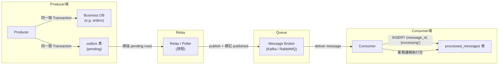
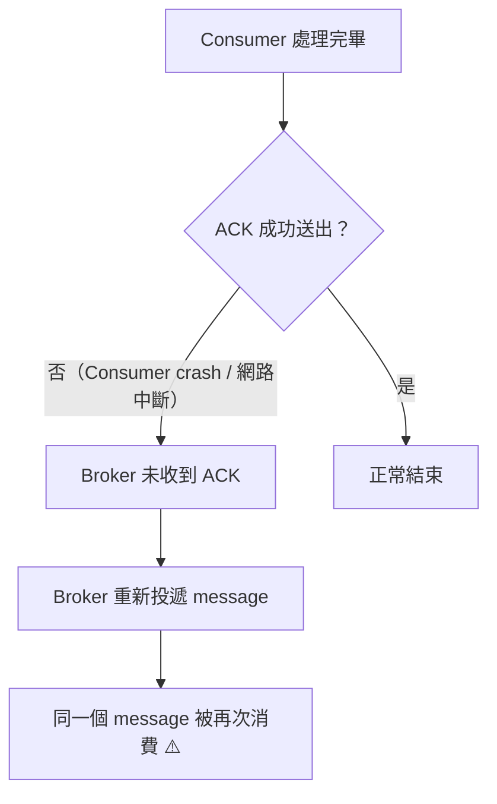
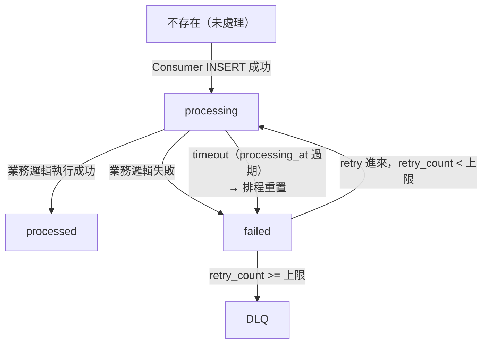
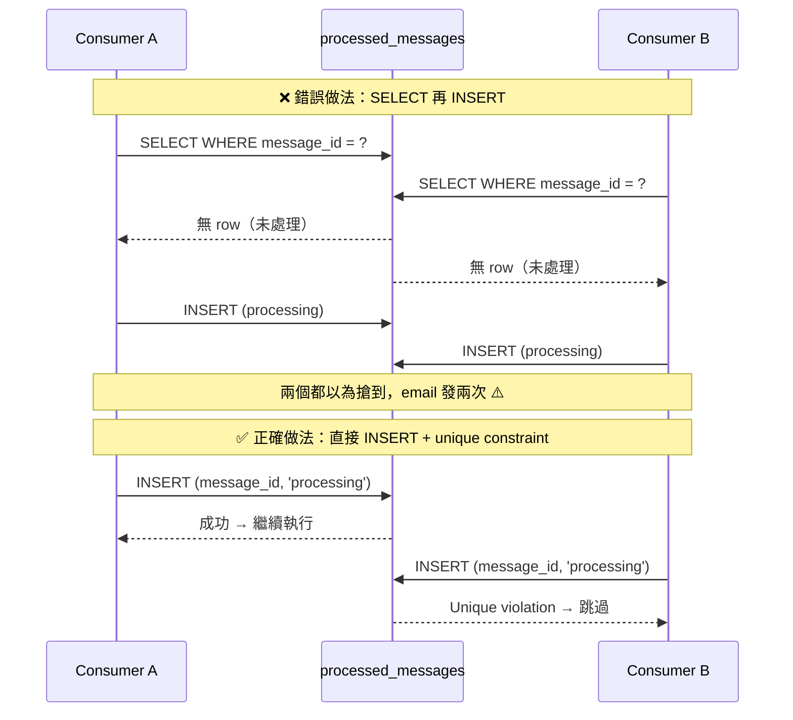
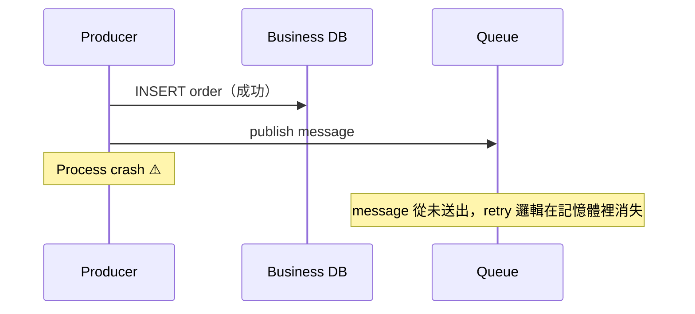
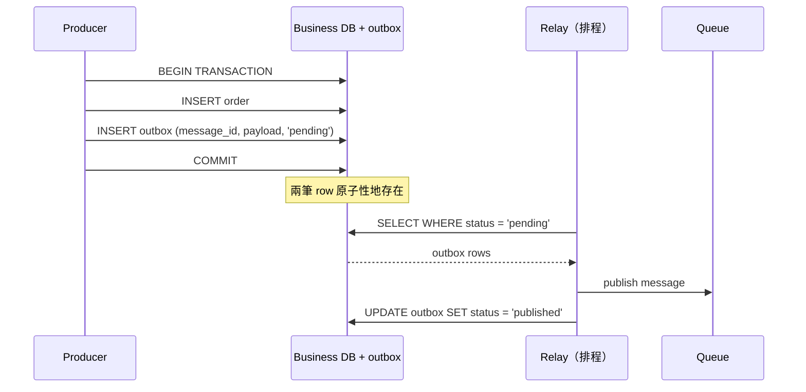

# Idempotency Key、processed_messages 與 Outbox Pattern 的 Schema 設計與取捨

> 學習日期：2026-07-07
> 涵蓋概念：Idempotency Key、processed_messages 設計、Race Condition 防護、Retry + DLQ、Outbox Pattern

---

## 整體架構：Producer → Queue → Consumer 的雙表設計



兩張表分工明確：
- **`outbox`**：Producer 端的可靠性保證——確保 message 一定會被 publish
- **`processed_messages`**：Consumer 端的冪等性保證——確保同一個 message 不會被處理兩次

---

## 為什麼需要 Idempotency Key

在 at-least-once 傳遞語意下，以下任何一種情況都會造成重複消費：



**End-to-end 的 Exactly-Once processing 在分散式系統幾乎做不到**，因為網路 latency、consumer crash、水平擴展都會導致重複。解法是換個思路：**不阻止重複傳遞，而是讓重複處理變得無害**。

> Kafka 0.11+ 透過 idempotent producer + transactions 支援 broker 層面的 Exactly-Once Semantics（EOS），可以保證 producer → broker 這段不重複。但 EOS 不涵蓋 consumer 的業務邏輯，因此 consumer 側仍需要 `processed_messages` 做冪等保護。

### Producer UUID vs Broker ID

| 來源 | 特性 | 問題 |
|------|------|------|
| Broker 指派 ID | 每次 publish 產生新 ID | Producer retry 時同一個業務事件被當成兩筆不同 message |
| **Producer 指派 UUID** | Producer 產生後帶入 payload/header | Retry 時帶同一個 UUID，Consumer 可偵測重複 ✓ |

Producer 在**產生請求時**就決定好 UUID，retry 時重用同一個——這樣 Consumer 才能識別「這是同一件事的重送」。

---

## processed_messages 表設計

### Schema

```sql
CREATE TABLE processed_messages (
  id            BIGINT UNSIGNED AUTO_INCREMENT PRIMARY KEY,
  message_id    VARCHAR(36)  NOT NULL,
  status        ENUM('processing', 'processed', 'failed') NOT NULL,
  retry_count   INT UNSIGNED NOT NULL DEFAULT 0,
  processing_at TIMESTAMP    NULL,
  processed_at  TIMESTAMP    NULL,
  created_at    TIMESTAMP    NOT NULL DEFAULT CURRENT_TIMESTAMP,
  UNIQUE KEY uq_message_id (message_id)
);
```

### 狀態轉換



> **INSERT unique violation 發生時**：代表該 row 已存在於 DB（status 為 `processing`、`processed` 或 `failed`），此 consumer 直接跳過，不改變 DB 狀態。狀態圖只描述 row 本身的轉換，consumer 的「跳過」行為不屬於 row 的狀態變化。

### 每個欄位的設計理由

| 欄位 | 用途 |
|------|------|
| `message_id` | Producer UUID，加 UNIQUE KEY → 讓 INSERT 成為原子的 check-and-lock |
| `status` | 表達中間狀態（processing），防 race condition；tracking retry 路徑 |
| `retry_count` | 達上限時不再重試，觸發 DLQ 轉移 |
| `processing_at` | 記錄進入 processing 的時間；排程掃描超時 row 並重置 |
| `processed_at` | 記錄成功完成時間，用於審計與監控 |
| `created_at` | Row 建立時間 |

---

## 用 Unique INSERT 解決 Race Condition

光記錄「row 是否存在」或「`processed_at` 是否有值」防不了兩個 consumer 同時搶同一個 message：



**一個 INSERT 同時完成 check + lock**，資料庫層面保證原子性，沒有 SELECT 和 INSERT 之間的 TOCTOU window。

### Failed Message 的 Retry 路徑

純 INSERT 只解決「全新 message 的競爭」。當一筆 message 已在 `failed` 狀態，retry 進來的 consumer 嘗試 INSERT 同一個 `message_id` 會拿到 unique violation——若直接跳過，這個 message 永遠無法被 retry。

正確做法是 **INSERT + fallback UPDATE**：

```
1. 嘗試 INSERT (message_id, 'processing')
2. 若成功 → 繼續執行業務邏輯
3. 若 unique violation：
   a. SELECT 該 row 的 status 和 retry_count
   b. 若 status = 'failed' 且 retry_count < 上限
      → UPDATE status = 'processing', retry_count + 1 WHERE message_id = ? AND status = 'failed'
      → 檢查 affected rows = 1（防止兩個 consumer 同時 retry 的競爭）
      → 繼續執行業務邏輯
   c. 若 status = 'processing' 或 'processed' → 跳過
   d. 若 retry_count >= 上限 → 轉移至 DLQ
```

---

## Stuck Processing 的偵測與恢復

Consumer crash 會讓 row 卡在 `processing` 永遠不被處理：

- `processing_at` 記錄進入 processing 的時間
- 排程定期執行：

```sql
UPDATE processed_messages
SET status = 'failed', retry_count = retry_count + 1
WHERE status = 'processing'
  AND processing_at < NOW() - INTERVAL 5 MINUTE;
```

timeout 的 row 被重置回 `failed`，下次 retry 就能重新處理。

---

## Outbox Pattern

### 為什麼 Producer 端 retry 靠記憶體不夠



Process crash 後，記憶體中的 retry 邏輯隨之消失。沒有人記得「這筆訂單還有一個 message 沒送出去」。

### Outbox Pattern 的解法



**把 publish 的意圖持久化進 DB**，Relay 負責實際送出。就算 Process crash，重啟後 Relay 仍能從 `outbox` 找到未發送的 row。

### Schema

```sql
CREATE TABLE outbox (
  id           BIGINT UNSIGNED AUTO_INCREMENT PRIMARY KEY,
  message_id   VARCHAR(36)  NOT NULL,
  topic        VARCHAR(255) NOT NULL,
  payload      JSON         NOT NULL,
  status       ENUM('pending', 'published') NOT NULL DEFAULT 'pending',
  published_at TIMESTAMP    NULL,
  created_at   TIMESTAMP    NOT NULL DEFAULT CURRENT_TIMESTAMP,
  UNIQUE KEY uq_message_id (message_id)
);
```

---

## 設計取捨 Trade-off

| 設計決策 | 優點 | 代價 |
|----------|------|------|
| `processed_messages` unique INSERT | 原子 check-and-lock，無 race condition | 每筆 message 都有一次 DB write |
| `status` 三種狀態 | 可表達中間狀態，支援 timeout 偵測 | Schema 複雜度提升；需排程清理 stuck rows |
| `retry_count` 上限 + DLQ | 防無限重試 | DLQ 需要額外監控與人工處理流程 |
| Outbox 與業務寫入同 transaction | Producer 端原子性，訊息不遺失 | 多一張表；Relay 是額外元件 |
| `outbox` 與 `processed_messages` 分開 | 職責清晰，生命週期不同 | 兩張表各自需維護與清理策略 |
| `processed_messages` 無限成長 | 完整的歷史記錄 | **需設計 TTL 或定期歸檔，否則表會無限膨脹** |
| Relay 的 at-least-once 特性 | 保證 message 一定送出 | Relay publish 成功但 UPDATE outbox 前 crash，重啟後會重複 publish——這正是 consumer 側 `processed_messages` 不可省略的原因，兩張表相互依存 |

---

## 學習過程的關鍵卡點

**卡點一：以為 `processed_at` 有值就能防重複**

原本以為：只要查到 `processed_at` 不是 NULL，就代表處理過了，後來的 consumer 跳過就好。

實際上：當兩個 consumer 幾乎同時查表，兩個都看到「這筆 row 不存在」——這時候 `processed_at` 根本還沒有值。race condition 在「查詢」和「寫入」之間發生，用 SELECT 再 INSERT 的兩步操作無法解決。解法是用 UNIQUE constraint + 直接 INSERT，讓資料庫在單一操作內完成 check-and-lock。

**卡點二：把 `processed_messages` 當成 Producer 端追蹤的地方**

原本以為：可以用 `processed_messages` 這張表記錄哪些 message 還沒被 publish 出去。

實際上：`processed_messages` 是 consumer 在寫的，記錄「我處理過了」；而 Producer 端要追蹤的是「我還沒送出去」——方向相反、職責完全不同。混用會讓兩邊的 lifecycle 和寫入方衝突。需要獨立的 `outbox` 表，由 Producer 在業務寫入的同一個 transaction 中填入。

**卡點三：以為 Process crash 後 retry 邏輯還在**

原本以為：Producer 端只要有 retry 機制就能確保 message 被送出去。

實際上：retry 邏輯住在記憶體裡，process crash 後就消失了。沒有任何人記得「這筆業務操作還有 message 沒送出去」。唯一可靠的方式是在 crash 前就把「待送出的意圖」持久化到 DB（Outbox Pattern），讓外部 Relay 負責實際 publish。
