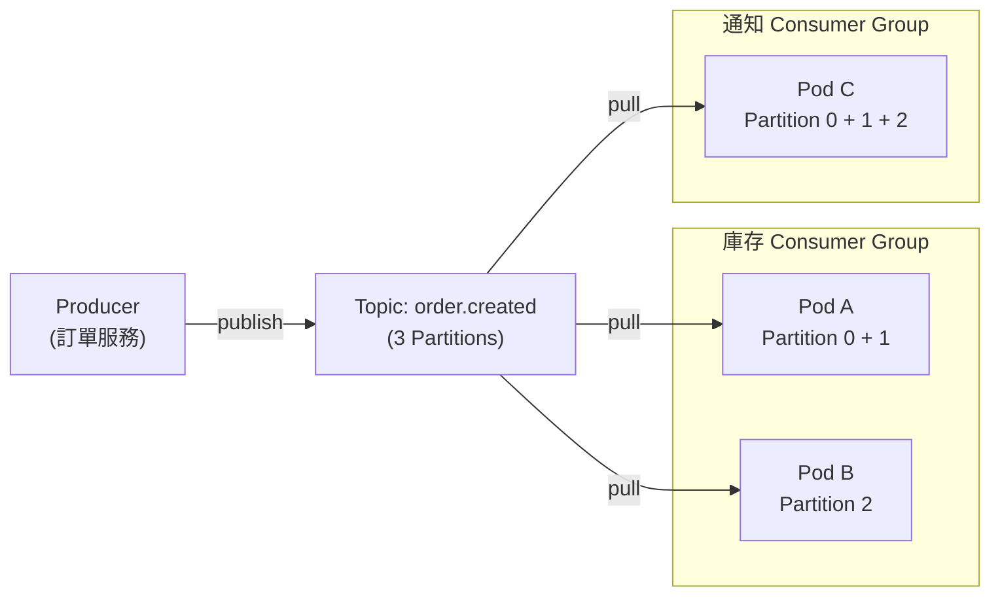
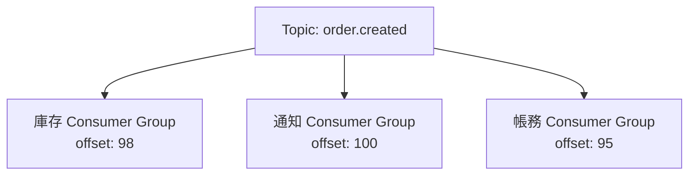
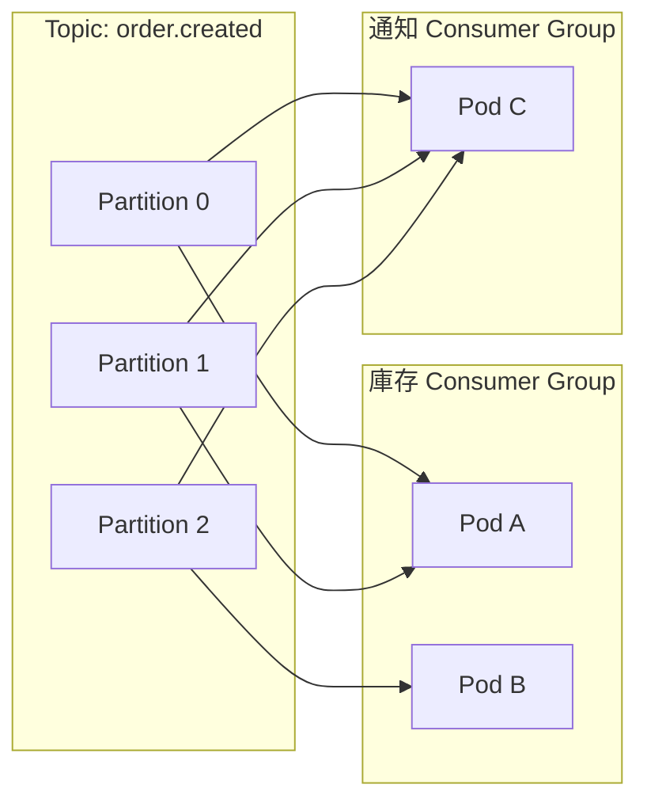
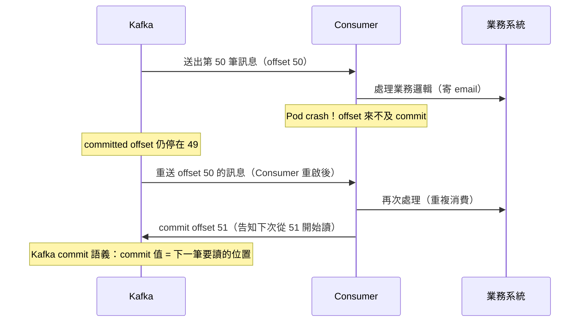

# Kafka Producer、Consumer、Partition 與 At-least-once Delivery

> 學習日期：2026-07-23
> 涵蓋概念：Kafka Producer、Consumer、Topic、Partition、Consumer Group、Offset、At-least-once Delivery、Idempotency

---

## 整體架構



## 為什麼需要 Kafka？

從 Laravel Queue 出發：一個 Job 被 Worker 拿走後就消失，只有一個 Worker 能處理。

當訂單成立需要通知庫存、通知、帳務三個服務時，Laravel Queue 的做法是**發三個 Job 到三個不同 Queue**——每次新增下游服務，就要改訂單服務的程式碼。這是**緊耦合（tight coupling）**。

Kafka 的解法：Producer 只管發到 **Topic**（廣播頻道），想收的人自己訂閱，Producer 完全不需要知道有誰在聽。

## Topic

像一個廣播頻道。Producer 把訊息丟進去，任意數量的下游服務可以各自獨立訂閱，互不干擾。

和 Laravel Queue 最關鍵的差異：**訊息不會在被消費後消失**，而是保留直到 retention 期間到期（預設 7 天）。這讓 Kafka 能做**事件重放（replay）**——新加入的服務可以從最早的歷史訊息開始讀起。

## Consumer Group

每個「獨立的訂閱者身份」叫做 Consumer Group。

- 庫存服務 → 一個 Consumer Group
- 通知服務 → 另一個 Consumer Group
- 帳務服務 → 又是一個 Consumer Group

Kafka 為每個 Consumer Group 獨立維護它讀到哪裡了（**offset**），三個 Group 互不影響。新加入的 Group 可以選擇從 `earliest`（所有歷史訊息）或 `latest`（只讀新訊息）開始。



## Partition

Topic 的**實體切分單位**，讓同一個 Consumer Group 的多個 Consumer instance 能並行處理。

核心規則：**同一個 Consumer Group 裡，一個 Partition 只能分給一個 Consumer。**

這保證了 Group 內不重複消費。分工方式是「每個 Consumer 負責不同的 Partition」，不是多個 Consumer 同時讀同一個 Partition。

### Partition 數量決定最大並行度

| Partition 數 | Consumer 數（同一 Group） | 結果 |
|:-----------:|:---------------------:|-----|
| 3 | 2 | 一個 Consumer 拿 2 個，另一個拿 1 個 |
| 3 | 3 | 每個 Consumer 各拿 1 個 |
| 3 | 5 | 3 個 Consumer 工作，2 個 Pod 閒置 |

**閒置的是 Pod，不是 Partition**——Partition 永遠會被分配出去。

### 實際範例：3 Partition、庫存 2 Pod、通知 1 Pod



兩個 Consumer Group 從同一個 Topic 各自讀，offset 完全獨立。

## At-least-once Delivery

Kafka 的訊息可靠性分三個層級：

| 層級 | 說明 |
|------|------|
| At-most-once | 可能遺失，不重複 |
| **At-least-once** | **不遺失，可能重複（需手動 commit：`enable.auto.commit=false`；若用預設 auto commit 可能退化為 at-most-once）** |
| Exactly-once | 不遺失，不重複（需 Kafka Transactions + Consumer 設定 `isolation.level=read_committed`） |

### Offset Commit 機制

Consumer 讀完訊息、處理完業務邏輯後，才告訴 Kafka「我讀到這裡了」——這個動作叫做 **commit offset**。



### Idempotency（冪等性）

At-least-once 是 Kafka 的保證，**「不重複」是 Consumer 自己要負責的事**。

解法：用 **event ID** 作為唯一鍵，處理前先查是否已處理過。

```
處理前：查詢 event_id 是否已存在
若已存在 → 直接跳過
若不存在 → 執行業務邏輯 → 記錄 event_id
```

event ID 可存於 Redis（快，但若未開啟持久化或在 crash 間隔內，可能遺失部分去重紀錄）或 DB（持久但稍慢），依場景對「偶爾重複」的容忍度決定。

## 對比：Laravel Queue vs Kafka

| 維度 | Laravel Queue + Redis | Kafka |
|------|----------------------|-------|
| 訊息消費後 | 立即刪除 | 保留至 retention 到期 |
| 多個下游消費者 | Producer 需發多個 Job | 各自建立 Consumer Group，Producer 無感知 |
| 並行擴展 | 多個 Worker 搶同一個 Queue | Partition 決定最大並行度 |
| 事件重放 | 不支援 | 支援（從 earliest offset 讀起） |
| 可靠性保證 | 依設定 | At-least-once（預設）、Exactly-once（需配置） |

## 學習過程的關鍵卡點

**原本以為**：同一個 Consumer Group 裡，多個 Consumer 可以同時讀同一個 Partition——類似多個 Worker 搶 Queue 的概念。

**實際上**：同一個 Group 內，每個 Partition 只分給一個 Consumer。分工是「各自拿不同 Partition」，而不是「搶同一個 Partition」。若讓兩個 Consumer 同時讀同一個 Partition，會造成重複消費。

---

**原本以為**：3 個 Partition、2 個 Pod，就是 2 個 Pod 各拿 1 個，剩下一個 Partition 沒人管。

**實際上**：Kafka 不會讓 Partition 閒置。3 個 Partition 分給 2 個 Pod，結果是一個 Pod 拿 2 個、另一個拿 1 個。「閒置」的是 Pod 不是 Partition（Pod 數 > Partition 數 時才會有 Pod 閒置）。

---

**原本說**：「Broker 會更新每個事件的狀態」

**實際上**：Broker 更新的是每個 Consumer Group 的 **offset**（讀到哪裡了），不是事件本身的狀態。事件寫進 Topic 後是不可變的（immutable），只有 offset 在移動。
