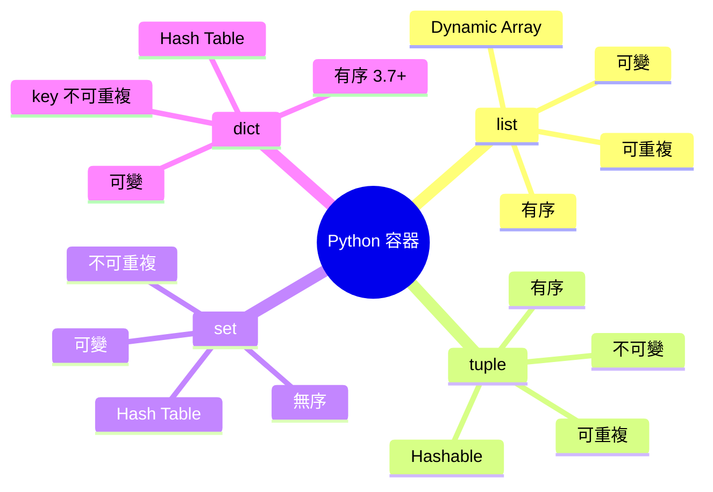
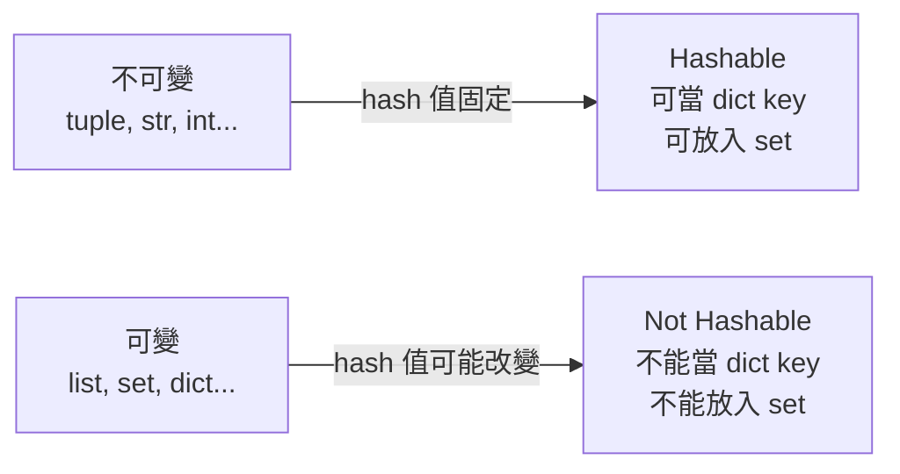
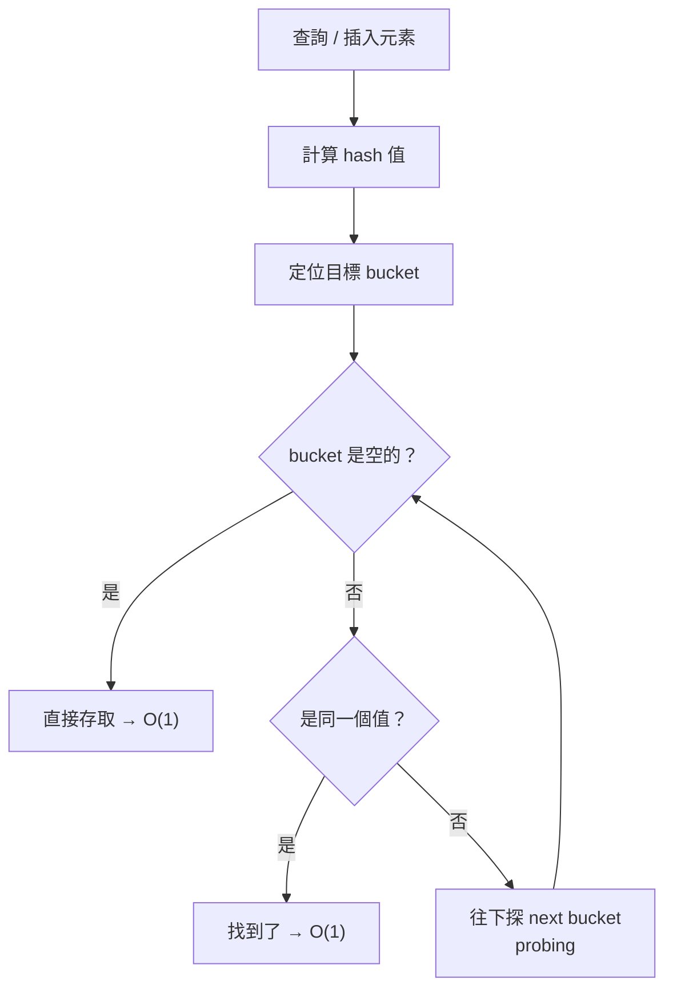
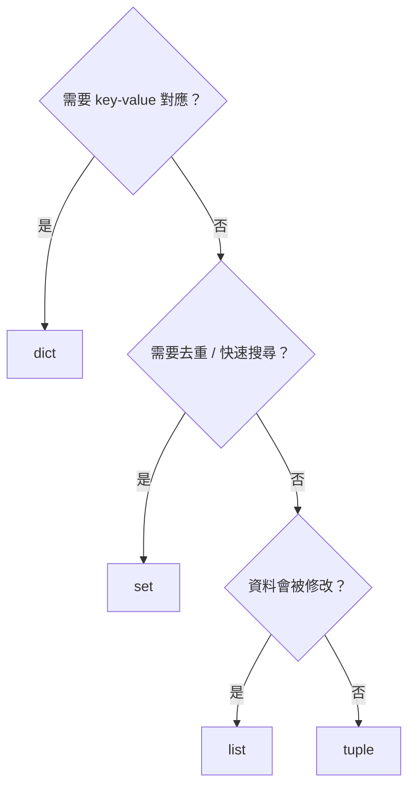

# Python 內建容器完全解析：list、tuple、set、dict 的設計邏輯與時間複雜度

> 學習日期：2026-07-06
> 涵蓋概念：list、tuple、set、dict、hash table、hash collision、open addressing、load factor

---

## 整體概覽



---

## 四種容器核心特性

### list — Dynamic Array（動態陣列）

list 底層是 **dynamic array**，所有元素存放在**連續的記憶體區塊**。

連續記憶體是它的一切：知道起始位址 + index，直接算出目標位址——這才是索引存取 O(1) 的根源。

- **索引存取 O(1)**：直接計算位址，不需遍歷
- **搜尋 O(n)**：沒有排序，只能一個一個比對
- **尾端插入 O(1) amortized**：空間夠直接放；不夠則擴容搬移（O(n)），但均攤後是 O(1)
- **中間插入 O(n)**：插入點後所有元素必須往後**位移**一格

### tuple — 不可變的 list

tuple 與 list 的存取複雜度相同，但有兩個 list 沒有的優勢：

1. **hashable**：不可變 → hash 值永遠固定 → 可當 dict key、可放入 set
   - 前提：tuple 內**所有元素也必須是 hashable**，否則依然會拋出 TypeError
   ```python
   hash((1, 2))       # OK
   hash((1, [2, 3]))  # TypeError: unhashable type: 'list'
   ```
2. **更小的記憶體佔用**：不需預留擴容空間，建立時就固定大小，比 list 快且省記憶體

```python
import sys
t = (1, 2, 3)
l = [1, 2, 3]
print(sys.getsizeof(t))  # 較小
print(sys.getsizeof(l))  # 較大
```

### set — Hash Table，天生去重

set 內部是 **hash table**。放入元素時先算 hash，直接定位到對應的 bucket。

- **搜尋、插入、刪除平均 O(1)**：hash 定位，不需遍歷
- **自動去重**：set 判斷重複需同時滿足兩個條件：`hash(a) == hash(b)` **且** `a == b`。hash 相同但值不相等是 collision，仍會繼續 probing，不會被視為重複元素
- **無序**：元素的排列由 hash 值決定，不是插入順序
- **元素必須 hashable**：`tuple` 可以放入，`list` 不行

### dict — 有序的 Hash Table

dict 與 set 同樣用 hash table，差異在於：

- 儲存的是 **key-value pair**，用 key 的 hash 定位
- **Python 3.7+ 保留插入順序**（set 不保留）
- **key 不可重複**：同一個 key 寫入兩次，後者直接覆蓋前者

---

## Hashability：可變性決定能否被 hash



**為什麼可變物件不能被 hash？**
dict/set 用 hash 值定位元素。如果一個 list `[1, 2, 3]` 被改成 `[1, 2, 99]`，hash 值就會改變，原本的定位就找不到它——所以 Python 乾脆規定可變物件不能被 hash。

---

## Hash Table 內部機制

### Hash Collision（碰撞）與 Open Addressing

兩個不同的值可能算出相同的 hash，稱為 **collision（碰撞）**。

Python 的解法是 **open addressing + probing**：碰撞時往下探下一個 bucket，直到找到空位。



碰撞多時，probing 步驟增加，最壞情況要探完所有 bucket → **O(n)**。

> CPython 實際使用的是 **perturbation-based probing**（每輪偏移量根據 `perturb` 值計算，不是單純 +1），上圖以線性探測示意。

### Load Factor 與 Rehash

Python 用 **load factor（負載因子）** 控制碰撞機率：

```
load factor = 元素數 / bucket 總數
```

當 load factor 超過 **2/3** 時，自動觸發 **rehash**——把 hash table 擴大並重新分配所有元素，讓碰撞機率降回低水位。

這也是 set/dict 說「**平均** O(1)」而非「保證 O(1)」的原因。

---

## 時間複雜度對比

| 操作 | list | tuple | set | dict |
|------|------|-------|-----|------|
| 索引存取 | O(1) | O(1) | ❌ | O(1) by key |
| 搜尋元素 | O(n) | O(n) | O(1) avg | O(1) avg by key |
| 尾端插入 | O(1) amortized | ❌ | O(1) avg | O(1) avg |
| 中間插入 | O(n) | ❌ | — | — |
| 刪除 | O(n) | ❌ | O(1) avg | O(1) avg |

---

## 選用指南



---

## 學習過程的關鍵卡點

**卡點一：list 底層是 linked list？**

**原本以為**：list 是「linked array」，類似 linked list。

**實際上**：Python list 是 **dynamic array**，元素存放在連續記憶體，索引存取才能是 O(1)。linked list 雖然也有序，但取第 n 個元素要 O(n)，因為必須從頭跟著指標一路走。連續記憶體才是 O(1) 的根源。

---

**卡點二：hash 是記憶體位址？**

**原本以為**：hash 是找到記憶體中元素位置的東西，類似記憶體位址。

**實際上**：hash 是**根據值的內容計算出的一個數字**，不是記憶體位址。同樣的值永遠算出同樣的 hash。可變物件之所以不能被 hash，是因為值被改掉後 hash 就變了，dict/set 就再也找不到它——Python 乾脆規定可變物件沒有 hash。

---

**卡點三：list.insert 為什麼是 O(n)？**

**原本以為**：因為需要「遍歷」才能找到插入位置。

**實際上**：定位到插入點是 O(1)（連續記憶體直接算位址），昂貴的是插入點之後的所有元素都要**往後位移一格**。這是連續記憶體的代價：存取快，但中間插入要搬移大量元素。

---

**卡點四：hash collision 如何讓 O(1) 退化？**

**原本以為**：碰撞發生時，Python 會去「看同一個位置指向哪些值」。

**實際上**：Python 用 **open addressing + probing**——碰撞時往下探下一個 bucket，直到找到空位或目標。碰撞越多，要探的 bucket 越多，最壞退化成 O(n)。Python 靠 load factor（2/3 閾值）觸發 rehash 來維持低碰撞率。
