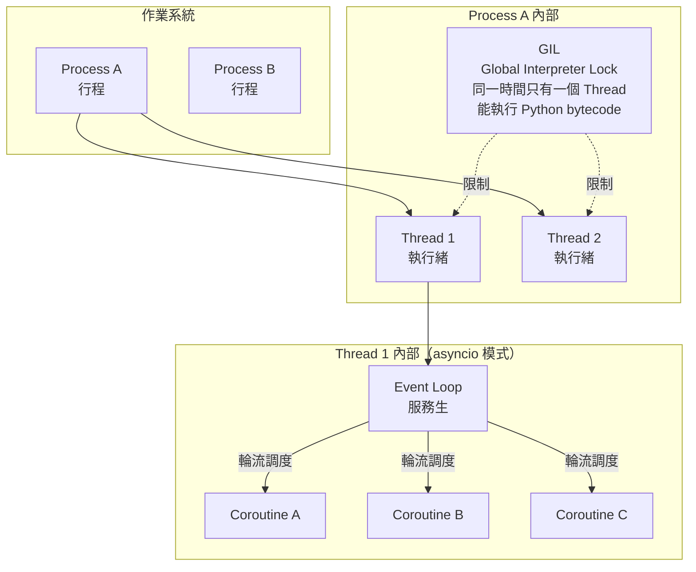
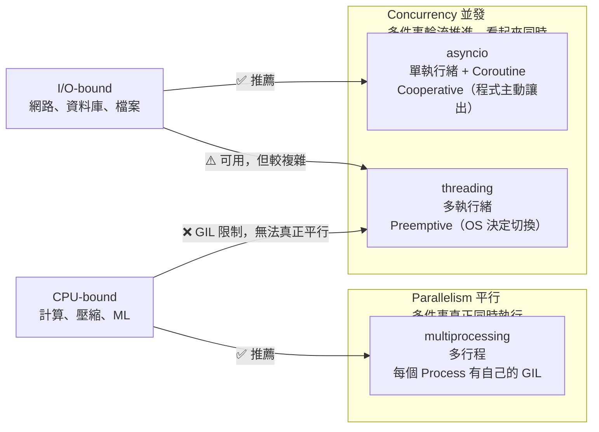
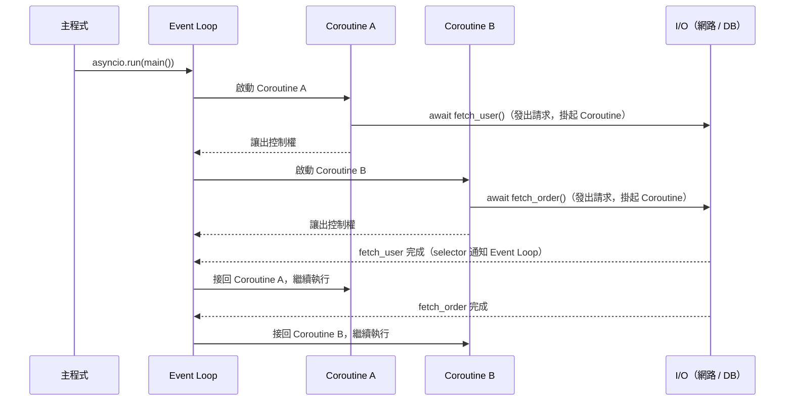
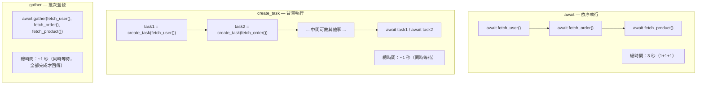
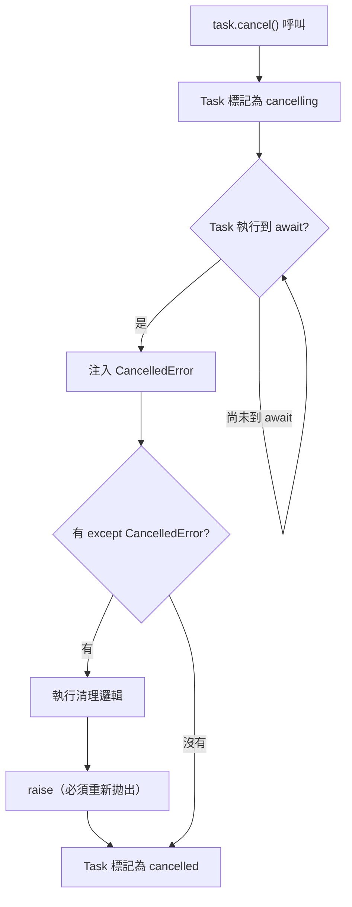

# Python 非同步完全指南：Event Loop、asyncio 與並發模型

> 學習日期：2026-07-11
> 涵蓋概念：Concurrency vs Parallelism、Thread vs Process vs Coroutine、Event Loop、Coroutine、async/await、asyncio.gather、asyncio.Task、asyncio.wait_for、asyncio.shield、GIL

---

## 執行單元層級與並發模型全景圖



**層級關係**：OS → Process → Thread → Coroutine

---

## Concurrency vs Parallelism



| | asyncio | threading | multiprocessing |
|---|---|---|---|
| 執行模型 | Concurrency（協作式） | Concurrency（搶佔式） | Parallelism（真正平行） |
| 執行緒數 | 1 | N | 1 per process |
| GIL 影響 | 單執行緒無爭搶問題 | CPU-bound 無效 | 不受影響（各自有 GIL） |
| 適合工作 | I/O-bound | I/O-bound | CPU-bound |
| 切換方式 | 程式主動（`await`） | OS 決定 | OS 決定 |
| Race Condition 風險 | 低（切換點可預期，但共享狀態在 `await` 間仍需注意） | 高（需要 lock） | 低（記憶體隔離） |

---

## Event Loop 核心機制

用餐廳來比喻：一個服務生（Event Loop）負責處理多位客人的訂單（Coroutine），需要等待的工作交給廚房（I/O 操作），等待期間繼續服務其他客人。



**關鍵**：`await` 不是「程式暫停」，而是「**這個 Coroutine 讓出控制權**，讓 Event Loop 去做別的事」。

---

## Coroutine 與 Promise 的對比

| | Python Coroutine | JS Promise |
|---|---|---|
| 建立方式 | `async def func()` | `new Promise()` 或 async function |
| 呼叫後得到 | Coroutine 物件（還沒跑） | Promise 物件（已開始跑） |
| 等待結果 | `await coro` | `await promise` |
| 比喻 | 一份食譜（可暫停的指令集） | 號碼牌（未來結果的容器） |

---

## async/await vs create_task vs gather



| | `await func()` | `create_task()` | `gather()` |
|---|---|---|---|
| 執行方式 | 依序，等完才繼續 | 背景排程，立刻繼續 | 同時啟動，全部完成才回傳（預設若有例外則立即取消其餘並傳播；`return_exceptions=True` 可改為收集全部結果再回傳） |
| 適合情境 | 有依賴關係的操作 | 背景持續任務、需個別控制 | 一次發多個無依賴的請求 |
| 取得結果 | 直接 | `await task` | 解構回傳值 |
| 底層 | - | asyncio.Task | 多個 asyncio.Task 的包裝 |

```python
# await — 依序
result1 = await fetch_user()    # 等完
result2 = await fetch_order()   # 才開始

# create_task — 背景
task1 = asyncio.create_task(fetch_user())
task2 = asyncio.create_task(fetch_order())
await do_something_else()       # 中間可做其他事
result1 = await task1           # 需要時再取結果
result2 = await task2

# gather — 批次
result1, result2 = await asyncio.gather(
    fetch_user(),
    fetch_order(),
)
```

---

## Timeout 與 Cancel

### wait_for — 設定超時

```python
try:
    result = await asyncio.wait_for(fetch_user(), timeout=5)
except asyncio.TimeoutError:
    # 超過 5 秒，處理備案
    result = default_value
```

### task.cancel() — 取消 Task

`cancel()` 不是立刻強制停止，而是在 Task 下次執行到 `await` 時**注入 `CancelledError`**。



```python
async def fetch_with_cleanup():
    try:
        await some_io_operation()
    except asyncio.CancelledError:
        await asyncio.shield(cleanup())  # 保護清理不被打斷
        raise  # 必須重新拋出，讓外部知道 Task 確實被取消
```

### shield — 保護關鍵工作

`asyncio.shield(func())` 將傳入的 async 函式呼叫包成一個獨立的內部 Task。外部 Task 被 cancel 時，`await asyncio.shield(...)` 本身仍會拋出 `CancelledError`（外部 Task 照常被取消），但被保護的內部 Task **不會被 cancel**，會繼續執行到完成。shield 保護的是「內部工作不被取消」，而不是讓外部 Task 免於 cancel。

**適用場景**：
- 資料庫 transaction 的 commit / rollback
- 關閉網路連線
- 寫入關鍵 log

> **注意**：被 `shield()` 保護的 coroutine 在外部 Task 被 cancel 後仍會繼續跑，但沒有人在 `await` 它，需要額外處理避免成為孤兒 Task。

---

## 快速選型記憶

```
工作類型？
├── I/O-bound → asyncio（gather 批次 / create_task 背景）
└── CPU-bound → multiprocessing（真正平行，各自有 GIL）

threading？
└── Python 裡因為 GIL，CPU-bound 用 thread 不會變快
    I/O-bound 可以用，但 asyncio 更輕量可預測
```

---

## 學習過程的關鍵卡點

**卡點 1：await 會讓整個程式凍住**

**原本以為**：`await` 讓程式暫停，其他部分也一起停下來。

**實際上**：`await` 只讓**當前這個 Coroutine** 讓出控制權，Event Loop 繼續調度其他 Coroutine。整個程式沒有凍住，只有這個函式在等。

這個誤解很常見，因為在同步程式碼裡「等待」就等於「卡住」，但 asyncio 裡的等待是主動讓出、而不是被動卡住。

---

**卡點 2：cancel() 會立刻強制停止 Task**

**原本以為**：呼叫 `task.cancel()` 就像 kill 掉一個執行緒，Task 立刻停止。

**實際上**：asyncio 是 cooperative multitasking，只有在 `await` 的地方才能切換。`cancel()` 做的是「在下一個 `await` 點注入 `CancelledError`」，不是立刻中斷。

這代表清理邏輯必須用 `asyncio.shield()` 保護，否則清理工作裡的 `await` 也有被再次打斷的風險。

---

**卡點 3：以為 thread 在 Python 可以解決 CPU-bound 問題**

**原本以為**：多執行緒就是平行，CPU 密集工作開多個 thread 就能加速。

**實際上**：Python 的 GIL 讓同一時間只有一個 Thread 能執行 Python bytecode，多個 thread 在 CPU-bound 的情境下反而因為 GIL 爭搶而更慢。CPU-bound 要真正平行，必須用 `multiprocessing`（多個 Process，各自有獨立的 GIL）。
