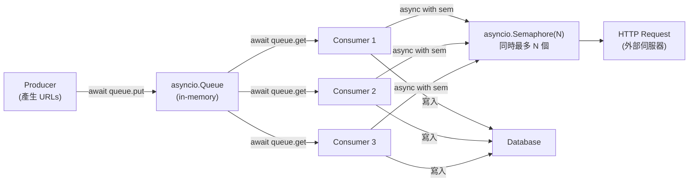
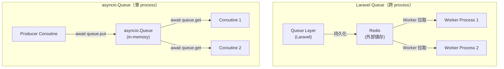
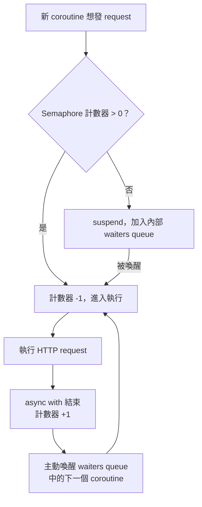

# Python asyncio.Queue 與 asyncio.Semaphore：in-process 並發協調

> 學習日期：2026-07-13
> 涵蓋概念：asyncio.Queue、asyncio.Semaphore、producer-consumer 模式、coroutine 並發控制

---

## 整體架構：爬蟲場景中的 Queue + Semaphore



---

## asyncio.Queue

### 它解決什麼問題

多個 coroutine 需要在同一個 event loop 裡安全地傳遞任務，producer 產生、consumer 消費，但彼此的速度不同——需要一個緩衝層協調節奏。

### 跟 Laravel Queue + Redis 的根本差異



| 維度 | asyncio.Queue | Laravel Queue + Redis |
|------|--------------|----------------------|
| 儲存位置 | Python process 記憶體 | Redis（外部持久化） |
| 作用範圍 | 單一 process、單一 event loop | 跨 process、跨機器 |
| Process 掛掉 | 資料消失 | 資料保留 |
| 設計目的 | coroutine 之間的協調 | 分散式任務分發 |

### 核心行為

Queue 空時，`await queue.get()` 不會 block event loop，而是 **suspend 當前 coroutine**，把控制權還給 event loop，等 producer `put()` 後才被喚醒。Queue 滿時（設定 `maxsize`），`await queue.put()` 同樣 suspend producer。

```python
queue = asyncio.Queue()

async def producer():
    for url in urls:
        await queue.put(url)   # Queue 滿時自動 suspend

async def consumer():
    while True:
        url = await queue.get()   # Queue 空時自動 suspend
        result = await fetch(url)
        await save_to_db(result)
        queue.task_done()
```

---

## asyncio.Semaphore

### 它解決什麼問題

在爬蟲場景中，100 個 consumer coroutine 同時對外發 HTTP request，可能打爆目標伺服器或觸發 rate limit。需要一個機制限制**同時執行某段程式碼**的 coroutine 數量。

### 停車場模型



### 使用方式

```python
sem = asyncio.Semaphore(3)   # 同時最多 3 個

async def fetch(url):
    async with sem:
        # 只有拿到 semaphore 的 coroutine 才能跑到這裡
        response = await http_client.get(url)
        return response
```

`async with sem` 進入時計數器 -1，離開時自動 +1，不需要手動 release。計數器為 0 時，下一個嘗試進入的 coroutine 會 suspend（不 block event loop），等有人離開才被喚醒。

### Semaphore vs Lock

| | asyncio.Semaphore(N) | asyncio.Lock |
|--|---------------------|-------------|
| 允許同時進入數 | N 個 | 1 個（功能上等於 Semaphore(1)） |
| 用途 | 限制並發數量 | 互斥存取共享資源 |
| Owner 概念 | 無，任何 coroutine 都能呼叫 `release()` | 有，只有取得鎖的 coroutine 才能 release，違反拋出 RuntimeError |

---

## Queue 與 Semaphore 的分工

兩者經常搭配，但職責完全不同：

- **asyncio.Queue**：負責**資料流動**——URL 從 producer 傳到 consumer
- **asyncio.Semaphore**：負責**資源限流**——同時最多 N 個 coroutine 發 HTTP request

```python
queue = asyncio.Queue()
sem = asyncio.Semaphore(5)

async def producer(urls):
    for url in urls:
        await queue.put(url)

async def consumer():
    while True:
        url = await queue.get()
        async with sem:               # 進入限流區
            result = await fetch(url)
        await save_to_db(result)
        queue.task_done()             # 通知 Queue 此任務完成，對應 queue.join() 計數

async def main():
    asyncio.create_task(producer(urls))
    workers = [asyncio.create_task(consumer()) for _ in range(20)]
    await queue.join()                # suspend 直到所有 task_done() 都被呼叫
    for w in workers:
        w.cancel()                    # 所有任務完成後取消 worker，避免卡在 queue.get()
```

---

## 學習過程的關鍵卡點

**原本以為**：`asyncio.Queue` 跟 Laravel Queue 是一樣的東西，資料存在 Redis。

**實際上**：asyncio.Queue 是純 in-memory 的，住在 Python process 的記憶體裡，process 掛掉資料就消失。Laravel Queue 的「Queue」是任務排程邏輯層，Redis 是它背後的持久化儲存——兩者的 Queue 雖然名字一樣，但設計目標完全不同：一個是 in-process coroutine 協調，一個是 cross-process 分散式任務分發。

**為什麼這個卡點值得記**：有 MQ 實務背景時，很容易把「Queue」這個詞的意涵直接套過來，但 asyncio.Queue 根本不是分散式系統工具，它只是讓同一個 event loop 裡的 coroutine 能安全傳遞資料的緩衝機制。

---

**原本以為**：Queue 空時，consumer 等待會 block 整個程式。

**實際上**：`await queue.get()` 只 suspend 當前 coroutine，把控制權還給 event loop，其他 coroutine 繼續跑。這是 asyncio 的核心特性——只有帶 `await` 的操作才是「安全的等待」，不會凍住 event loop。
