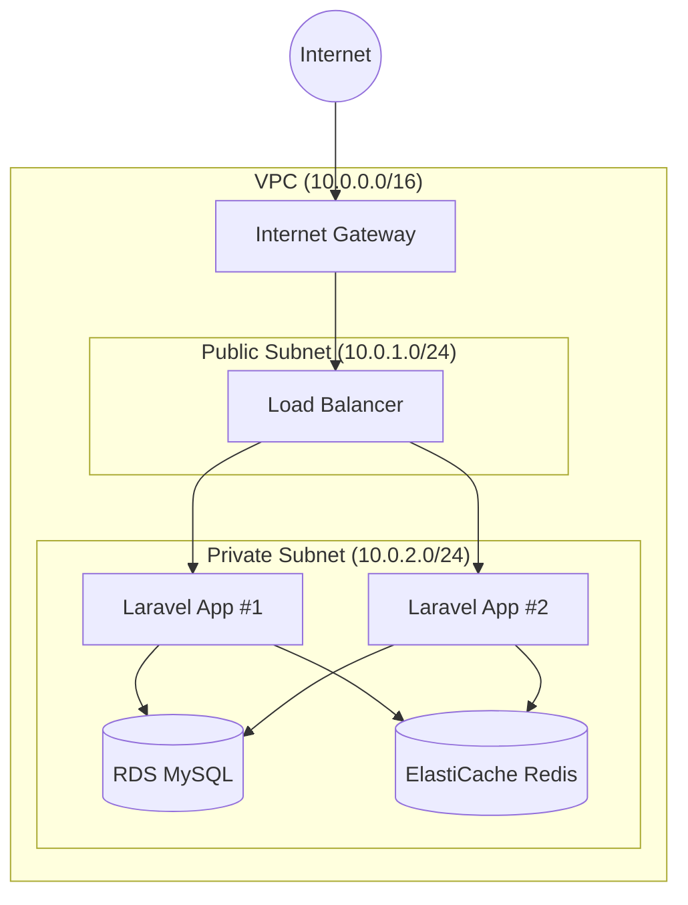
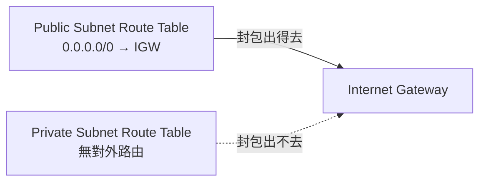
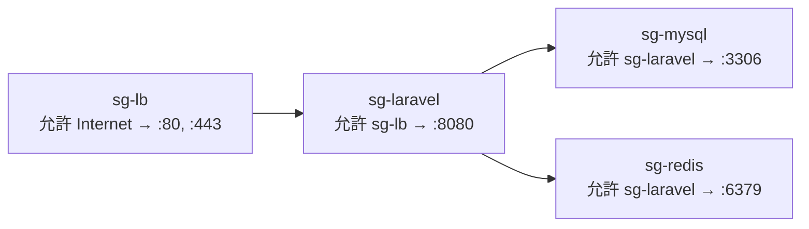
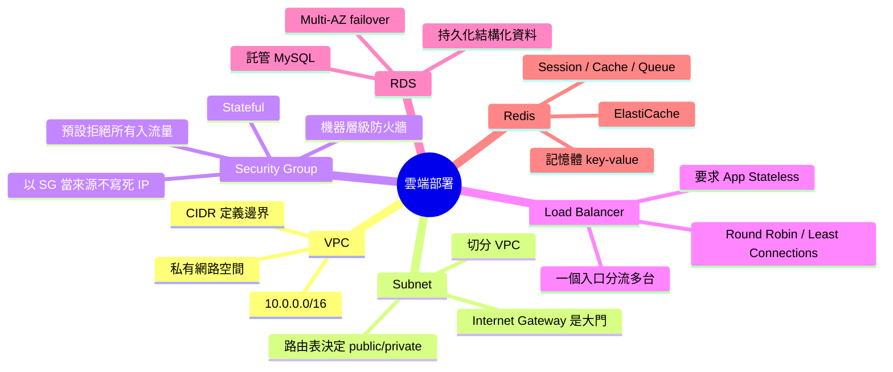

# 雲端部署基礎：VPC、Subnet、Security Group、Load Balancer、RDS、Redis

> 學習日期：2026-07-08
> 涵蓋概念：VPC、Subnet、Security Group、Load Balancer、RDS、ElastiCache Redis

---

## 整體架構圖

---

## VPC（Virtual Private Cloud）

### 它解決什麼問題？

AWS 上有數百萬台虛擬機器，如果你開了幾台，預設它們和所有人的機器混在同一個公開網路上。VPC 讓你在 AWS 的大網路裡**圈出一塊屬於自己的私有 IP 空間**，圈進去的資源**一定有私有 IP**，公有 IP 是可選的——沒有公有 IP 的資源（如 private subnet 裡的 RDS），外部網路無法路由到它們。

這跟家用路由器建立的 LAN 完全一樣：家裡設備用 `192.168.x.x`，外面連不進來，因為這段 IP 不在公開網際網路上路由。

> **核心**：VPC 是雲端上的私有局域網，用 CIDR 定義邊界（如 `10.0.0.0/16`）。裡面的資源預設只能彼此溝通，不對外暴露——不是因為被「擋住」，而是根本沒有公開地址。標準三層架構只有 Load Balancer 放在 public subnet（有公有 IP），app server、DB、Redis 全放在 private subnet。

---

## Subnet（子網路）

### 它解決什麼問題？

同一個 VPC 裡，不同機器的「對外程度」不同：Laravel app 需要對外接收請求，MySQL 和 Redis 絕對不能對外。Subnet 把 VPC 的 IP 段再切小，讓你對每個區塊套不同的路由規則。

**Public Subnet**：路由表有一條 `0.0.0.0/0 → Internet Gateway`，流量可以進出網際網路。

**Private Subnet**：路由表沒有這條規則，封包送不出去，外部也無法主動連入。

> **核心**：Subnet 的 public/private 差異由**路由表**決定，不是名稱或標籤。Internet Gateway 是那扇門，路由表決定誰有路走到那扇門。

---

## Security Group

### 它解決什麼問題？

Subnet 做的是「區域隔離」，但同一 VPC 內還需要更細的管控：哪台機器可以連我、連哪個 port？Security Group 是掛在**每台機器**上的虛擬防火牆，只寫允許規則，未列到的一律擋掉（預設拒絕所有入流量）。

### 為什麼用 Security Group 當來源，而不是 IP？

雲端機器的 IP 會隨重開、替換、水平擴展而改變。如果 MySQL 的規則寫死 IP，Laravel 擴展到十台就要手動更新十條規則。

用 Security Group 當來源：**規則跟著角色走，不跟著 IP 走**。新機器只要掛上 `sg-laravel`，MySQL 的規則自動套用。

> **核心**：Security Group 是 stateful 的 instance 層級防火牆（允許進入的流量，回應封包自動放行）；以 Security Group 當來源，讓規則與機器數量完全解耦。注意：**入流量預設全擋**（只允許明列的規則），**出流量預設全放行**（`0.0.0.0/0` outbound allow）——兩個方向的預設行為截然相反。

---

## Load Balancer

### 它解決什麼問題？

單台 Laravel app 撐不住流量時，水平擴展成多台。Load Balancer 對外只暴露一個入口（一個 IP/網址），對內把流量分配給多台機器。

### 分流策略

| 策略 | 說明 |
|------|------|
| **Round Robin** | 依序輪流（1 → 2 → 3 → 1…），不考慮機器負載，最簡單 |
| **Weighted Round Robin** | 輪流但按比例——規格強的機器設較高權重，拿到更多流量 |
| **Least Connections** | 優先送給目前連線數最少的機器 |
| **IP Hash** | 把使用者 IP 做 hash，固定對應到同一台機器；適合不用外部 session store 的舊系統 |

### 水平擴展帶來的 Session 問題

多台機器服務同一批使用者時，session 可能存在機器 A，下一個請求被 LB 分到機器 B——找不到 session，使用者被登出。

**解法：把 session 外移到 Redis。** 所有機器都去 Redis 讀寫 session，LB 分到哪台都沒差。

> **核心**：Load Balancer 讓應用層可以水平擴展，但同時要求應用本身是 **stateless** 的——任何機器都能處理任何請求，不依賴本地狀態。這就是 Redis 幾乎與 LB 綁定出現的原因。

---

## RDS vs ElastiCache Redis

| 維度 | RDS（Relational Database Service） | ElastiCache Redis |
|------|------------------------------------|--------------------|
| **類型** | 關聯式資料庫（MySQL / PostgreSQL 等） | 記憶體內 key-value store |
| **持久性** | 持久化，資料不會丟 | 預設非持久，重啟可能丟失（可開啟 RDB/AOF） |
| **速度** | 較慢（磁碟 I/O） | 極快（記憶體） |
| **存什麼** | 使用者、訂單、文章等結構化資料 | 快取、session、queue |
| **雲端好處** | 自動備份、Multi-AZ、failover，免維護 | 託管，免自己裝管 Redis |

兩者互補：RDS 是資料的「永久倉庫」，Redis 是加速存取的「工作臺」。

---

## 名詞地圖

---

## 學習過程的關鍵卡點

**卡點 1：VPC 的隔離靠的不是「防火牆擋」，而是「根本沒有公開地址」**

**原本以為**：MySQL 不對外是因為某個防火牆擋掉了外部連線。

**實際上**：第一層防禦是 MySQL 根本沒有公開 IP——私有 IP 在公開網際網路上無法路由，外部流量根本找不到它。防火牆（Security Group）是第二層，但「沒有公開地址」才是根本。

思路上很容易先想到「擋」，但更根本的問題是「根本沒有地址可以連」。這個認知差異在排查連線問題時很關鍵。

---

**卡點 2：Subnet 的 public/private 是路由表決定的，不是名稱或標籤**

**原本以為**：「對外」和「不對外」是某種開關或設定。

**實際上**：Public subnet 的路由表有一條 `0.0.0.0/0 → Internet Gateway`，封包有路可以出去；private subnet 的路由表沒有這條，封包出不去。Internet Gateway 一直在那裡，差別只在路由表有沒有寫「往外的封包送去那裡」。

---

**卡點 3：Security Group 的來源可以是另一個 Security Group**

**原本以為**：限制「哪台機器可以連我」要寫機器名稱或 IP。

**實際上**：可以引用另一個 Security Group 當來源。MySQL 的規則寫「允許來自 sg-laravel 的 :3306 流量」，Laravel 擴展到幾台、IP 怎麼變都不影響規則——只要每台掛上 sg-laravel 就自動被信任。規則跟「角色」綁定，不跟「機器」綁定。

---

**卡點 4：Load Balancer 帶來 stateless 的強制要求，解法是 Redis**

**原本以為**：多台機器 + LB 分流，session 問題好像不是 LB 的事。

**實際上**：LB 水平擴展的前提是每台機器可以互換，但 session 存在本地就破壞了這個假設。解法是把 session 外移到 Redis——這在 Laravel 實務上就是把 session driver 改成 `redis`，概念完全相同，只是在雲端架構層面看到了「為什麼要這樣做」的原因。
