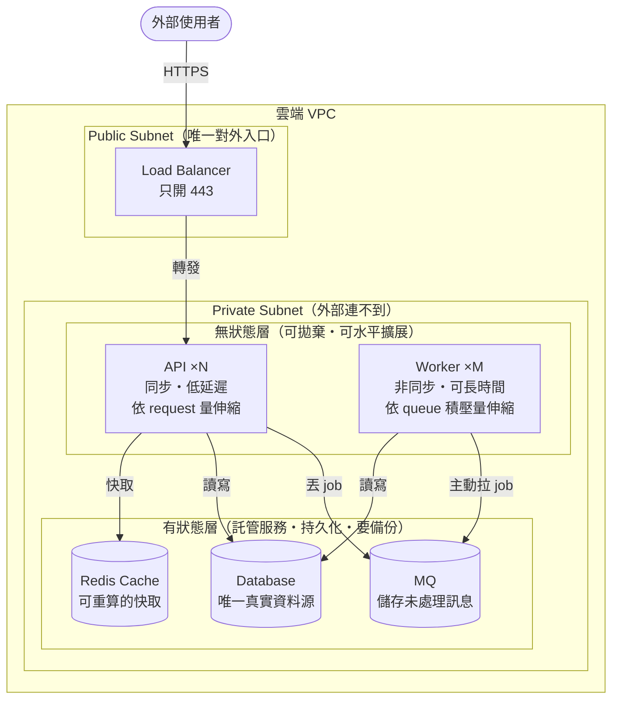
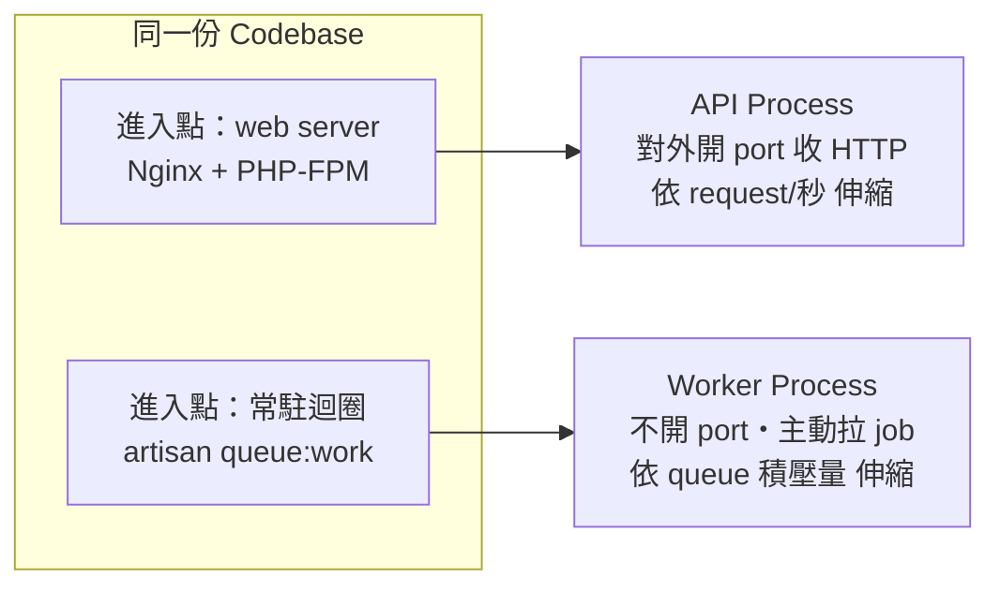
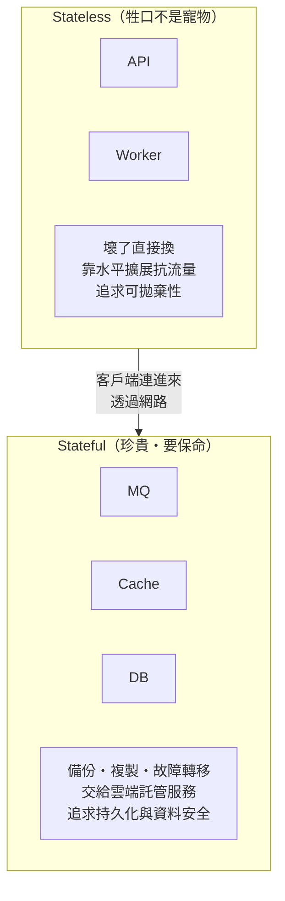
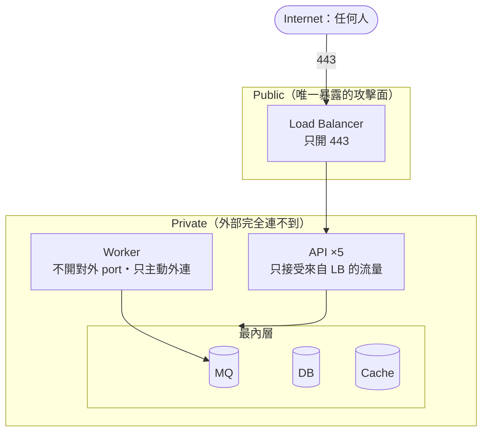
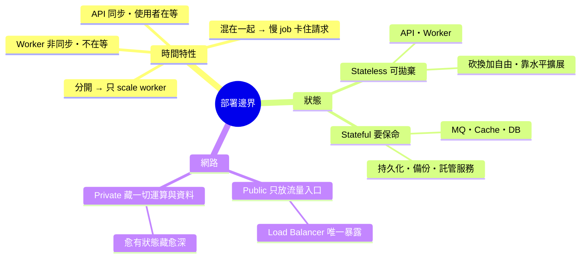

# 部署邊界與責任：API / Worker / MQ / DB 怎麼切

> 學習日期：2026-07-09
> 涵蓋概念：Stateless vs Stateful、API 與 Worker 分離、獨立伸縮、Public/Private 網路邊界、Load Balancer 作為唯一入口

---

## 整體架構圖

這張圖的三條分界線，就是這篇筆記的全部重點：

1. **API / Worker 的橫切線**：同步 vs 非同步的時間特性不同。
2. **Stateless / Stateful 的縱切線**：有沒有保管資料，決定能不能被隨意砍換。
3. **Public / Private 的網路線**：誰需要被外部主動連入。

> **註**：圖中 worker 標為「主動拉 job（pull）」，是以 Laravel Queue / SQS / Redis list 的 pull 模型為例。push vs pull 依 broker 而異——RabbitMQ、Kafka consumer group 有各自的推拉機制，不要把「worker 一律主動拉」當成所有 MQ 的通則。

---

## 邊界一：API vs Worker —— 時間特性不同就該分開

### 為什麼不能塞在同一個 process？

直覺會覺得「同一份程式碼跑在一起最省事」，但這忽略了兩種工作的**時間特性**根本不同：

| 工作 | 同步/非同步 | 延遲要求 | 使用者在等嗎？ |
|------|-----------|---------|--------------|
| HTTP 請求（送出訂單） | 同步 | 幾百 ms 內回應 | 在螢幕前等 |
| Queue job（寄確認信） | 非同步 | 幾秒也沒關係 | 根本不在等 |

如果塞在同一個 process，一個慢吞吞的寄信 job 就會**占住本來該去服務 HTTP 請求的資源**——這就是「web process 被 queue 卡住」。

### 分開部署帶來的營運價值：獨立伸縮

兩個角色的負載曲線不一樣，就該各自獨立伸縮：

- 平常 API 請求穩定，但整點湧入大量批次 job（例如結算 10 萬筆）。
- 如果 API 和 worker 是**分開部署的兩組機器**，這時可以**只 scale worker，完全不動 API**。

> **核心**：API 和 worker 通常**共用同一份 codebase**，但用**不同的進入點、部署成不同的 process/服務**。API 由 web server 驅動、對外開 port 收 HTTP；worker 是常駐迴圈，不對外開 port，只主動往 queue 拉 job。因為負載特性不同，兩者要能各自獨立伸縮——API 看 request/秒，worker 看 queue 積壓量。

---

## 邊界二：Stateless vs Stateful —— 部署的第一刀

### 分水嶺不是「省不省事」，而是「有沒有保管資料」

判斷一個組件該怎麼部署，真正該問的問題是：

> **把這台機器直接砍掉、換一台新的頂上，使用者會不會感覺到資料不見了？**

- **不會 → Stateless（無狀態）**：API、Worker。它們不保管長期資料，處理完請求/job 就結束，狀態寫回別處。正因為無狀態，才能被**自由地砍、換、加**——這是「scale API / scale worker」能成立的前提。
- **會 → Stateful（有狀態）**：MQ、Cache、DB。它們**保管資料**，砍掉就掉資料，必須是獨立、被妥善管理、會持久化的組件。

### Cache 與 MQ 都是 stateful，但存的資料性質不同

| 組件 | 存什麼 | 掉了會怎樣 |
|------|--------|-----------|
| Redis Cache | 掉了也能從 DB 重算回來的資料 | 效能下降，資料不會真的少 |
| MQ | 還沒被處理的 job/訊息 | 真的少做事（訊息遺失） |
| DB | 唯一真實資料源（source of truth） | 資料永久遺失 |

> **補充**：在小型 Laravel 系統裡，常用同一個 Redis 同時兼任 cache 和 queue——這很常見，但它們是**兩種不同責任**，規模大了會拆開（例如 cache 用 ElastiCache、queue 改用 SQS / 專用 MQ）。

> **核心**：雲端部署的第一刀，沿著 stateless / stateful 切開。無狀態層（API、worker）追求「可拋棄性」，機器是「牲口不是寵物」，壞了直接換、靠水平擴展抗流量；有狀態層（DB、MQ、Cache）追求「持久化與資料安全」，要有備份、複製、故障轉移，通常交給雲端**託管服務**（RDS、ElastiCache、SQS / managed Kafka）來扛，而不是自己裝在 app 機器上。API 和 worker 都只是這些託管服務的**客戶端**。

---

## 邊界三：Public vs Private —— 誰需要被外部主動連入

### 分法：只有「流量入口」需要 public

四個角色沿著「誰需要被外部主動連入」來分：

- **API**：需要接收外部請求 → 靠近 public。
- **Worker / MQ / DB**：都是被 API 或 worker 從內部去連的，沒有任何理由對全世界開放 → private。

### 但連 API 機器本身都可以退進 private

如果有 5 台 API 機器，外部請求要怎麼知道連哪一台？中間需要一個 **Load Balancer** 分流。而這個 LB 一出現，它就變成真正頂在 public 最前線的東西——**API 機器反而可以全部退進 private**。

這樣一來，暴露在網路上的攻擊面只剩「一個 LB + 它開的 443 port」，後面所有東西全躲在 private，外面完全連不到。層層往內收，**愈珍貴、愈有狀態的東西藏得愈深**。

> **核心**：網路邊界不是沿著「誰要對外服務」切，而是沿著「誰真正需要被外部主動連入」切。真正需要 public 的只是**流量入口（Load Balancer）**，不是運算節點本身。LB 當唯一 public 入口（通常只開 443），API/worker/MQ/DB 全退進 private，只透過內部網路互連，並用 security group / 防火牆規則限制「誰能連我」。

---

## 責任邊界總表

| 角色 | 狀態 | 網路層 | 對外開 port？ | 伸縮依據 |
|------|------|--------|--------------|----------|
| Load Balancer | 無狀態 | public | 是（443） | 通常託管、自動 |
| API | 無狀態 | private | 否（只收 LB） | request/秒 |
| Worker | 無狀態 | private | 否（主動外連） | queue 積壓量 |
| MQ | 有狀態 | private（內層） | 否（只收內部） | 託管/水平分區（partition）擴展 |
| Cache | 有狀態 | private（內層） | 否（只收內部） | 一般垂直/託管擴展 |
| DB | 有狀態 | private（最內層） | 否（只收內部） | 讀寫分離；寫入瓶頸靠 sharding（水平分片） |

---

## 快速記憶脈絡

三句話總結：

1. **時間特性不同就分開**：API 同步、worker 非同步，塞一起慢 job 會卡住請求，分開才能獨立伸縮。
2. **有沒有保管資料決定能不能砍**：stateless（API/worker）可拋棄、水平擴展；stateful（MQ/Cache/DB）要持久化、交給託管服務。
3. **只有流量入口需要 public**：LB 當唯一對外門面，其餘全退進 private，愈珍貴藏愈深。

---

## 學習過程的關鍵卡點

**卡點 1：MQ 放哪裡的判斷，不是「方不方便」而是「它有沒有狀態」**

**原本以為**：MQ（Redis）跟 API 裝在同一台機器上也沒差，就近取用最省事。

**實際上**：MQ 負責**儲存未處理的訊息**，是有狀態的。裝在 API 機器上會踩到兩個問題——(1) 所有 worker 都得伸手進 API 那台機器拉 job，讓 API 多背了「當 queue 中心」的責任；(2) 未處理的訊息跟著 API 的生死週期一起冒險。

問題的核心是**生命週期綁定**，而不是單純「有沒有開持久化」：就算 Redis 有開 AOF 落盤，只要跟 app 同機，機器整台掛掉、或無狀態層擴縮時被回收，資料就一起消失。有狀態的東西不能跟「可拋棄的無狀態機器」共命運。

---

**卡點 2：判斷 stateless/stateful 的那個關鍵提問**

**原本以為**：部署要先想「怎麼擺最省事」。

**實際上**：真正該先問的是「**把這台機器砍掉換一台，使用者會不會感覺資料不見？**」。答「不會」的（API、worker）就是 stateless，可以隨意砍換加；答「會」的（MQ、DB、Cache）就是 stateful，必須獨立部署並持久化。這個提問是切開整個部署架構的第一刀。

---

**卡點 3：public 放的是「入口」，不是「要對外服務的機器」**

**原本以為**：API 要對外服務，所以 API 機器要放 public、掛公開 IP。

**實際上**：這會讓每一台 API 都變成攻擊面。真正需要 public 的是**流量入口（Load Balancer）**，它收到請求後透過內部網路轉發給 private 裡的 API。連 API 機器本身都可以退進 private，最後暴露在外的只剩「一個 LB + 443 port」。
