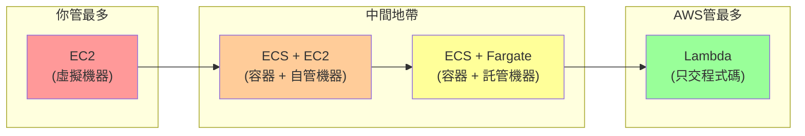
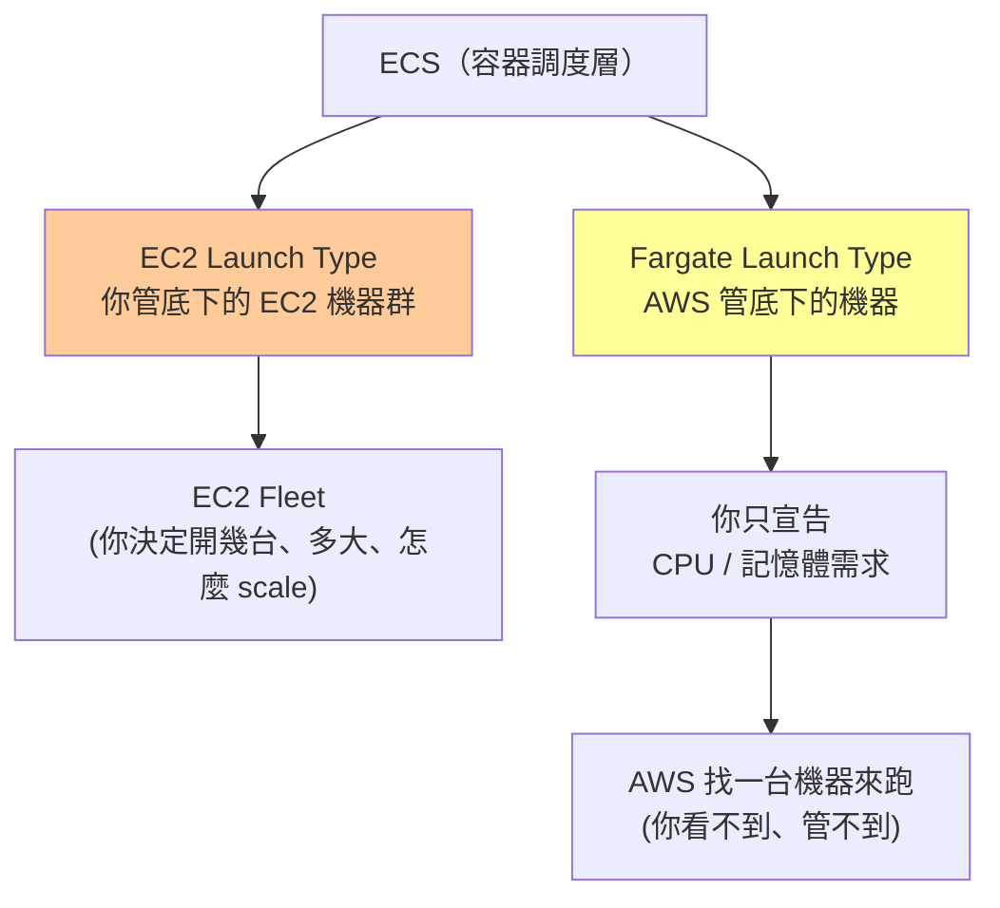
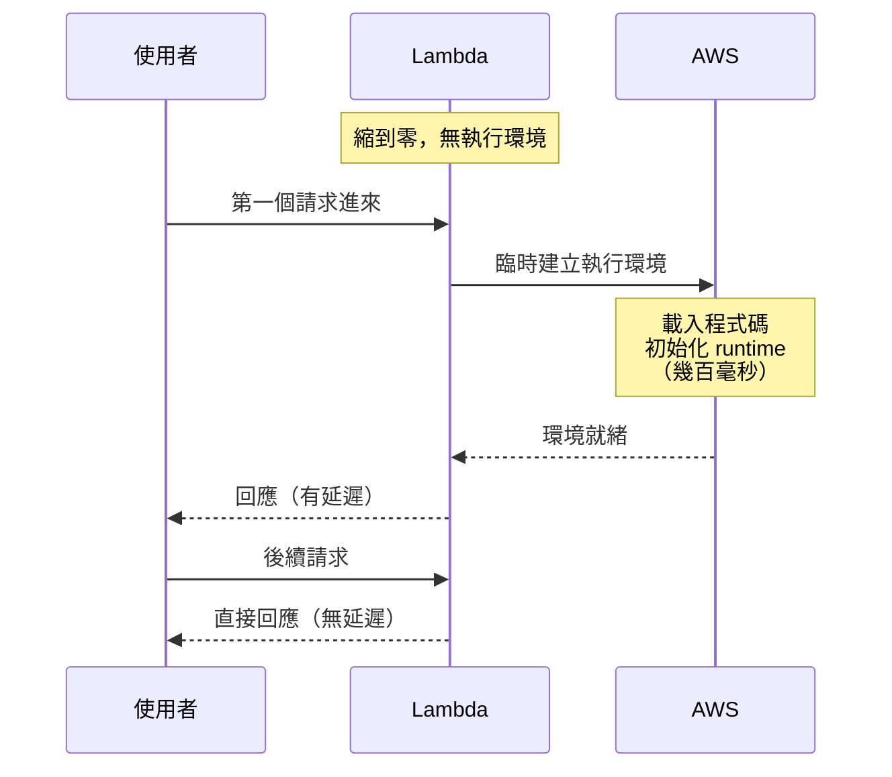
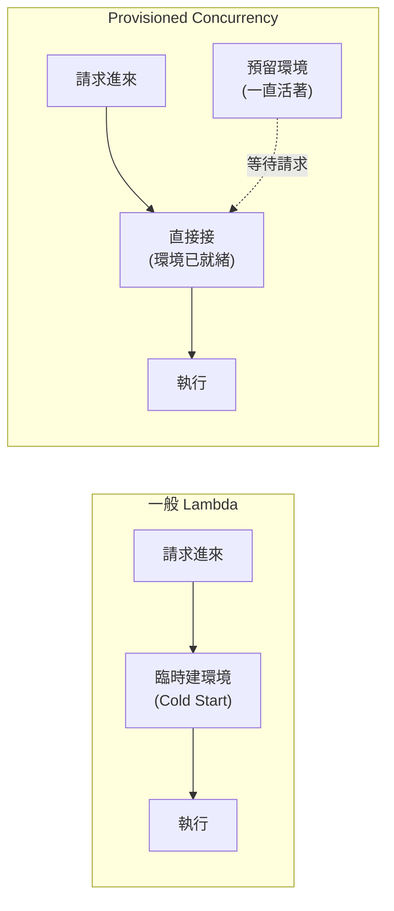

# 雲端運算選型：EC2、ECS、Lambda 的管理責任邊界

> 學習日期：2026-07-10
> 涵蓋概念：EC2、ECS（EC2 launch type、Fargate launch type）、Lambda、Cold Start、Provisioned Concurrency

---

## 整體架構：管理責任光譜

這三個服務的核心差異不在功能，而在**你需要自己管到哪一層**。

---

## EC2：虛擬機器，你管一切

AWS 交給你的是一台**虛擬機器（Virtual Machine）**——底下的實體硬體和虛擬化層是 AWS 的事，從 OS 往上全部是你的責任。

**你要管的東西：**
- 作業系統安裝、設定、安全性更新
- Runtime 環境（PHP、Node.js、Java...）
- 程式部署與開機自動啟動
- Scaling（流量大了要不要再開一台？）
- 磁碟空間、記憶體監控

**收費方式**：機器開著就收錢，不管有沒有流量。

**適合情境**：需要完整控制環境、有特殊系統需求（特定 OS 版本、GPU、特殊網路設定）。

---

## ECS：容器調度層，有兩種發動機

ECS（Elastic Container Service）本身只做一件事：**把你的容器調度到機器上跑**。但「底下那台機器誰管」有兩種選擇。

### ECS + EC2 Launch Type

你自己維護一群 EC2 當 worker pool，ECS 把容器分配到這群機器上。等同 EKS 的 Node 管理邏輯——容器（ECS 術語叫 Task，Kubernetes 才叫 pod）有地方跑，但那個「地方」是你開的、你管的。

**你管：** 底下的 EC2 數量、規格、Auto Scaling Group、OS 維護  
**ECS 管：** 把哪個容器跑在哪台 EC2 上

**適合情境**：需要 GPU、特殊網路設定、或已有現成 EC2 fleet 要充分利用。

### ECS + Fargate Launch Type

你只宣告「這個容器需要 0.5 vCPU、1GB RAM」，AWS 臨時找一台符合的機器來跑，跑完還給 AWS。你完全看不到底層機器。

**你管：** 容器規格宣告（CPU、記憶體）、容器本身  
**AWS 管：** 底下所有機器的事

**收費方式**：容器跑著就收錢（按 CPU + 記憶體 × 時間）。

**適合情境**：長時間運行的服務（API server、Queue Worker），且不想管 infra。

---

## Lambda：只交程式碼，其他全託管

Lambda 是光譜的另一端：你只提交**一段 function**，AWS 決定要跑在哪台機器上、要同時跑幾份。

### Scale to Zero（縮到零）

Lambda 最獨特的特性：**沒有請求時，不保留任何執行環境**。

- 好處：沒請求 = 不收錢（按請求次數 + 執行時間計費）
- 壞處：第一個請求進來時需要臨時建立執行環境，產生延遲

### Cold Start（冷啟動）

**Cold Start 的代價**：延遲時間高度依賴 runtime 與套件大小——Node.js、Python 通常在 100ms 以內；Java、.NET（JVM/CLR）可達數秒；套件越大、初始化邏輯越重，延遲越長。對延遲敏感的 API 有感。

### Lambda 的限制

- **原生不支援持有長連線**：函式執行完即結束，Lambda 本身無法維持 WebSocket 連線。但可搭配 API Gateway WebSocket API 實現雙向通訊——連線由 API Gateway 持有，每次訊息觸發一次獨立的 Lambda 呼叫。若需要原生持有 TCP/WebSocket 連線的情境（高頻訊息、自訂協定），Lambda 不適合。
- **無狀態**：in-memory 狀態不跨請求保留，下一個請求可能跑在不同的執行個體上

---

## Provisioned Concurrency：用錢消除 Cold Start

Provisioned Concurrency 讓你**預先保留 N 份已初始化的執行環境**，讓它們一直活著等待請求。

**代價**：預留的環境一直活著就一直收錢（類似 EC2 的「開著就跑錶」邏輯）。

**何時值得開？** 同時滿足兩個條件：
1. 服務對延遲敏感（使用者直接在等的 API）
2. 流量夠穩定夠大（能攤平固定費用）

> 進階用法：搭配 Application Auto Scaling，根據流量動態調整預留份數——尖峰前自動拉高，離峰後縮回來。

---

## 選型表

| 維度 | EC2 | ECS + EC2 | ECS + Fargate | Lambda |
|------|-----|-----------|---------------|--------|
| **你管什麼** | OS + runtime + 機器 | 容器 + EC2 機器群 | 只管容器規格宣告 | 只管程式碼 |
| **收費方式** | 機器開著就收錢 | 機器開著就收錢 | 容器跑著就收錢 | 按請求次數 + 執行時間 |
| **沒有流量時** | 繼續收錢 | 繼續收錢 | 通常持續收錢（Service 不會自動停止） | 不收錢（縮到零） |
| **Cold Start** | 無 | 無 | 通常無（容器保持活著） | 有（依 runtime：Python/Node < 100ms，Java 可達數秒） |
| **長連線支援** | 支援 | 支援 | 支援 | 原生不支援（可搭配 API Gateway WebSocket，但架構較複雜） |
| **適合工作負載** | 需完整控制環境 | 有現成 EC2 fleet | 長時間服務、不想管 infra | 事件觸發、短暫、無狀態 |
| **不適合情境** | 不想管 OS | 不想管機器 | 極短暫任務（不划算） | 長連線、有狀態、低延遲敏感 |

---

## 學習過程的關鍵卡點

**卡點一：ECS Fargate 的「管理」邊界**

**原本以為**：ECS Fargate 下我負責「管理機器規格」。

**實際上**：「管理機器規格」和「宣告容器需求」是根本不同的事。Fargate 你沒有在管任何機器，你只是告訴 AWS「我的容器需要 0.5 vCPU、1GB RAM」，AWS 去找合適的機器——那台機器你看不到、管不到。用「宣告需求」而非「管理規格」才能準確描述這個邊界。

---

**卡點二：Provisioned Concurrency 跟 ECS launch type 的關係**

**原本以為**：Provisioned Concurrency 可能是 ECS 的另一種「發動機模式」。

**實際上**：這是兩個完全無關的概念。ECS launch type（EC2 / Fargate）是 ECS 服務的底層機器選擇；Provisioned Concurrency 是 Lambda 自己的特性，用來預先保留執行環境消除 Cold Start。兩者都跟「預先備好資源」有關，但分屬不同服務、解決不同問題，不能混為一談。

---

**卡點三：Cold Start 的名字**

**原本以為**：那個「縮到零後第一個請求要等」的現象，只是一種說明方式。

**實際上**：這個現象有精確的術語——**Cold Start（冷啟動）**。在 Lambda 選型討論中這是關鍵詞，看到「低延遲需求」就要自動聯想到 Cold Start 是否是瓶頸、是否需要 Provisioned Concurrency。
