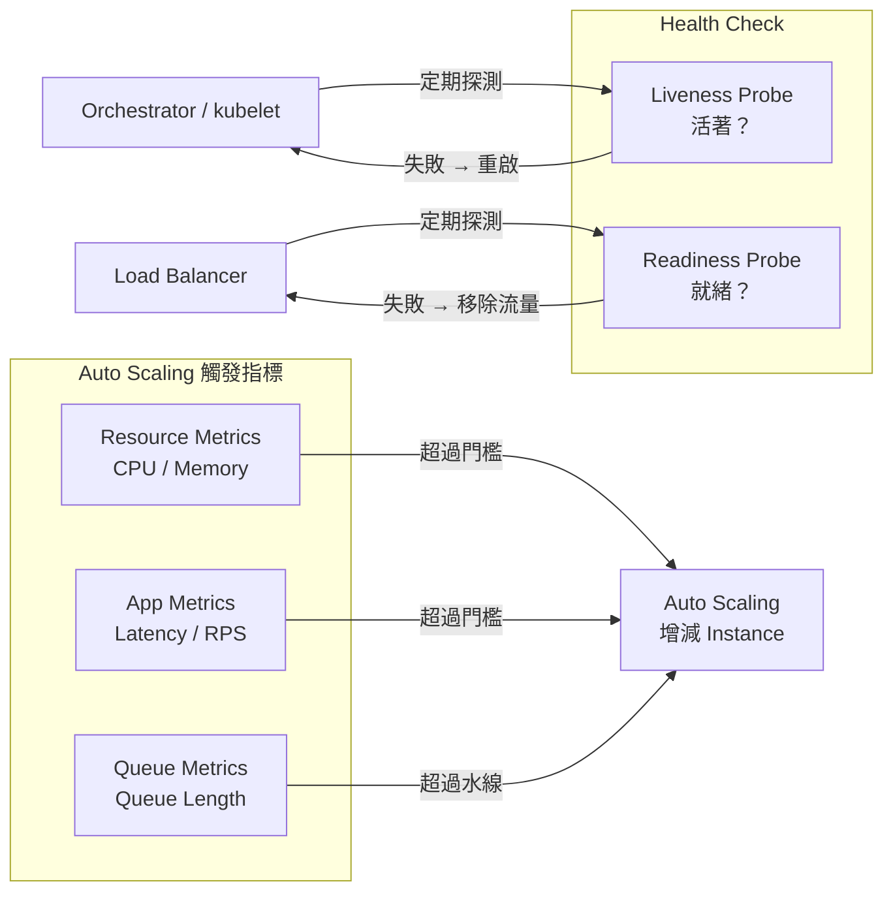
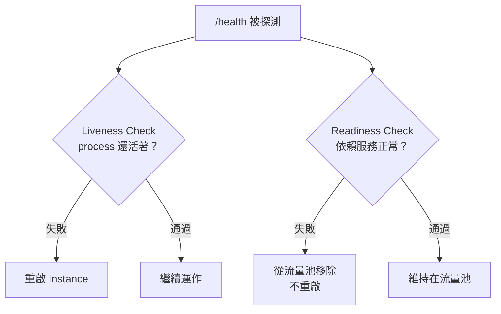
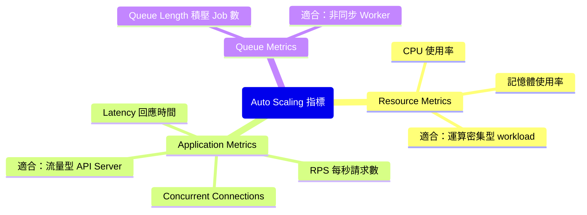
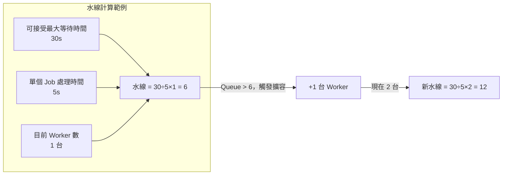

# 雲端監控與擴縮規則：Health Check、Auto Scaling、Queue Length Scaling

> 學習日期：2026-07-13
> 涵蓋概念：Health Check、Liveness Probe、Readiness Probe、Auto Scaling、Custom Metrics、Queue Length Scaling

---

## 整體架構概覽



---

## Health Check

### 存在的原因

HTTP 能回應 ≠ 服務能正常運作。Load balancer 需要一個機制判斷「這台機器還能接流量嗎？」——這就是 health check endpoint 的用途。

Health check 失敗觸發的不只是告警通知，而是**自動採取行動**：移除流量、重啟機器。這是雲端環境 self-healing 的核心機制，類比於 Supervisor 偵測到 process 死掉就自動重啟——但 Supervisor 的類比只對應到 Liveness（偵測存活並重啟），Readiness 的流量控制部分沒有對應物。

### 兩種語意不同的 Probe



| | Liveness | Readiness |
|--|----------|-----------|
| **問的問題** | Process 還活著嗎？ | 準備好接受流量嗎？ |
| **失敗後動作** | 重啟 Instance | 從 load balancer 移除，不重啟 |
| **應該檢查** | HTTP 能回應 | MySQL、Redis 等依賴服務的連線狀態 |

### 實務設計

Laravel `/health` endpoint 應同時涵蓋兩層：

- **Liveness**：HTTP 能回應（輕量，刻意不連外部服務）
- **Readiness**：MySQL 連線能查詢、Redis 連線能存取

Liveness 故意只回一個輕量的 200 OK，不連線任何外部服務——因為 Liveness 失敗就觸發重啟，若把 DB 斷線也算 Liveness 失敗，DB 不穩定時會引發大量 instance 連續重啟，反而加劇問題。外部依賴的狀態應交給 Readiness 負責。

---

## Auto Scaling

### CPU/Memory 的盲點

CPU 和記憶體是最常見的 scaling 指標，但有明顯盲點：

> **情境**：API server CPU 維持 20%、記憶體正常，但使用者抱怨 API 回應很慢。
> → CPU-based auto scaling **不會觸發**，因為數字沒超過門檻。

瓶頸可能來自流量突增、DB 查詢慢、外部 API 延遲——這些問題在 CPU 數字上完全看不出來。

### 三層觸發指標



**Resource Metrics** 反映機器負擔，**Application Metrics** 反映使用者體驗，**Queue Metrics** 反映非同步任務的積壓狀況。選對指標才能在對的時機觸發擴容。

---

## Queue Length Scaling

### 為什麼用 Job 數量而不是等待時間

系統無法直接量測「這個 job 已經在 queue 等了幾秒」，但可以直接數 queue 裡有幾個 job。所以觸發條件是**積壓 job 的數量（水線）**，不是等待時間本身。

### 水線計算方式



**水線公式：**

```
水線 = (可接受最大等待時間 ÷ 單個 Job 處理時間) × 目前 Worker 數
```

> 前提：假設每台 Worker 一次只處理一個 job（concurrency = 1）。若 Worker 支援並行（例如 Laravel Horizon 的 `processes`、Celery 的 `--concurrency`），需再乘以每台 Worker 的並行數。

**比率觸發法（更通用）：**

```
每台 Worker 平均 Job 數（jobs-per-worker ratio）> 閾值 → 加一台
```

比率觸發的好處：無論目前幾台 Worker，觸發邏輯保持一致，不需要每次擴容後手動更新水線。AWS Auto Scaling 稱此為 **target tracking**。

### 與 CPU Scaling 的差異對比

Queue Worker 的 CPU 才 10%，但 queue 積壓 100 個 job：CPU scaling 完全看不到問題，只有 queue length scaling 能偵測到並觸發擴容。

這是結構性原因：Queue Worker 的 job 通常以 I/O 等待為主（查 DB、呼叫外部 API），Worker process 在等待時並不佔用 CPU，所以即使積壓嚴重，CPU 使用率也可能很低。這正是 Queue Length Scaling 存在的原因。

---

## 三種擴縮機制對比

| | Health Check | CPU/App Metrics Scaling | Queue Length Scaling |
|--|--|--|--|
| **監控對象** | 單台機器的健康狀態 | 機器資源或流量指標 | Queue 積壓 job 數量 |
| **觸發動作** | 移除流量 / 重啟 | 增減 Instance 數量 | 增減 Worker 數量 |
| **適用場景** | 所有服務 | API Server | 非同步 Worker |
| **盲點** | 無（分兩層探測） | 看不到 queue 積壓 | 看不到 API latency |

---

## 學習過程的關鍵卡點

**卡點 1：Health check 失敗只會發告警**

**原本以為**：health check 失敗後，系統只會通知人去處理。

**實際上**：告警只是最弱的反應。Load balancer 和 orchestrator 偵測到失敗會立即自動採取行動——先把機器從流量池移除，再嘗試重啟——不需要人工介入。

---

**卡點 2：Health check 只要能 HTTP 回應就算健康**

**原本以為**：`/health` 能收到 response 就代表服務正常。

**實際上**：HTTP 能回應只是 liveness（活著），不是 readiness（就緒）。MySQL 斷線時 HTTP 還是能回應，但 API 完全不能用。Readiness check 必須主動測試所有依賴服務的連線狀態。

---

**卡點 3：Auto Scaling 只看 CPU/記憶體就夠了**

**原本以為**：CPU 正常就代表系統沒問題，不需要擴容。

**實際上**：CPU/記憶體反映不了所有瓶頸。API latency 上升、queue 積壓過多，這些問題 CPU 數字完全看不出來，需要 application metrics 和 queue metrics 才能偵測到。

---

**卡點 4：Queue scaling 水線應該用「等待時間」來設定**

**原本以為**：當 job 等待時間 > 30 秒才觸發擴容。

**實際上**：系統無法直接量測等待時間，實際觸發條件是 job 數量（水線）。水線的計算方式是把「可接受等待時間 ÷ 單個處理時間 × Worker 數」換算成一個 job 數量門檻，每次擴容後水線也要跟著調整，或改用比率觸發讓邏輯保持一致。
