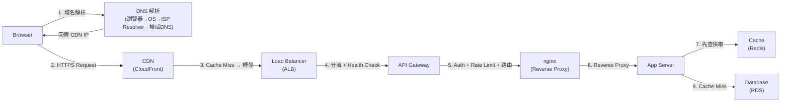
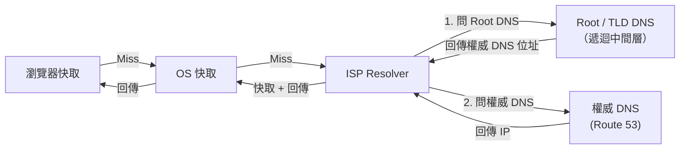
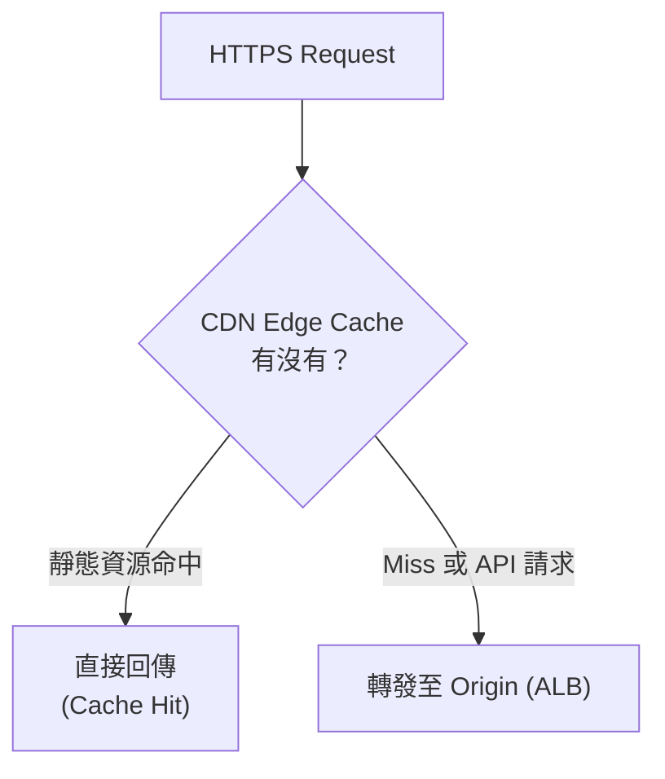
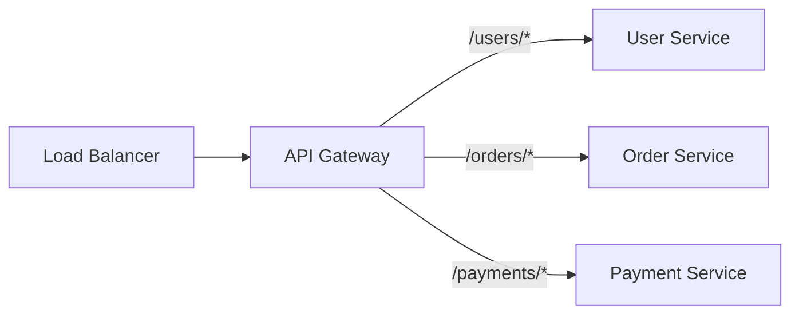
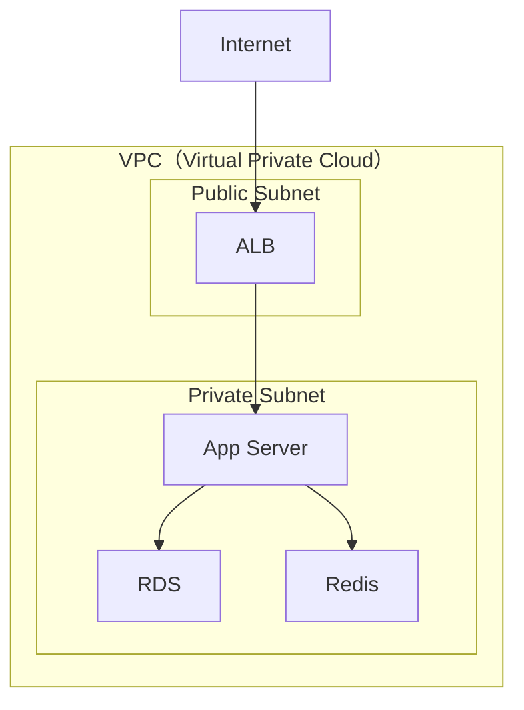
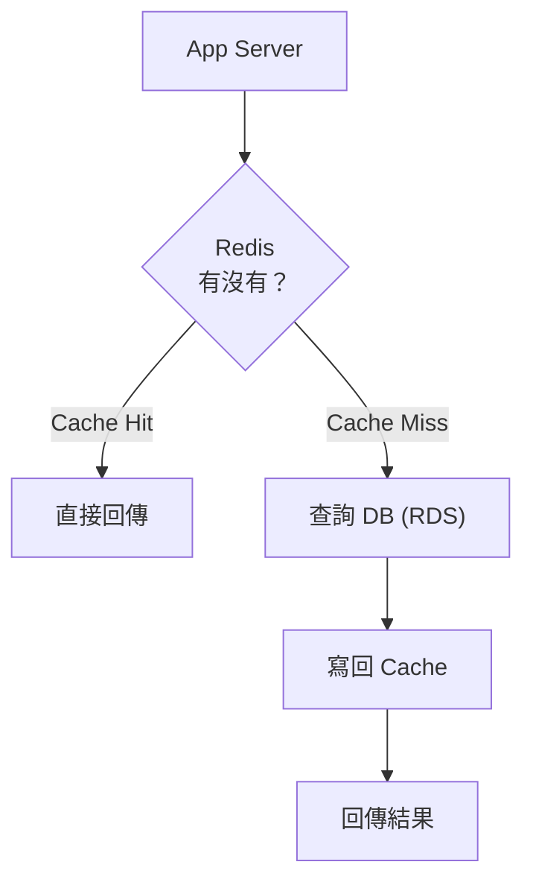
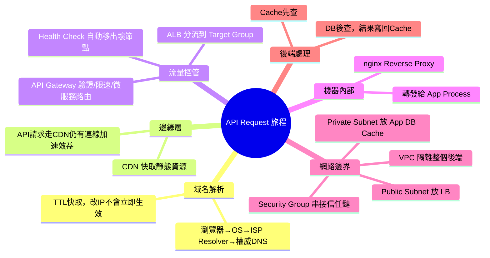

# 前端 API Request 的雲端旅程：從瀏覽器到後端完整路徑

> 學習日期：2026-07-14
> 涵蓋概念：DNS、ISP Resolver、CDN、Load Balancer、ALB、Target Group、nginx、API Gateway、VPC、Security Group、Cache、Database

---

## 整體請求路徑圖

---

## 面試回答框架（口頭 3 段式）

> 「讓我依序說明每一層做什麼、為什麼需要它。」

1. **DNS → CDN**：域名解析找到入口 IP，靜態資源在邊緣快取直接回傳
2. **LB → API Gateway → nginx**：流量分配、統一入口控管、機器內部轉發
3. **App Server → Cache → DB**：業務邏輯執行，先查快取再查資料庫

---

## 各層詳解

### 1. DNS 解析

使用者輸入 `api.example.com`，瀏覽器需要找到對應 IP。查詢順序如下：

- **瀏覽器快取**：最近查詢過的結果，最快
- **OS 快取**：作業系統層級的 DNS 快取
- **ISP Resolver**：你的網路供應商（中華電信、台灣大哥大）提供的 DNS 伺服器，Cache Miss 時負責遞迴查詢：先問 Root DNS 取得 TLD 伺服器位址，再問 TLD DNS（.com / .tw）取得權威 DNS 位址，最後才從權威 DNS 拿到實際 IP，查到後快取供下次使用
- **權威 DNS**：最終持有 domain 記錄的伺服器（如 Route 53）
- **關鍵點**：DNS 有 TTL 快取，改 IP 後不會立即生效，各 ISP Resolver 快取行為不同，實際 propagation 時間可能從幾分鐘到數小時不等

---

### 2. CDN（Content Delivery Network）

DNS 通常把 domain 指向 CDN 的 IP（CNAME 或 A Record 指向 CloudFront），所以請求先到 CDN。

- **靜態資源**（JS、CSS、圖片）：從最近的 Edge Node 直接回傳，不打後端
- **API 請求**：通常 cache miss，但走 CDN 仍有兩段加速效益：
  - **客戶端 → Edge Node**：TLS session resumption 減少每次 TLS 握手的 RTT
  - **Edge Node → Origin**：TCP Keep-Alive 持久連線，減少 TCP 三次握手成本
  - 注意：Edge Node 閒置過久連線會關閉，冷啟動時效益較小
- **可省略條件**：純內部 API、非公網服務

---

### 3. Load Balancer（ALB）

**ALB = Application Load Balancer**，AWS 提供的 L7 Load Balancer，能看懂 HTTP 內容。

| 功能 | 說明 |
|------|------|
| 流量分配 | 把請求分散到 Target Group 裡的多台 App Server |
| Health Check | 定期確認 Target Group 成員健康狀態，不健康的自動移出 |
| SSL 終止 | HTTPS 在 LB 解密，後端通常走 HTTP（內部網路視為可信）；合規場景（PCI-DSS、HIPAA）可設定 end-to-end TLS，LB 到後端同樣走 HTTPS |
| Path routing | 依 HTTP 路徑做初步分流（不同於 AG 的業務路由，這裡是分流到同質副本） |

**Target Group**：ALB 的流量分發名單，登記哪些 Server（IP + port）是可以打的對象，Health Check 也是針對 Target Group 成員執行。

- LB 放在 **Public Subnet**，是對外的入口
- 與 Security Group 的差異：SG 管「能不能連」，Target Group 管「要打給誰」

---

### 4. API Gateway

微服務架構的統一入口，前端只需要打一個 domain，由 API Gateway 依路徑路由到對應服務。

> **語境說明**：以下以 self-hosted API Gateway（Kong、nginx-based）為主要範例。若使用 **AWS API Gateway**，它本身是 managed service，具備自動高可用與擴展，通常直接接 CloudFront 或公網流量，不需要前置 ALB。

| 功能 | 說明 |
|------|------|
| 微服務路由 | 依路徑導向不同後端服務 |
| Auth（AuthN） | 驗證 JWT Token，確認身份；細粒度授權（AuthZ）由下游服務負責 |
| Rate Limiting | 限制每個 client 的請求頻率 |

**LB vs API Gateway 的順序**：兩種都合理，視架構而定：
- **方案 A（常見）**：LB → AG → App：LB 先做高可用分流到 AG cluster，AG 再路由到微服務
- **方案 B**：AG → LB（internal）→ App：AG 直接對外，各服務內部再用 LB 分流

**LB vs AG 的職責邊界**：
- LB 的「路由」= 把流量分到**同一服務的多個副本**（水平擴展）
- AG 的「路由」= 把請求導向**不同的業務服務**（微服務拆分）

雖然 ALB 也能做 path-based routing，但它做不到 JWT 驗證或 Rate Limiting；需要集中 Auth / Rate Limit 時才需要 API Gateway。

---

### 5. nginx（Reverse Proxy）

請求進到某台機器後，App Process（Gunicorn、PHP-FPM、Node.js）本身通常不直接監聽 80/443 port，nginx 負責接收後轉發給正確的 Application Process。

- **Load Balancer**：在多台機器之間分流
- **nginx**：在同一台機器內，把請求轉給正確的 Application Process

nginx 的常見職責不只轉發，還包括：
- **靜態檔案服務**：直接回傳 CSS / JS / 圖片，不打 App Process
- **gzip 壓縮**：回應在 nginx 層壓縮，減少傳輸量
- **Access log**：集中記錄請求 log，App Process 本身不需要處理

---

### 6. VPC + Security Group（網路邊界）

- **VPC**：雲端上的私有網路，與 Internet 隔離（注意：VPC ≠ VPS；VPS 是虛擬機器，VPC 是網路）
- **Public Subnet**：放 LB，對外可達
- **Private Subnet**：放 App Server、DB、Cache，只有 VPC 內部能存取
- **Security Group**：每個資源的防火牆規則，串接成信任鏈：
  - LB 的 SG → 允許 80/443 from 0.0.0.0/0
  - App Server 的 SG → 只允許來自 LB 的 SG
  - DB 的 SG → 只允許來自 App Server 的 SG

---

### 7. App Server → Cache → DB

---

## 各層對比

| 層級 | 解決什麼問題 | 可省略條件 |
|------|-------------|-----------|
| DNS | 域名 → IP 映射 | 不可省 |
| CDN | 靜態資源加速、邊緣快取 | 純 API、純內部服務 |
| Load Balancer (ALB) | 流量分配、高可用 | 單一 server 且無 HA 需求 |
| API Gateway | 統一入口、Auth、Rate Limit、微服務路由 | 單體架構或 Auth/Rate Limit 在 App Server 自行處理 |
| nginx | 機器內部 Reverse Proxy | App 直接監聽 port 時可省 |
| Security Group | 網路層防火牆 | 不可省 |

---

## 快速記憶脈絡

---

## 學習過程的關鍵卡點

**原本以為**：CDN 在 DNS 前面，要先「繞過」CDN 才能做 DNS 解析。

**實際上**：順序是反過來的。DNS 解析完才能找到 CDN 的 IP——正是因為 DNS 把 domain 指向 CDN 的位址（CNAME 或 A Record 指向 CloudFront），請求才會先打到 CDN。CDN 一定在 DNS 之後。

---

**原本以為**：VPC 跟 VPS 是同一個東西，Private Subnet 是 VPS 的一部分。

**實際上**：完全不同的概念：
- **VPS（Virtual Private Server）**：一台獨立的虛擬機器
- **VPC（Virtual Private Cloud）**：雲端上的私有網路環境，Public Subnet 和 Private Subnet 都是 VPC 的子網路

---

**原本以為**：Security Group 跟 Target Group 都是「管哪些東西可以連」的設定。

**實際上**：職責維度不同：
- **Security Group**：防火牆規則，管「能不能連」（port + 來源 IP）
- **Target Group**：ALB 的流量分發名單，管「要打給誰」（登記哪些 Server 是可以接流量的對象）

---

**原本以為**：ALB（Load Balancer）能做路由，那 API Gateway 做的事不就重疊了？

**實際上**：ALB 是 L7 所以確實能做 path-based routing，但它做不到 JWT 驗證或 Rate Limiting。兩者路由的「層次」也不同：ALB 的路由是分流到同質副本（水平擴展），API Gateway 的路由是導向不同業務服務（微服務拆分）。小型架構直接用 ALB 就夠；需要集中 Auth / Rate Limit 時才加 API Gateway。
