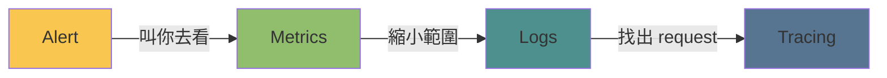
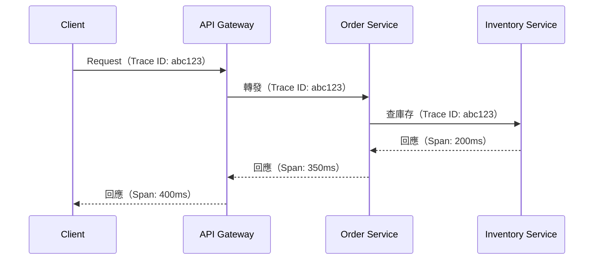
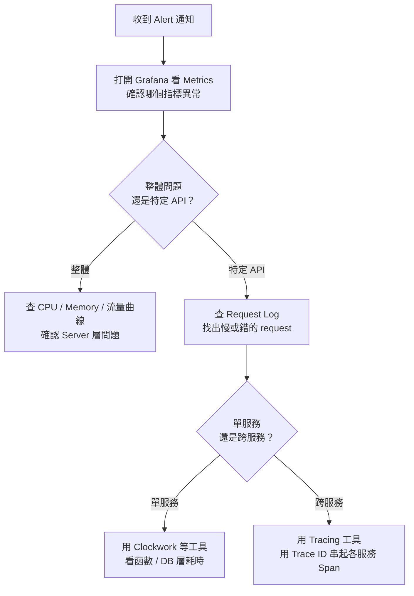

# Observability 四柱：Logs、Metrics、Tracing、Alert

> 學習日期：2026-07-15
> 涵蓋概念：Logs、Metrics、Tracing、Alert、Trace ID、Span、故障排查流程

---

## 整體定位：四種工具，四個問題



> 此為最完整的查障路徑；實際情況視問題類型，可能只需走到 Metrics 或 Logs 即可定位，不一定走完全部四步。

每個工具回答不同層次的問題：

| 概念 | 記錄什麼 | 資料形狀 | 適合回答 |
|------|---------|---------|---------|
| **Metrics** | 服務的數值狀態 | 時間 + 一個數值（曲線） | 整體有沒有異常？趨勢怎麼走？ |
| **Logs** | 每筆請求的詳細紀錄 | 時間 + 多個欄位 | 哪個 request 出問題？帶了什麼資料？ |
| **Tracing** | 一個 request 的跨服務旅程 | Trace ID + 多個 Span | 慢在哪個服務？哪個環節是瓶頸？ |
| **Alert** | 不記錄，是觸發規則 | Metrics threshold + 通知動作 | 有沒有需要人介入的異常？ |

---

## 核心概念

### Metrics — 系統狀態的時間序列

Metrics 是對系統數值的**持續記錄**，每筆資料的形狀極簡：

```
時間戳記 + 一個數值
```

依實作方式分為兩種：**定期拉取**（Prometheus scrape，由監控系統主動去抓）或**即時推送**（StatsD、Datadog Agent，由服務主動送出）。

Grafana 接上 Prometheus 等資料源，把這些點連成曲線，你看到的 CPU 使用率、Memory 佔用、Request 流量，都是 Metrics。

**為什麼需要它**：Log 資訊量大，每秒幾千筆 request 時沒辦法靠眼睛看出「系統整體有沒有異常」。Metrics 犧牲細節，換來**快速感知整體健康狀態**的能力。

### Logs — 每筆請求的完整紀錄

一筆 Log 保留一個 request 的所有細節：

```
時間 | IP | URL | Status Code | Response Time | Request Params | ...
```

**為什麼需要它**：Metrics 告訴你「error rate 上升了」，但不告訴你是哪個 request、哪個 user、帶了什麼參數。Log 是拿來**回答「到底是什麼 request 出問題」**的工具——在確認異常範圍之後才打開。

### Tracing — 一個 Request 的跨服務旅程

單服務架構下，PHP Clockwork 這類工具可以顯示「這個 request 時間花在哪幾段」（DB query、cache、view render⋯⋯）。

多服務架構下，一個 request 可能跨越 API Gateway → Order Service → Inventory Service，三個服務的 Log 是分開的。要把它們串起來，需要一個**共同的識別符**：

- **Trace ID**：這個 request 的全局 ID，所有服務都帶同一個
- **Span**：一段有開始與結束時間的操作單位，可以是一次 service call、一次 DB query、或任何有意義的區間；Span 之間有**父子巢狀關係**，一個服務內可能有多個 Span，合起來構成一個 Trace



> 圖中數字代表各服務從收到 request 到回應的**總耗時**，且外層包含內層（400ms ⊇ 350ms ⊇ 200ms）。實際上每個服務內部可能有多個 Span（如 Order Service 同時產生 DB query span 和 cache span）。

Trace ID 就像快遞單號——不管包裹經過幾個轉運站，每站都掃同一個條碼，你才能知道它現在在哪、每段花了多久。

### Alert — Metrics 上的自動告警

Alert 不是一種資料，而是一套**觸發規則**：當某個條件成立，就發送通知。

```
當 Metrics 超過 threshold（例如 error rate > 5% 持續 3 分鐘）→ 發送通知
```

最常見是建立在 **Metrics threshold** 上，但現代可觀測平台（如 Datadog、Grafana）也支援對 **Logs 的 query 結果**或 **Tracing 的異常 Span** 設定 Alert 條件。

**為什麼需要它**：Metrics 讓人「看得到」異常，Alert 讓人「不用一直盯著看」。你只需在異常時收到 Slack / PagerDuty 通知，其餘時間不用管。

---

## 實際查障流程



---

## 學習過程的關鍵卡點

**原本以為**：Tracing 是「記錄請求跟請求之間的共通性」。

**實際上**：Tracing 追蹤的是**同一個 request** 在**多個服務之間**的完整旅程，跟「不同 request 之間的共通性」完全無關。

這個卡點很典型——「共通的 Trace ID」容易被誤讀成「比較不同 request 的共通點」，但 Trace ID 的作用是把**同一個 request** 在不同服務裡的 Log 串起來，而不是用來比較不同 request。
