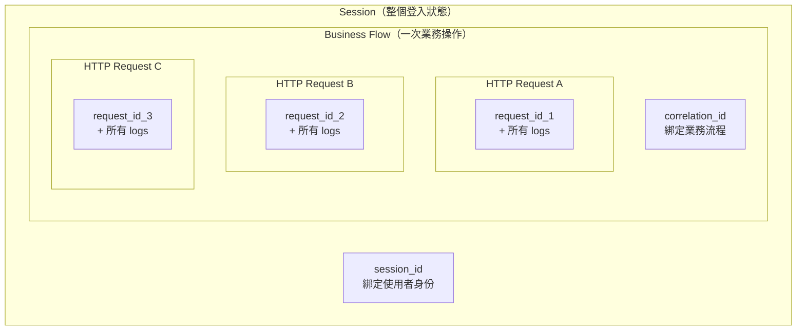
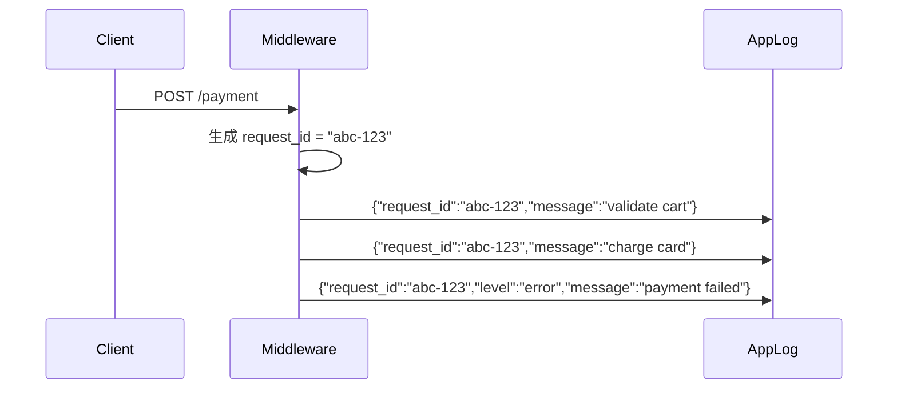
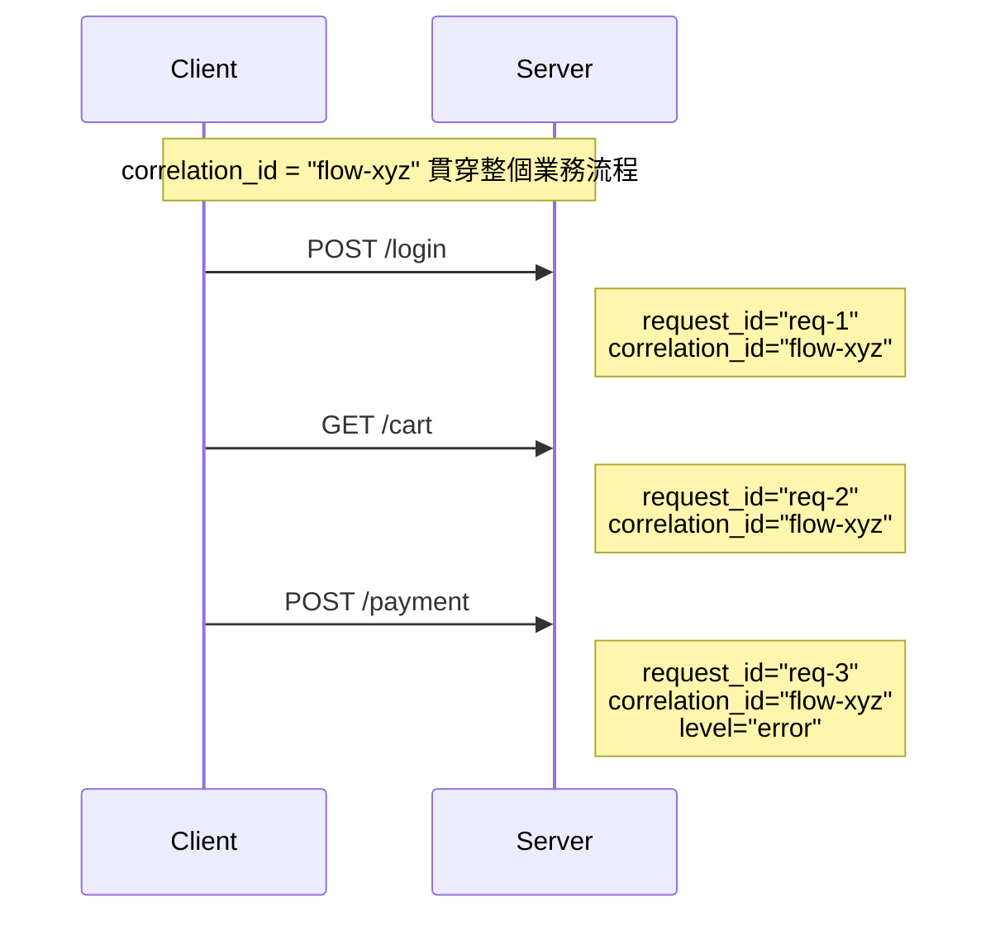
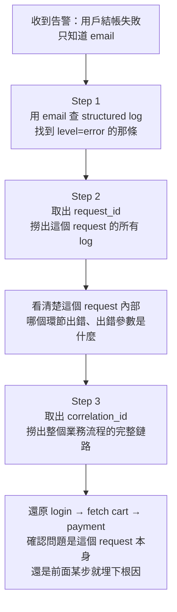

# Observability 故障排查實戰：Structured Log、Request ID、Correlation ID

> 學習日期：2026-07-16
> 涵蓋概念：Structured Log、Request ID、Correlation ID、故障排查流程、業務 ID 與追蹤 ID 的取捨

---

## 三個概念的作用範圍



---

## Structured Log

Plain text log 無法用程式查詢，只能用肉眼掃。Structured log 把每條 log 寫成 JSON，讓每個欄位都能作為查詢條件。

```json
{
  "timestamp": "2026-07-16T10:00:01Z",
  "level": "error",
  "message": "payment failed",
  "user_id": 42,
  "request_id": "abc-123",
  "correlation_id": "order-flow-xyz",
  "reason": "card declined"
}
```

**Structured log 的價值**：讓 `level = error AND user_id = 42` 這樣的查詢成為可能，而不是靠 grep 掃純文字。前提是有 log aggregation 系統（如 ELK Stack、Grafana Loki、CloudWatch Logs Insights）解析 JSON 並建立索引；沒有這層，JSON log 仍只是可讀性更差的純文字。

---

## Request ID

### 為什麼需要

高並發情境下，100 個 request 同時進來，每個 request 都產生多條 log。光靠 `level = error` 只能找到那條錯誤，卻無法知道「這個 request 在失敗前還做了什麼」。

用 IP 或 user_id 當對應依據也不夠——同一個 IP 後面可能是多個不同用戶（NAT），同一個 user_id 可能同時開兩個分頁。

### 解法

每個 HTTP request 進來時，middleware 先檢查 header 是否已帶有 `X-Request-ID`（由 API gateway 或 load balancer 注入）；若有則沿用，若無則自行生成 UUID 作為 **request ID**，注入到 request context，這個 request 觸發的所有 log 都帶上它，並在 response header 回傳給客戶端。



查詢時 `filter request_id = "abc-123"` 就能撈出這個 request 從頭到尾的完整鏈路。

---

## Correlation ID

### 為什麼需要

Request ID 解決了「單一 HTTP request 內」的追蹤問題。但一個業務流程（例如結帳）通常由多個 HTTP request 組成：login → fetch cart → payment，各自有不同的 request ID。

要追完整流程，需要一個「跨多個 request 都帶同一個值」的識別符。

### 解法

由 **API Gateway 或第一個進入伺服器端的入口 service** 生成 **correlation ID**，透過 HTTP header（如 `X-Correlation-ID`）往下游傳遞，每個 request 寫 log 時都帶上它。若客戶端傳入 `X-Correlation-ID`，伺服器端應驗證後再決定採用或自行生成，不應直接信任客戶端提供的值（避免惡意偽造 ID 污染日誌鏈路）。



---

## 三種 ID 的對比

| | **session_id** | **correlation_id** | **request_id** |
|---|---|---|---|
| **綁定對象** | 使用者身份 | 一次業務操作 | 一次 HTTP request |
| **生命週期** | 整個登入狀態 | 一個業務流程（跨多 request） | 單一 HTTP request |
| **生成時機** | 登入成功時 | 業務流程第一步 | 每個 request 進來時 |
| **用途** | 身份驗證、session 管理 | 跨 request 追蹤業務鏈路 | 追蹤單一 request 的完整上下文 |
| **例子** | 登入後的 session cookie（有狀態）或 access token（無狀態） | 一筆訂單的整個下單流程 | 一次 /payment API 呼叫 |

---

## 故障排查流程



**一句話記憶**：email 找到 error → request_id 看單次 request 脈絡 → correlation_id 看完整業務鏈路。

---

## 邊界情況：用業務 ID 當 Correlation ID

實務上可以用有業務意義的 ID（如 order ID）當 correlation ID，好處是工程師、客服、商務都能用同一個 ID 溝通。

**但有一個前提**：這個 ID 必須在業務流程的第一步就存在。

| 情境 | 適不適合 |
|---|---|
| 有「暫存訂單編號」從流程開始就存在 | 適合，可讀性高 |
| order ID 付款成功後才產生 | 不適合，前半段的 log 帶不上 |

**實務常見做法**：兩個都帶——UUID 的 correlation_id 保證可追蹤，order_id 當額外欄位方便業務查詢。

---

## 學習過程的關鍵卡點

**原本以為**：用 IP 或 user_id 就可以把相關的 log 串起來

**實際上**：同一個 IP 後面可能有多個不同用戶（NAT），同一個 user_id 可能同時有多個 session 或分頁——都會造成錯誤的對應。Request ID 才是「屬於同一個 request 的所有 log」的唯一依據。

---

**原本以為**：request ID 是跟整個業務流程（login → cart → payment）綁的

**實際上**：request ID 是「每個 HTTP request 唯一」，一個業務流程有幾個 HTTP request 就有幾個不同的 request ID。要跨 request 追蹤，必須用 correlation ID 這個獨立的層。這也是為什麼需要兩個不同的 ID：一個管 request 層，一個管業務流程層。
