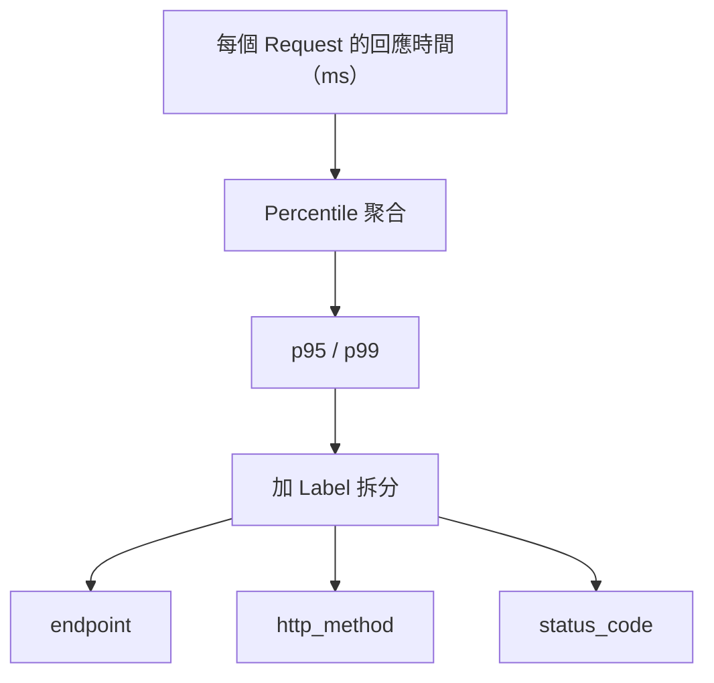
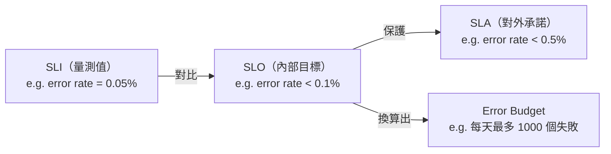
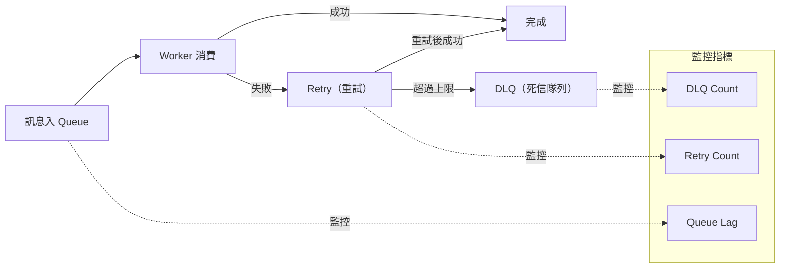
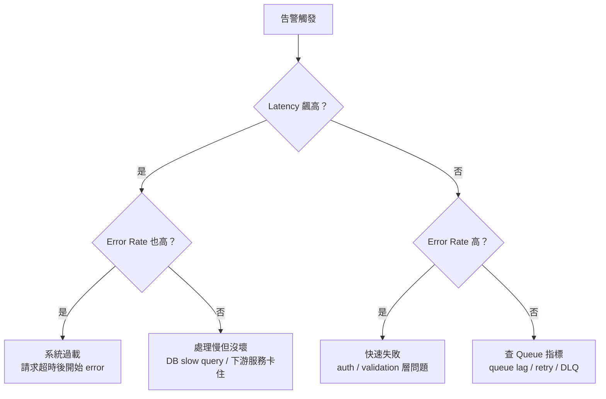

# Observability Day 3：監控指標設計——從 API Latency 到 Queue 三劍客

> 學習日期：2026-07-17
> 涵蓋概念：API Latency（p95/p99）、Error Rate（5xx vs 4xx）、SLI / SLO / SLA、Error Budget、Queue Lag、Retry Count、DLQ Count、Correlated Metrics

---

## 指標設計的三個層次

設計任何監控指標，都要回答三個問題：

1. **量什麼**：原始量測值是什麼？
2. **怎麼聚合**：如何從一堆數字變成一個可以看的值？
3. **加哪些維度（label）**：告警後如何快速定位問題？

> **重要區分**：指標是原始量測值（例如每個 request 花了幾 ms），告警閾值是之後加在指標上的條件（例如「p95 > 2s 就告警」）。兩者不同——先設計正確的指標，才能設計有意義的閾值。

---

## API Latency

### 量什麼
每個 request 從收到到回傳花了幾毫秒（ms）。

### 怎麼聚合：為什麼用 Percentile，不用 Average

| 聚合方式 | 問題 |
|---------|------|
| Average | 無法反映分布，掩蓋真實使用者體驗（少數極慢 request 拉高平均、或少數極快 request 壓低平均，都看不出多數人實際等多久）|
| **p95** | 「有 5% 的使用者等超過這個時間」，直接對應使用者體驗 |
| p99 | 捕捉更極端的 outlier，適合對尾端延遲敏感的服務 |

**p95 vs p99 的差距本身是一個信號**：差距很大代表有極端 outlier，值得單獨追查。

### 加哪些維度（label）

- `endpoint`：告警後先查是哪個 API 出問題
- `http_method`：GET vs POST 可能有不同的 latency profile
- `status_code`：分開看成功 vs 失敗請求的 latency（失敗請求因為提早 reject，latency 可能反而很低，混在一起看會誤導）

---

## Error Rate

### 量什麼
失敗 request 數 ÷ 總 request 數，以時間窗口（例如每分鐘）計算。

### 5xx vs 4xx：不是都要算進 error rate

| Status Code 類型 | 代表 | 是否納入主要 error rate |
|----------------|------|----------------------|
| **5xx** | 系統錯誤，伺服器出問題 | ✅ 是 |
| **4xx** | Client 錯誤，通常是使用者行為 | ❌ 一般不納入 |

**4xx 的特殊情境**：401/403 突增是一個告警信號——使用者不會同時大量忘記密碼，突增幾乎代表 auth service 出問題。**4xx 的絕對量要獨立監控**，不是納入 error rate 主指標，而是另設一條規則。

> **B2B API 的例外**：對第三方整合服務，400 Bad Request 突增可能代表下游客戶端的整合問題，部分團隊會另設 4xx 監控或納入 SLI 計算，但排除預期的 401/403 未認證流量。是否納入取決於你的服務對象是誰。

### 加哪些維度（label）
- `endpoint`：定位哪個 API 出問題
- `status_code`：區分 500、502、503 哪種錯誤，縮小排查方向

---

## SLI / SLO / SLA / Error Budget

四個概念是同一條鏈：從「量到什麼」到「對誰承諾什麼」。

### SLI（Service Level Indicator）
你實際量到的數字——就是你的監控指標（error rate、latency p95 等）。

SLI 是溫度計，SLO 是你設定的「幾度以上要開冷氣」。

### SLO（Service Level Objective）
設在 SLI 上的**內部目標**，刻意比 SLA 更嚴，留緩衝空間。

目的：SLO 先告警，讓你在違反對外承諾前有機會修復。

### SLA（Service Level Agreement）
對外合約承諾，違反通常有法律或賠償後果。比 SLO 寬鬆——SLO 是保護 SLA 的防線。

### Error Budget：讓「能不能部署」從主觀變客觀

Error Budget = SLO 允許的失敗量。

例：99.9% SLO + 每天 100 萬 request → **每天最多 1000 個失敗 request**。

| Error Budget 狀態 | 行動 |
|-----------------|------|
| 充裕 | 可以部署新功能，鼓勵快速迭代 |
| 快耗盡 | 凍結新功能部署，優先保穩定 |
| 修復線上問題（incident fix） | 優先於 budget 限制，但仍需走快速的 change review，不是完全無限制 |

核心價值：產品說「這個功能很重要」、工程師說「系統不穩不適合部署」——Error Budget 讓這個爭論變成規則說了算，不是誰聲音大誰贏。

---

## Queue 系列指標

Queue Lag、Retry Count、DLQ Count 三個指標是**同一個失敗流程的不同觀測點**，要一起設計。

### Queue Lag

**量什麼**：Queue Lag 有兩種量法——**offset 差距**（積壓的訊息數量，如 Kafka consumer lag）與**最老訊息等待時間**（age of oldest unacked message）。後者更能反映實際嚴重程度，因為數量相同但消費速率不同，時間差異可以很大。

| 情境 | 積壓量 | 消費速率 | 實際嚴重程度 |
|-----|-------|---------|------------|
| A | 1000 個 | 500 個/秒 | 2 秒後清完，不嚴重 |
| B | 1000 個 | 2 個/秒 | 500 秒後清完，非常嚴重 |

同樣 1000 個積壓，嚴重程度可以差 250 倍。光看數量不夠。

**設計重點**：
- 看**趨勢**（數量是往下清還是持續往上堆）比看瞬間快照更有意義
- 告警後要搭配 retry count 和 worker error rate 才能判斷是 bug 還是流量問題

### Retry Count

**按 job 類型（label）拆分**，知道是哪種業務邏輯一直在失敗。

**告警條件不是 `retry count > 0`**——偶發 retry 是正常的（網路短暫抖動、暫時逾時 retry 後就成功了）。

真正的告警條件：**retry count 持續增加 + DLQ count 也在增加** → 持續性失敗，需要立即處理。

| 現象 | 診斷 |
|-----|------|
| retry 高，DLQ 不動 | 暫時性失敗，retry 後成功，正常 |
| retry 高，DLQ 也增加 | 持續性失敗（bug 或下游服務掛掉），緊急 |

### DLQ Count

DLQ 是訊息的最終墳場——進來就代表系統放棄了，需要人工介入。

**告警條件**：對大多數業務系統（尤其是金融交易、訂單處理等 lossless 系統），`DLQ count > 0` 就觸發；訊息容忍度較高的系統（如非核心通知推送）可根據速率設閾值。共同點是：**DLQ 進入速率暴增絕對是緊急信號**，無論閾值怎麼設。

**設計重點**：
- 加 `job_type` label：一眼看出是哪個業務失敗
- 監控**進入速率**：1 天 1 個 vs 1 分鐘 100 個嚴重程度天差地別，速率暴增代表系統性問題需要升級

> **延伸**：DLQ 訊息通常需要 replay 機制——修完 bug 後，把 DLQ 裡的訊息重新送回原始 queue 重新處理。

---

## 組合診斷：多個指標一起讀

單一指標只能說「有問題」，組合指標才能說「問題在哪」。

| Latency | Error Rate | 最可能原因 |
|---------|-----------|----------|
| 飆高 | 也飆高 | 系統過載，請求超時後開始 error |
| 飆高 | 正常 | 處理慢但沒壞（DB、下游服務卡住） |
| 正常 | 飆高 | 快速失敗（auth、validation、路由問題） |

| Queue Lag 持續增加 | Retry Count | DLQ Count | 診斷 |
|-----------------|------------|----------|-----|
| ✅ | 飆高 | 也飆高 | Bug：持續失敗，需要查 worker 邏輯 |
| ✅ | 正常 | 正常 | 流量暴增：worker 不夠，需要擴容 |
| 正常 | 飆高 | 不動 | 暫時性失敗：retry 後成功，不需介入 |

---

## 學習過程的關鍵卡點

**卡點 1：把告警閾值當成指標本身**

**原本以為**：「監控指標」就是「超過幾秒就告警」這個設定，設好這個數字就是在做監控設計。

**實際上**：指標是原始量測值（每個 request 的回應時間 ms），告警閾值是之後設在指標上的條件。先有正確的量測設計，才能在上面設有意義的閾值。兩件事要分開思考。

---

**卡點 2：error rate 和 latency 是完全獨立的兩個問題**

**原本以為**：error rate 高就查 error，latency 高就查 latency，各自獨立處理。

**實際上**：它們要組合讀。Latency 正常但 error rate 高 → 快速失敗（auth/validation 被擋）；Latency 高但 error rate 正常 → 處理卡住（DB、下游服務）。組合縮小了問題範圍，才能快速找到根因。

---

**卡點 3：queue lag = 積壓的訊息數量**

**原本以為**：queue 裡有幾個訊息就是 queue lag，數字大就嚴重。

**實際上**：1000 個積壓可能 2 秒清完也可能 500 秒清完，光看數量完全無法判斷嚴重程度。關鍵是時間維度：消費速率是多少？趨勢是往上堆還是往下清？數量的**趨勢**比瞬間快照更有診斷價值。
