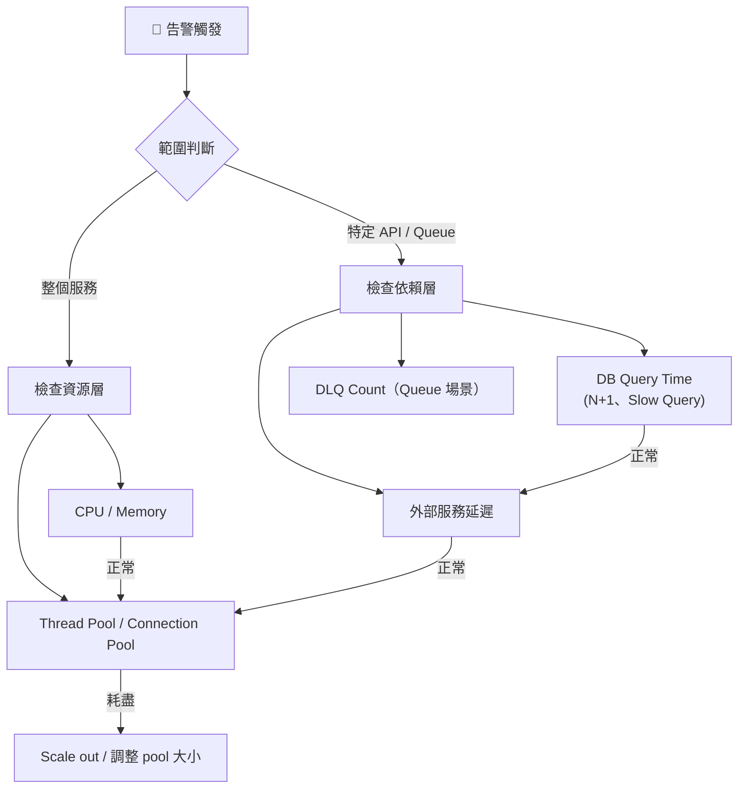
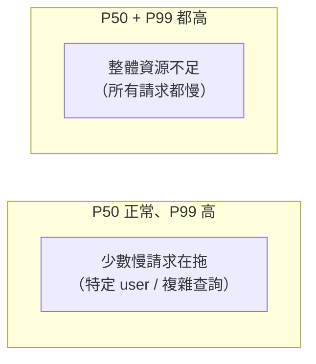
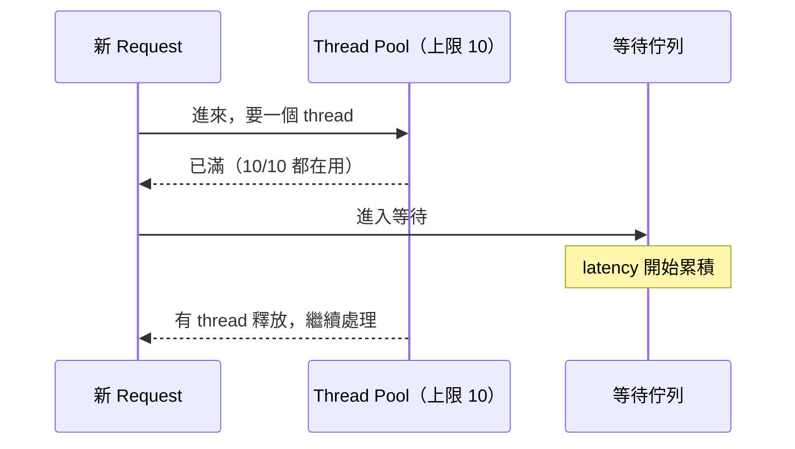
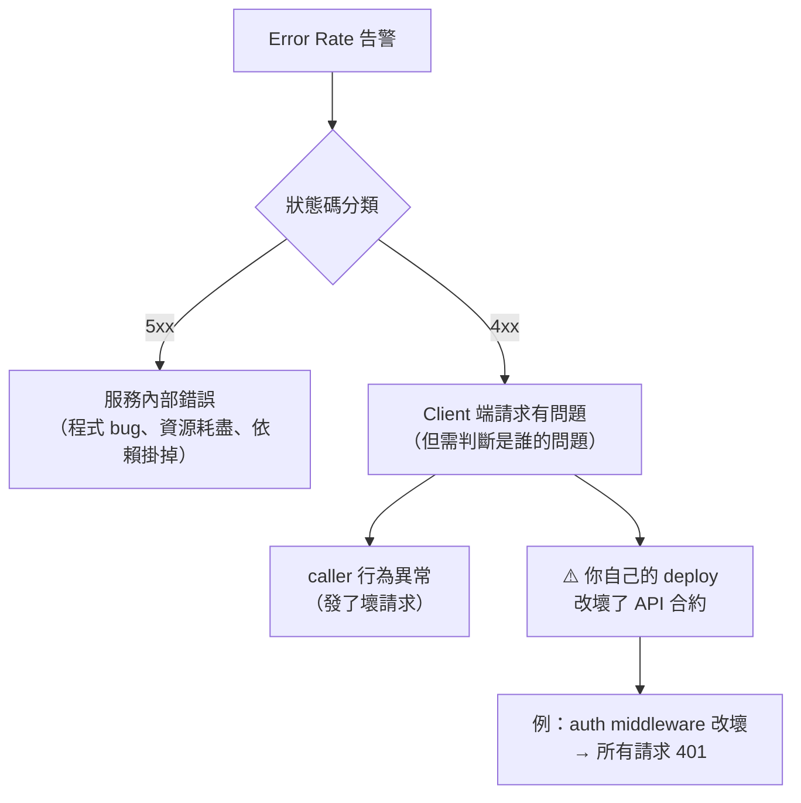
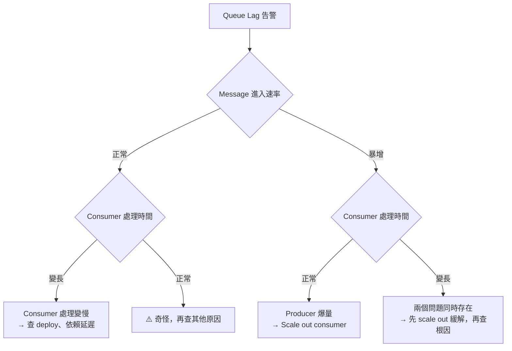
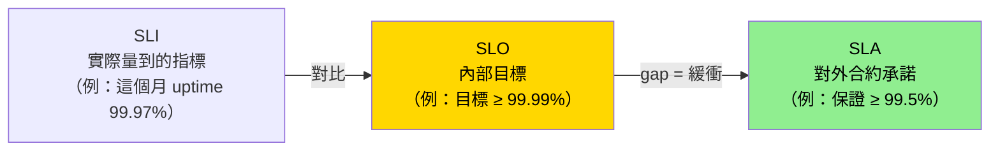

# Observability 故障排查心法：API Latency、Error Rate、Queue Lag 與 SLI/SLO/SLA

> 學習日期：2026-07-18
> 涵蓋概念：API Latency 排查流程、Percentile 分析、Thread Pool、Connection Pool、Error Rate 4xx vs 5xx、Queue Lag 診斷矩陣、SLI / SLO / SLA 關係

---

## 整體排查思維

收到任何告警，第一步都不是「立刻找工具」，而是先**縮小問題範圍**——是整個服務壞了，還是局部？接著才往底層挖原因。

---

## API Latency

### 排查流程

**第一步：確認範圍**

在 Grafana 或 log 中，依 endpoint breakdown，判斷是**整體服務慢**還是**特定 API 慢**。

**第二步（整體慢）：查資源層**

| 資源 | 如何看 | 滿了的症狀 |
|------|--------|-----------|
| CPU / Memory | Grafana 系統指標 | 飆高、OOM |
| **Thread Pool** | JVM metrics / server config | 請求排隊等 thread，latency 高但 CPU 低 |
| **Connection Pool** | DB / Redis client metrics | 請求等連線，latency 高但 DB query 快 |

**第三步（特定 API 慢）：查依賴層**

- DB query time：是否有 slow query、N+1 問題
- 外部服務 response time：呼叫 log 裡記錄的耗時
- 如果兩者都正常 → 回頭看 thread pool / connection pool

### Percentile 分析：P50 vs P99

> **P50 正常但 P99 很高** = 少數慢請求，不是整體資源不足——兩者的處理方向完全不同，要先看 percentile 分佈再決定怎麼挖。

### Thread Pool：為什麼 CPU 低還是會慢？

每個進來的 HTTP request 都要佔用一個 **thread**，直到 response 送出去才釋放。Thread pool 有上限，超過就排隊等——這時 CPU 閒著但 latency 飆高，很容易被誤判為「服務正常」。

---

## Error Rate

### 4xx vs 5xx：問題出在哪裡

### 診斷規則

| 現象 | 可能原因 |
|------|---------|
| 5xx 暴增 | 服務內部：看 error log、資源指標、依賴服務狀態 |
| 4xx 暴增 + 剛 deploy | ⚠️ 高度懷疑 breaking change：auth 邏輯、request schema 改了 |
| 4xx 暴增 + 無 deploy | Caller 行為異常，或外部惡意流量 |

> **關鍵直覺**：4xx 的定義是「client 的請求有問題」，但如果 4xx **突然暴增**而且剛好有 deploy，幾乎可以直接懷疑是你自己改壞了合約，而不是 caller 突然集體變笨。

---

## Queue Lag

### 診斷矩陣

Queue Lag 飆高，不要直接加 consumer——先搞清楚是**進來太多**還是**處理太慢**。

| 進入速率 | 處理時間 | 診斷 | 對策 |
|---------|---------|------|------|
| 正常 | 變長 | Consumer 邏輯變慢 | Rollback / 查效能問題 |
| 暴增 | 正常 | Producer 爆量 | Scale out consumer* |
| 暴增 | 變長 | 雙重問題 | 先 scale out，再查根因 |

*Scale out consumer 的前提：consumer 必須是 stateless，且 queue 本身支援並行消費。Kafka 的情況下，partition 數量是有效 consumer 數的上限——consumer 數超過 partition 數，多出的 consumer 會閒置。

### 別忘了 DLQ

Queue Lag 高的同時要一起看 **DLQ Count**——失敗的 message 一直 retry 會持續消耗 consumer 資源，讓 lag 更難降下來。

⚠️ 特別注意：若 DLQ Count **持續上升**（不只是 retry），lag 可能假性降低——壞的 message 被移出 queue，看起來 lag 下降了，但這些資料其實已遺失或需要另外補救。只看 lag 降低以為問題解決，是更危險的盲點。

---

## SLI / SLO / SLA

### 三者的關係

### 嚴格程度

**SLO > SLA**（SLO 更嚴格，數值更高）

| | SLO | SLA |
|--|-----|-----|
| 對象 | 內部團隊 | 外部客戶 |
| 嚴格度 | 更高（如 99.99%） | 較寬鬆（如 99.5%） |
| 違反後果 | 內部警示、改善行動 | 合約違約、賠償退款 |

> **為什麼 SLA 比 SLO 寬鬆？** 這個 gap 是緩衝帶。即使偶爾沒達到 SLO，只要沒跌破 SLA，就不會觸發合約違約。這讓團隊有空間應對意外，而不是每次小故障都觸發賠償。實務上 SLA 通常比 SLO 寬鬆以保留緩衝，但這不是技術規定，取決於商業合約的談判結果（少數特殊合約可能例外）。

---

## 學習過程的關鍵卡點

**卡點一：CPU 正常 ≠ 無資源瓶頸**

**原本以為**：CPU 低、Memory 正常就代表服務沒有資源問題。

**實際上**：Thread pool 和 Connection pool 耗盡也會讓 latency 飆高，但完全不會反映在 CPU/Memory 上——因為 thread 是在**等**，不是在**算**。

這是 on-call 排查最常見的誤判：「CPU 才 30%，哪有資源問題？」——但 thread 全在等 DB 回應，pool 早就滿了。

---

**卡點二：P99 高不代表整體慢**

**原本以為**：latency 指標高 = 所有請求都慢 = 要加資源。

**實際上**：P50 正常但 P99 高，代表是**少數慢請求**在拉高尾部延遲，加資源不一定有用——應該去找那些特別慢的請求是誰、在做什麼。

---

**卡點三：4xx 暴增不一定是 caller 的錯**

**原本以為**：4xx = client 送了壞請求，跟服務無關。

**實際上**：如果 4xx 暴增剛好在 deploy 之後，幾乎要先懷疑是自己改壞了 API 合約（例如 auth middleware 邏輯變了），而不是 caller 突然集體出問題。

---

**卡點四：SLA 比 SLO 寬鬆，不是更嚴格**

**原本以為**：對外承諾的 SLA 標準比內部的 SLO 更高（更嚴格）。

**實際上**：剛好相反。SLO（99.99%）> SLA（99.5%）——對外承諾刻意留比內部目標更多的緩衝，這樣即使偶爾沒達到內部目標，也不會立刻違反對外合約。

記憶方法：**SLO 是你對自己的要求（高標），SLA 是你對客戶的保底（低於 SLO 才安全）。**
