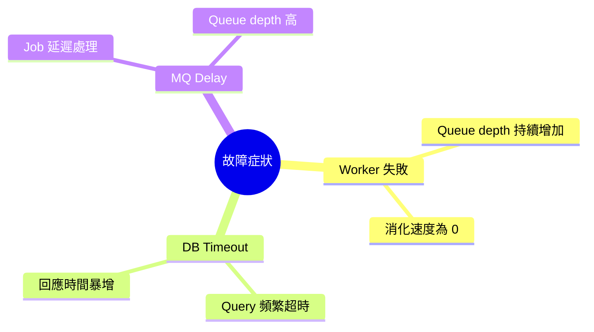
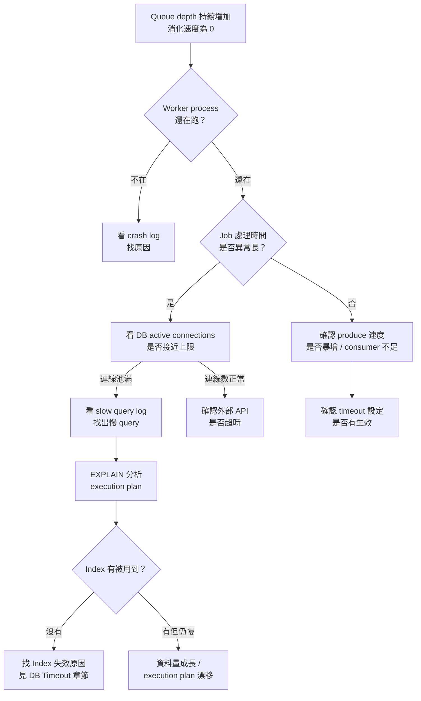
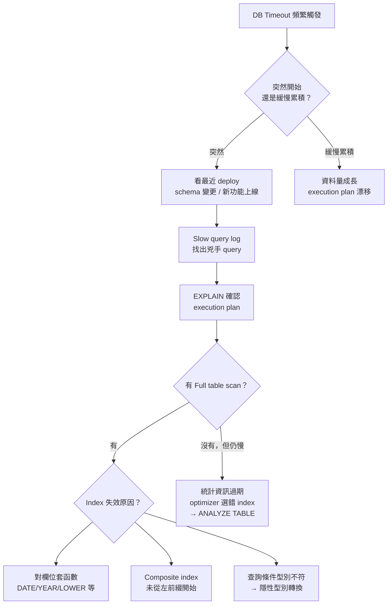
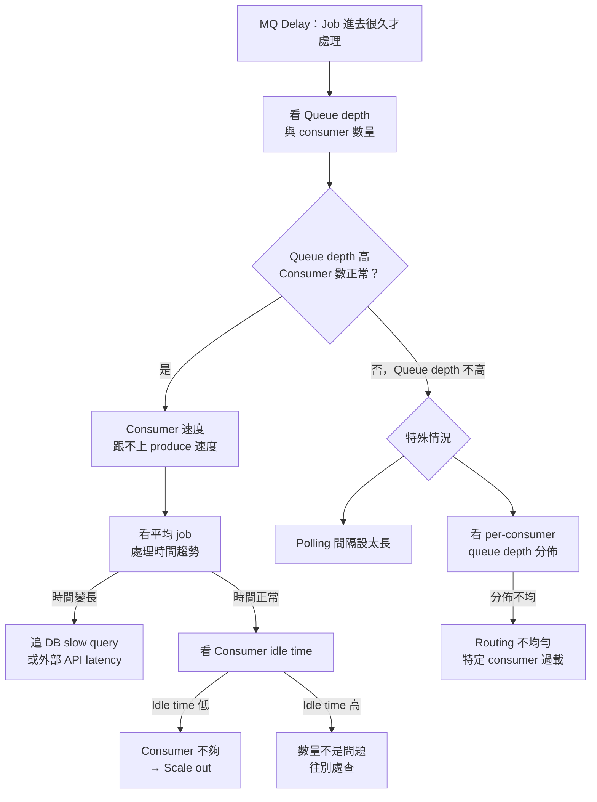

# Observability 故障排查 Checklist：Worker 失敗、DB Timeout、MQ Delay

> 學習日期：2026-07-20
> 涵蓋概念：Queue depth、Worker process、DB timeout、Index 失效、Consumer idle time、Routing 不均勻、Polling interval

---

## 整體排查路徑

---

## Worker 失敗排查

### 排查流程

### Checklist

- [ ] Queue depth 持續增加、消化速度為 0？
- [ ] Worker process 還在跑嗎？
  - 不在 → 看 crash log 找原因
  - 還在 → 懷疑 job 卡住
- [ ] Job 平均處理時間是否異常長？
- [ ] DB active connections 是否接近上限？（連線池滿）
- [ ] Slow query log 有沒有新增的慢 query？
- [ ] 連線池為什麼滿？Queue 暴增 or 單個 job 處理時間變長？

---

## DB Timeout 排查

### 排查流程

### Checklist

- [ ] Timeout 是突然開始還是緩慢累積？
- [ ] 最近有 deploy、schema 變更、新功能上線嗎？
- [ ] Slow query log 找到兇手 query 了嗎？
- [ ] `EXPLAIN` 確認 execution plan，有沒有 full table scan？
- [ ] Index 是否失效？確認以下三種隱性陷阱：
  - 欄位套了函數（`DATE(created_at)`、`LOWER(email)`）
  - Composite index 沒從左前綴開始（跳過中間欄位）
  - 查詢條件與欄位型別不符 → DB 做隱性型別轉換

### Index 失效速查表

| 陷阱 | 範例 | 為什麼失效 |
|------|------|-----------|
| 對欄位套函數 | `WHERE DATE(created_at) = '2024-01-01'` | 函數把欄位包起來，index 無從比對；MySQL 8.0+ 可用 Function-Based Index 解決 |
| Composite index 跳欄位 | Index: `(a, b, c)`，query: `WHERE a=1 AND c=3` | 跳過 `b`，`c` 的 index 不會被用 |
| 型別不符隱性轉換 | 欄位是 `INT`，query 用 `WHERE id = '123'`；反向：欄位是 `VARCHAR`，query 用 `WHERE phone = 0912345678` | DB 轉型後 index 無效，且不報錯；兩個方向都會發生，VARCHAR 欄位用數字查在實務上更常踩到 |

---

## MQ Delay 排查

### 排查流程

### Checklist

- [ ] Queue depth 高？Consumer 數量正常？
- [ ] 平均 job 處理時間有沒有變長趨勢？
  - 有 → 追 DB slow query 或外部 API latency
- [ ] Consumer idle time 是否很低（< 10%）？
  - 是 → Consumer 不夠，考慮 scale out
- [ ] Per-consumer 的工作量分佈是否嚴重不均？
  - RabbitMQ：看 per-consumer unacked count
  - Kafka：看 per-partition consumer lag
  - 分佈不均 → Routing 問題，特定 consumer 過載
- [ ] Worker polling 間隔是否設太長？

### Consumer Idle Time 說明

Worker 的時間只花在兩件事：**等待新 job** 和 **處理 job**。

| Idle time 高（例：> 50%） | Idle time 低（例：< 10%） |
|--------------------------|--------------------------|
| Consumer 大部分時間在空等 | Consumer 幾乎沒有喘息空間 |
| 問題不在 consumer 數量 | 需要 scale out 增加 consumer |
| 往 job 本身慢或 routing 不均查 | 或檢查是否有 job 長時間佔用 |

> 閾值僅供參考，合理範圍取決於業務吞吐量與 SLA 要求，實際判斷應依趨勢變化而非絕對數字。

---

## 學習過程的關鍵卡點

**卡點 1：Idle time 定義不熟悉**

**原本以為**：不知道 idle time 是什麼意思，無法用它判斷是否要 scale out。

**實際上**：Worker 的時間只有兩種用途——處理 job 和等待 job。Idle time 就是「等待」的時間比例。Idle time 低代表 consumer 幾乎一直在忙，scale out 才能解決；Idle time 高卻還是有 delay，表示問題在 job 本身慢或 routing 不均，加 consumer 沒有用。

---

**卡點 2：Index 失效的隱性陷阱**

**原本以為**：Index 失效只有「查詢條件不在 index 欄位上」這種明顯情況。

**實際上**：最危險的三種情況都不會報錯，query 照常執行，但 index 完全沒被用到：
1. 對欄位套函數（`DATE(created_at)`）
2. Composite index 跳欄位使用
3. 查詢條件型別與欄位不符導致隱性型別轉換

這三種情況要靠 `EXPLAIN` 才能發現，不會有任何錯誤提示。

---

**卡點 3：症狀不等於根因，要一層層往下追**

**原本以為**：看到 Queue depth 增加就代表 Worker 有問題。

**實際上**：Queue depth 增加只是症狀入口，背後可能是完全不同的根因——Worker crash、job 卡在 DB 等待、DB 連線池被耗盡、MQ routing 不均勻等。正確的排查方法是：確認症狀 → 第一層判斷（排除最明顯的可能）→ 第二層判斷（縮小範圍）→ 找到根因，每一步都要先問「是哪種情況」才能決定下一步要看什麼。
