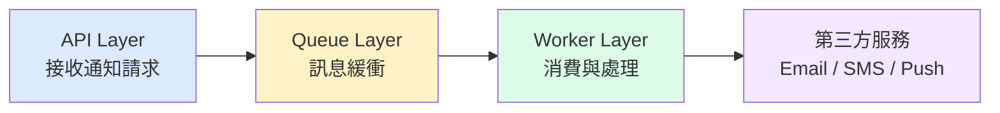
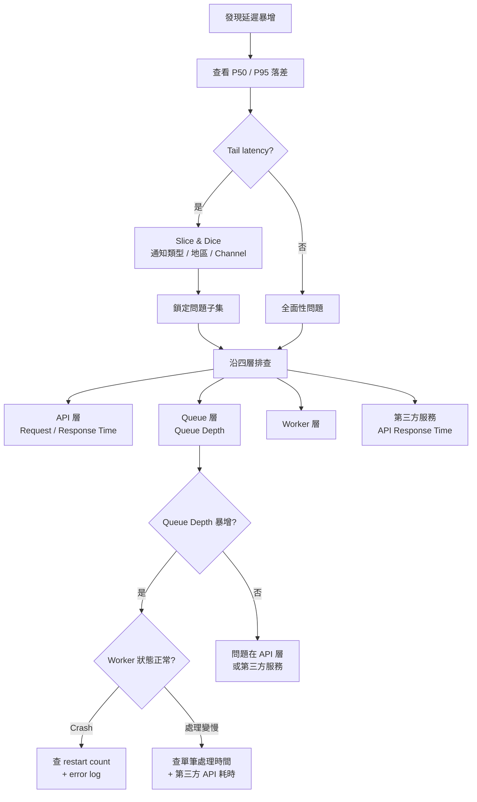
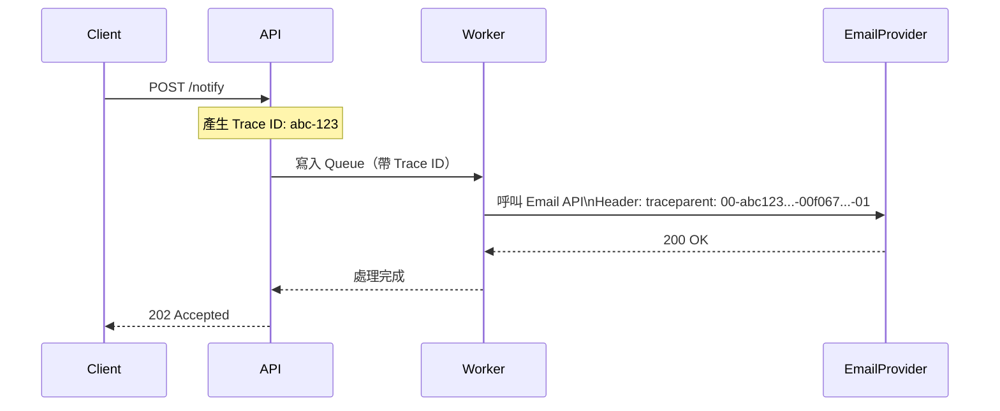
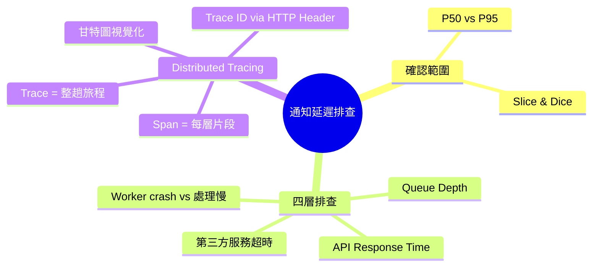

# 通知系統延遲排查與 Distributed Tracing

> 學習日期：2026-07-21
> 涵蓋概念：延遲排查框架、P50/P95、Slice & Dice、Queue Depth、Distributed Tracing、Trace、Span、Trace ID

---

## 通知系統的四層架構

通知系統的「延遲」不等於一般 API 的延遲。一個通知從觸發到送達，會跨越四層：

每一層都可能是延遲的來源，排查時要逐層確認，而不是只看 CPU / Memory。

---

## 排查流程

### Step 1：確認問題範圍

先看 **P50 vs P95** 的落差：

| 狀況 | 代表意義 |
|------|---------|
| P50、P95 都高 | 全面性問題，整個服務都慢 |
| P95 遠高於 P50 | Tail latency，特定請求特別慢 |

若是 tail latency，用 **Slice & Dice** 鎖定問題子集：

- 通知類型（Email / SMS / Push）
- 地區（Asia / US / EU）
- 第三方 channel（SendGrid / Twilio / FCM）

### Step 2：沿四層逐一排查

#### Queue 層：Queue Depth 是關鍵訊號

Queue depth 暴增代表三種可能：

1. **生產速度 > 消費速度**（流量暴增，Worker 數量不足）
2. **Worker crash**（消費端掛了，訊息積壓）
3. **Worker 存活但被 I/O 阻塞**（第三方 API 超時未設上限，Worker 阻塞等待，消費速度接近 0 但不會 crash）

這三種情境的排查方向完全不同：

| 情境 | 指標 | 工具 |
|------|------|------|
| Worker crash | restart count、OOMKilled | k8s events、error log |
| Worker 處理慢 | 單筆處理時間、第三方 API response time | APM、Trace |
| Worker 被 I/O 阻塞 | restart count 正常，但單筆處理時間極高 | Trace 的 Span 耗時 |

> 第三種情境容易被忽略：Worker 健康檢查通過、restart count 也不異常，但因為缺少 timeout 設定，Worker 卡在等待外部 I/O，實際消費速度近乎 0。

#### Queue Depth 正常但延遲高

代表 Worker 有在消費，但某一環節卡住了——通常是**第三方服務超時**。此時看：
- 第三方 API 的 response time
- timeout / 5xx error rate

---

## Distributed Tracing

### 它解決什麼問題？

在微服務架構下，一個請求跨越多個 service，各 service 的 log 是分開的。  
當某個請求很慢，你不知道慢在哪一個 service——只能逐一翻 log，而且無法確認「A 的這筆 log」和「B 的那筆 log」是同一個請求。

### 核心機制：Trace ID 串聯

每個 request 產生一個 **Trace ID**，透過 HTTP Header 在 service 之間傳遞。每個 service 收到後繼續往下帶，讓全程所有 log 可以被同一個 ID 串起來。

**W3C 標準 `traceparent` Header 的格式**為 `{version}-{traceId}-{parentSpanId}-{flags}`，例如 `00-4bf92f3577b34da6a3ce929d0e0e4736-00f067aa0ba902b7-01`。Trace ID 是其中一個欄位，不是整個 Header 值。自定義 Header（如 `X-Trace-ID`）則直接放 Trace ID。

**跨 Queue 傳遞**：Trace ID 需要跨越 Message Queue 時，不放在 HTTP Header，而是放在訊息的 **message metadata**（Kafka message header、RabbitMQ message properties）。Worker 消費訊息後從 metadata 取出 Trace ID，再帶入後續的 HTTP 呼叫。

### Trace 與 Span

| 名詞 | 定義 |
|------|------|
| **Trace** | 一個請求從頭到尾的完整旅程 |
| **Span** | 每個 service（或步驟）的處理片段，記錄開始時間與耗時 |

### 視覺化：甘特圖形式

Distributed Tracing 的可視化像甘特圖——每個 Span 是一條橫條，顯示它在整個 Trace 時間線上的位置與長度：

```mermaid
gantt
    title Distributed Trace 示意（每條橫條 = 一個 Span）
    dateFormat X
    axisFormat %L

    section API Service
    接收請求與驗證   :a1, 0, 2

    section Queue Service
    寫入 Message Queue   :a2, 2, 4

    section Worker Service
    消費 Message + 處理邏輯   :a3, 4, 9

    section Email Provider
    外部 API 呼叫   :a4, 9, 15
```

一眼就能看出哪條橫條最長，那層就是瓶頸。

### 常見工具

| 工具 | 類型 |
|------|------|
| Jaeger | 開源，自行部署 |
| Zipkin | 開源，輕量 |
| AWS X-Ray | 雲端託管 |
| Google Cloud Trace | 雲端託管 |

---

## 學習過程的關鍵卡點

**卡點 1：排查起手式停在 CPU / Memory**

**原本以為**：系統變慢就看 CPU 跟 Memory，這兩個正常就不知道往哪查。

**實際上**：CPU / Memory 只是 infra 層的健康指標。通知系統的延遲要沿著 `API → Queue → Worker → 第三方服務` 四層各自確認，每層有各自的關鍵指標（P95、Queue depth、restart count、外部 API response time）。

---

**卡點 2：以為 Distributed Tracing 是折線圖**

**原本以為**：Tracing 的視覺化是折線圖或長條圖。

**實際上**：是甘特圖形式。因為每個 Span 有**開始時間**和**持續時間**這兩個維度，甘特圖能同時呈現「先後順序」和「各層耗時」，一眼看出瓶頸在哪層。折線圖無法表達這種時序重疊關係。

---

## 快速記憶脈絡

