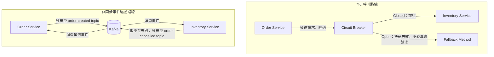
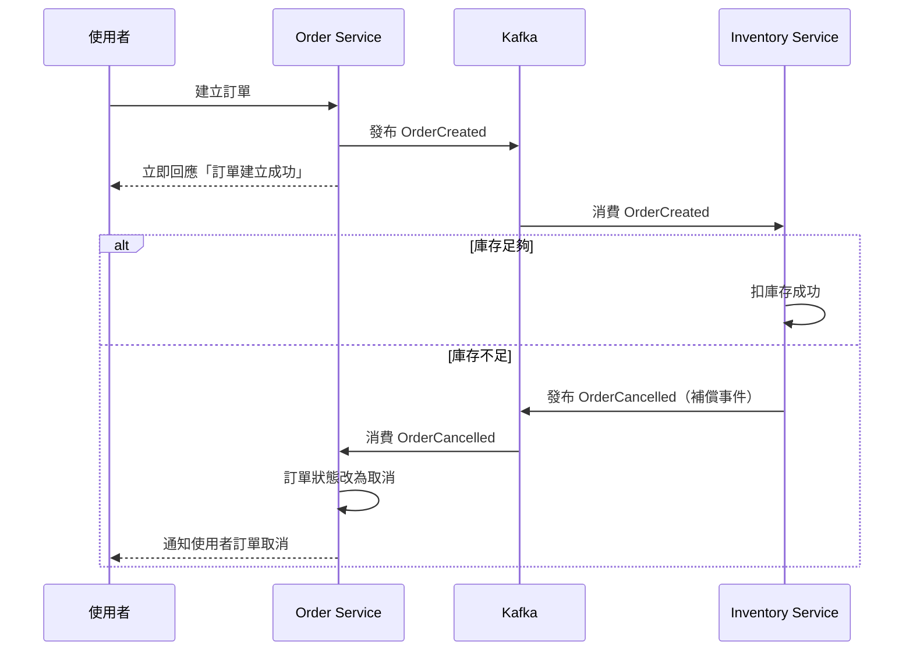
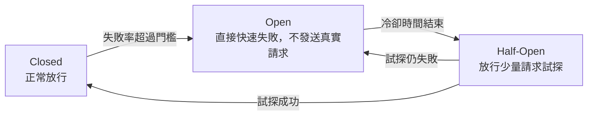

# 服務間溝通與 Resilience：同步呼叫、事件驅動與 Circuit Breaker

> 學習日期：2026-07-24
> 涵蓋概念：REST 同步呼叫 vs Kafka 事件驅動、Cascading Failure、Eventual Consistency、Saga Pattern、Circuit Breaker（Closed/Open/Half-Open）、Fallback Method

---

## 整體架構圖

---

## 為什麼同步呼叫會拖垮上游服務

Order Service 若用 `RestTemplate`（同步 blocking client）呼叫 Inventory Service，該 thread 會卡在原地等待回應，直到收到結果或 timeout。`WebClient` 本身是 Spring WebFlux 提供的非阻塞（non-blocking）reactive client，不會佔用 thread 等待——但如果用 `.block()` 把它當同步呼叫使用，效果就跟 `RestTemplate` 一樣會卡住 thread。以下討論的「thread 被占滿」風險，前提都是同步阻塞的呼叫方式。

如果 Inventory Service 剛好掛掉或回應很慢，Order Service 那些正在等待的 thread 就會被占滿。當同時有大量請求進來，thread pool 被耗盡，Order Service 自己也會被拖垮——**故障沿著呼叫鏈往上蔓延**，這個現象叫做 **Cascading Failure（連鎖故障）**。這是同步呼叫在分散式系統裡最危險的地方：B 掛了，不只 B 有事，連本來健康的 A 都會一起倒下。

---

## Kafka 事件驅動：用解耦換一致性

解法之一是把「呼叫並等待」換成「發布事件」：Order Service 把 `OrderCreated` 事件丟進 Kafka 就能立刻回應使用者，不用等 Inventory Service 處理完。Inventory Service 按自己的節奏消費事件，即使暫時掛掉也不會直接拖累 Order Service。

代價是犧牲了強一致性，變成 **Eventual Consistency（最終一致性）**：訂單狀態和庫存扣減結果之間存在一段時間差視窗，使用者可能已經看到「訂單成立」，但 Inventory Service 消費事件時才發現庫存不夠。這時系統需要額外的收尾機制。

### Saga Pattern：用補償事件收尾

當 Inventory Service 扣庫存失敗，它會發布一個反向的補償事件（例如 `OrderCancelled`）回去，讓 Order Service 監聽到後把訂單狀態改回取消，並通知使用者。這種「一連串正向事件 + 失敗時反向補償」的設計模式稱為 **Saga Pattern**。

---

## Circuit Breaker：保護仍然選擇同步呼叫的服務

不是所有場景都適合改成事件驅動（例如需要即時知道結果的付款確認）。如果繼續用同步呼叫，就需要 **Circuit Breaker（斷路器）** 來避免 thread 被浪費在等待一個大機率會失敗的呼叫上。

跟保險絲的類比對應：保險絲偵測到異常電流就跳開保護電器；斷路器偵測到呼叫失敗率過高，就「跳開」，之後的呼叫直接快速失敗，不再真的發送 request 去等待。

### 三個狀態

| 狀態 | 行為 |
|------|------|
| Closed | 正常放行所有呼叫 |
| Open | 失敗率超過門檻後跳開，後續呼叫直接快速失敗，**不會**真的發送 HTTP request |
| Half-Open | 冷卻一段時間後，放行少量請求試探對方是否恢復；成功則回 Closed，失敗則回 Open |

Half-Open 存在的原因：如果 Open 之後永遠不再嘗試，就算下游服務早就恢復正常，呼叫方也會一直誤判它是壞的，永遠走備援方案，系統失去自動復原的能力。

### Fallback Method

斷路器跳到 Open、快速拒絕呼叫時，不能讓使用者直接看到錯誤。Resilience4j 通常會搭配預先定義好的 **Fallback Method**，在呼叫被拒絕或失敗時執行，回傳快取資料、預設值，或是「服務暫時不可用，請稍後再試」的友善訊息。

在 Spring Boot 生態裡，**Resilience4j** 是最常用的實作，提供 `@CircuitBreaker`、`@Retry`、`@RateLimiter`、`@Bulkhead`、`@TimeLimiter` 等 annotation。

> 注意：Circuit Breaker 跟 Retry 是互補而非取代的關係——Retry 處理「這次呼叫的暫時性失敗要不要再試一次」，Circuit Breaker 處理「這段時間內還要不要繼續嘗試呼叫這個服務」。

---

## 同步 vs 非同步：怎麼選

| 維度 | 同步（REST + Circuit Breaker） | 非同步（Kafka + Saga） |
|------|-------------------------------|------------------------|
| 一致性 | 即時、強一致性 | Eventual Consistency，需補償機制收尾 |
| 耦合度 | 高，B 的可用性直接影響 A | 低，A、B 可用性互相解耦 |
| 失敗處理 | 斷路器快速失敗 + fallback | 補償事件（Saga）反向收尾 |
| 適用場景 | 需要即時結果、一致性要求高（如付款確認） | 能接受稍後才知道結果、重可用性（如扣庫存、發通知） |

---

## 快速記憶脈絡

- 同步呼叫會讓故障沿呼叫鏈往回傳染（cascading failure），因為 thread 卡在等待
- Circuit Breaker 用 Closed → Open → Half-Open 三態，避免浪費資源在大機率失敗的呼叫上，並保留自動復原能力
- 事件驅動用「發布事件」取代「呼叫並等待」換取解耦，但要用 Saga Pattern 的補償事件處理最終一致性的失敗情境

---

## 學習過程的關鍵卡點

**原本以為**：斷路器的「重試」就是設一個重試上限，試到一定次數就放棄。

**實際上**：重試上限（Retry）跟斷路器（Circuit Breaker）是兩個不同層次的機制。Retry 是針對「單一次請求」要不要再試幾次；Circuit Breaker 是根據「過去一段時間的整體失敗率」，決定接下來的呼叫要不要乾脆連試都不試，直接快速失敗。兩者是互補關係，Resilience4j 裡通常會一起搭配使用。

這個卡點值得記住，因為在實際設計 resilience 策略時，如果把兩者混為一談，容易漏掉「斷路器需要自己的失敗率門檻與冷卻時間設定」，只用重試次數去頂替，並不能真正解決 thread 被大量浪費在等待失敗呼叫上的問題。

> 待釐清：Circuit Breaker 的失敗率門檻與冷卻時間的建議數值、以及跟 Bulkhead、Timeout 的實際搭配方式，之後可以再深入 Resilience4j 的實作細節。
