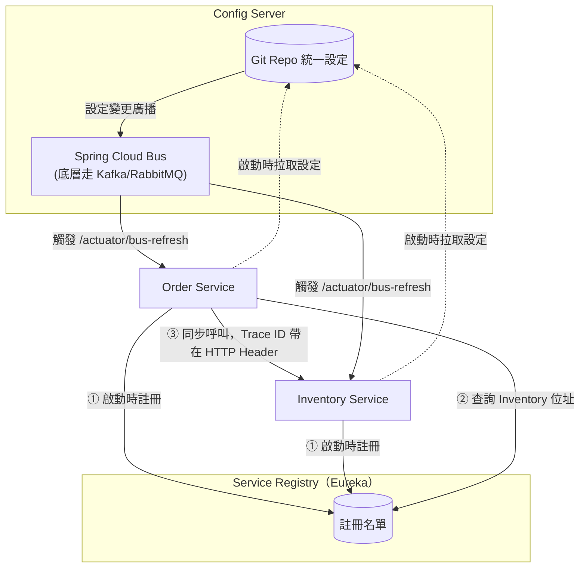
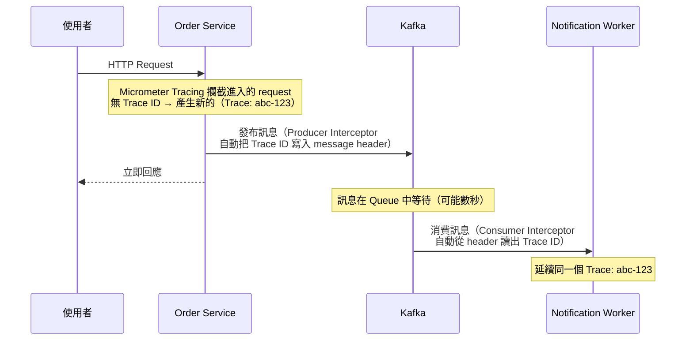
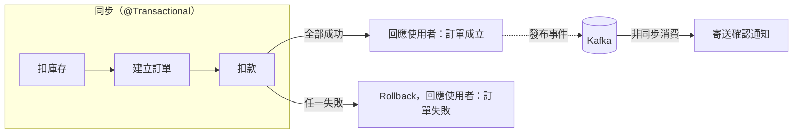

# Spring Cloud 生態地圖與 Trace ID 跨服務傳遞

> 學習日期：2026-07-25
> 涵蓋概念：Service Discovery（Eureka）、Client-side Load Balancing、Spring Cloud Config、Actuator、Spring Cloud Bus、Micrometer Tracing、Trace/Span 傳遞機制、訂單流程同步/非同步邊界

---

## 整體架構圖

---

## Service Discovery：解決「動態環境下怎麼找到對方」

如果服務數量固定、位址不會變，把對方的 URL 寫死在 config 裡完全沒問題。但雲端環境中實例會因為 auto-scaling、部署更新、故障重啟而動態增減、IP 也會變動，寫死的位址很快就會失效。

**Service Registry**（例如 Eureka）扮演「總機」的角色：每個服務實例啟動時主動向 Registry **註冊**自己的位址，並持續送心跳維持存活狀態；Registry 定期做 health check 淘汰失聯的實例。呼叫方不需要知道對方的固定位址，只要向 Registry 查詢「目前健康的實例清單」即可。

兩種常見模式：

| 模式 | 運作方式 | 例子 |
|------|---------|------|
| Client-side Discovery | 呼叫方自己查詢名單，自己做負載平衡 | Eureka + Spring Cloud LoadBalancer |
| Server-side Discovery | 交給中介的 Load Balancer/Gateway 查名單並轉發 | Kubernetes Service |

---

## Spring Cloud Config：解決「多服務設定分散難維護」

多個微服務各自散落 `application.yml`，改一組共用密碼要一台一台改、重新部署，既耗時又容易改漏或不一致。

**Config Server** 把所有服務的設定集中放在一個 Git repo 管理，各服務（Config Client）啟動時去拉自己的那份設定。但這只解決「集中管理」，沒解決「熱更新」——Spring 應用預設只在啟動時讀一次設定，改了 Git 上的值不會自動反映到正在跑的服務。

要做到不重啟就套用新設定，需要兩層機制：

1. **Actuator 的 `/actuator/refresh`**：觸發單一服務重新拉取設定，只有標記 `@RefreshScope` 的 Bean 會被重建。
2. **Spring Cloud Bus**：如果有 10 個服務、幾十個實例，不可能一個個手動呼叫 refresh。Bus 底層接上 Kafka 或 RabbitMQ，一次呼叫 `/actuator/bus-refresh` 就能把「重新讀取設定」的事件廣播給所有訂閱的實例，各自收到後自動 refresh。

---

## Trace ID 如何跨 HTTP 與 Kafka 傳遞

分散式追蹤（Distributed Tracing）的核心是：一個 Trace 由多個 Span 組成（Span = 一段有起訖時間的操作紀錄），靠共同的 Trace ID 把橫跨多個服務的 Span 串起來。

問題是：Trace ID 要怎麼「物理上」從一個服務傳到下一個服務？答案依傳輸方式而不同：

- **HTTP 呼叫**：放在 HTTP Header（W3C 標準的 `traceparent`，或自訂的 `X-Trace-ID`）。
- **Kafka 訊息**：HTTP Header 不存在於訊息傳遞中，改放在 Kafka message 的 **header metadata**（key-value 形式，概念上跟 HTTP Header 類似）。

在 Spring Boot 生態中，這件事不需要開發者手動寫程式碼塞 Header——**Micrometer Tracing**（Spring Cloud Sleuth 的後繼者）以攔截器（Interceptor）的方式，對業務邏輯透明地自動處理三個邊界：

**同步 HTTP 呼叫**（`RestTemplate`/`WebClient`/`OpenFeign`）與**非同步 Kafka 訊息**在傳遞機制上完全不同，但只要 Trace ID 有被正確帶過去，Trace 的連續性不受影響——即使中間隔了幾秒的 Queue 等待，追蹤系統（Zipkin/Jaeger）仍會把所有 Span 視為同一個 Trace，只是時間軸上會呈現一段「非同步等待間隔」。

---

## 訂單流程：同步/非同步邊界怎麼切

以「送出訂單」為例：扣庫存、建立訂單、扣款、寄送確認通知，四個步驟不是全部同步或全部非同步，判斷標準是：

> **這個步驟失敗時，是否會改變要回給使用者的結果？**

- 扣款失敗 → 訂單必須跟著失敗、需要 rollback，使用者要立即知道 → **必須同步**，包在同一個 `@Transactional` 邊界。
- 通知寄送失敗（Email 服務暫時掛掉）→ 訂單本身依然成立，通知可以事後補寄 → **可以非同步**，丟 Kafka 處理、失敗可重試。

單純用「即時性」或「能不能接受延遲」當標準並不精確——真正的判斷點是這個步驟的成敗會不會決定「這次請求算不算成功」。這也是為什麼扣款雖然可能呼叫外部金流商、延遲較高，仍然要放在同步邊界內。

> 注意：「同步」跟「`@Transactional` 邊界」是兩個不同層次的概念，不要混為一談。若扣庫存、建立訂單、扣款都發生在同一個服務、同一個資料庫內，`@Transactional` 才能提供真正的 ACID rollback 保證。但如果扣庫存實際上是像本篇架構圖那樣呼叫**遠端** Inventory Service，`@Transactional` 是無法跨網路呼叫保證原子性的——這時候的「同步」只代表「Order Service 會等待回應、對方失敗就讓整個請求失敗」，真正的資料一致性要靠 **Saga Pattern**：先呼叫扣庫存，成功才繼續建立訂單，任一步失敗就呼叫補償 API 把已扣的庫存加回去（詳見 [07-24 服務間溝通與 Resilience](./2026-07-24-service-communication-resilience.md) 的 Saga Pattern 一節）。

---

## 快速記憶脈絡

- Service Discovery 解決「怎麼動態找到對方」：服務啟動時註冊、呼叫方查詢名單，取代寫死的 IP/URL
- Spring Cloud Config 解決「怎麼集中管理設定」，但要靠 Actuator refresh + Spring Cloud Bus（底層 MQ 廣播）才能做到不重啟熱更新
- Trace ID 跨 HTTP 靠 Header、跨 Kafka 靠 message metadata，Micrometer Tracing 自動注入，傳輸方式不影響 Trace 連續性
- 訂單流程同步/非同步的判斷標準是「失敗會不會改變回給使用者的結果」，不是單純的「快不快」

---

## 學習過程的關鍵卡點

**原本以為**：Load balancer 靠 health check 就能知道所有服務實例的位置，機器數量變動時只要設定一個指向 load balancer 的公開 URL 就夠了。

**實際上**：Health check 只能確認「已知名單裡」的機器是否存活，無法回答一台全新開機、還沒被任何人記錄過的機器是怎麼被發現的。真正解決這個問題的是 Service Registry——新機器主動「註冊」自己的存在，Registry 維護一份動態名單，呼叫方或 load balancer 都是向這份名單查詢，而不是反過來由 load balancer 自己去「發現」機器。

**原本以為**：判斷一個步驟該同步還是非同步，看的是「使用者能不能接受延遲」（即時性）。

**實際上**：一開始用這個標準把「扣款」也歸類成非同步，但這樣會讓使用者在扣款結果未知時就先看到「訂單成立」的回應，一旦扣款失敗，系統會停在「訂單已建立但錢沒扣到」的不一致狀態。真正的判斷標準是「這個步驟失敗時，會不會改變要回給使用者的結果」——扣款失敗必須讓訂單跟著失敗（同步），通知失敗不影響訂單成立與否（可非同步）。這個卡點值得記住，因為「即時性」和「一致性要求」是兩個不同的維度，光看前者容易把需要強一致性的步驟誤判成可以非同步處理。

> 待釐清：Micrometer Tracing 在 Kafka Producer/Consumer 攔截器的實際 annotation/設定方式（例如是否需要額外依賴 `micrometer-tracing-bridge-brave` 或搭配 `spring-kafka` 的哪個介面），之後可以動手寫一個小範例驗證。
